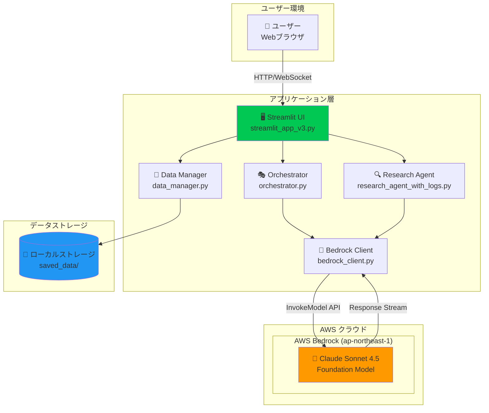
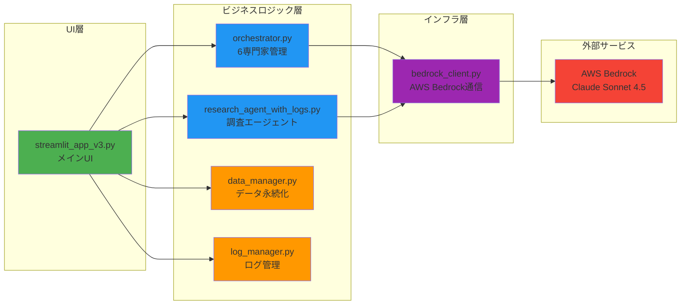
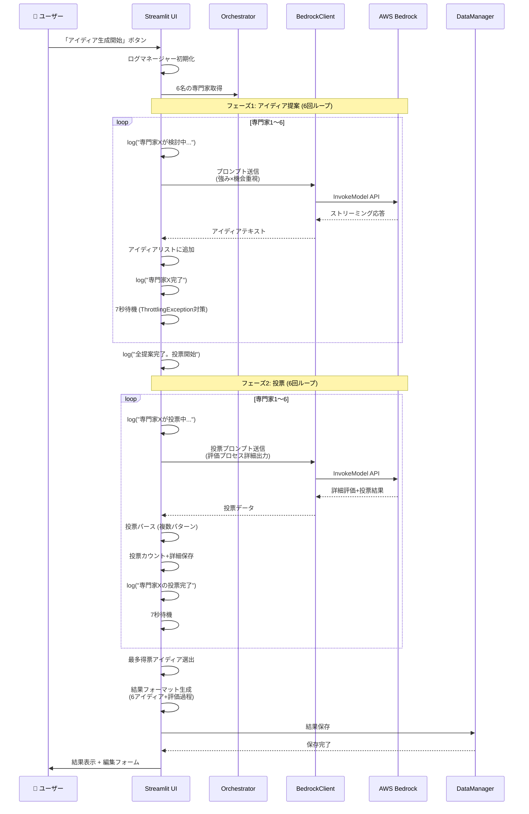
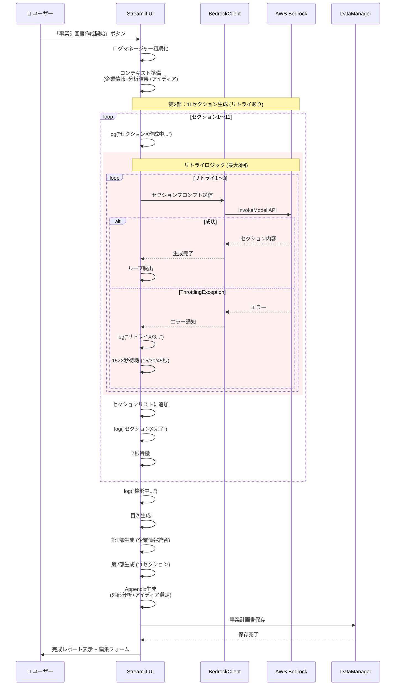
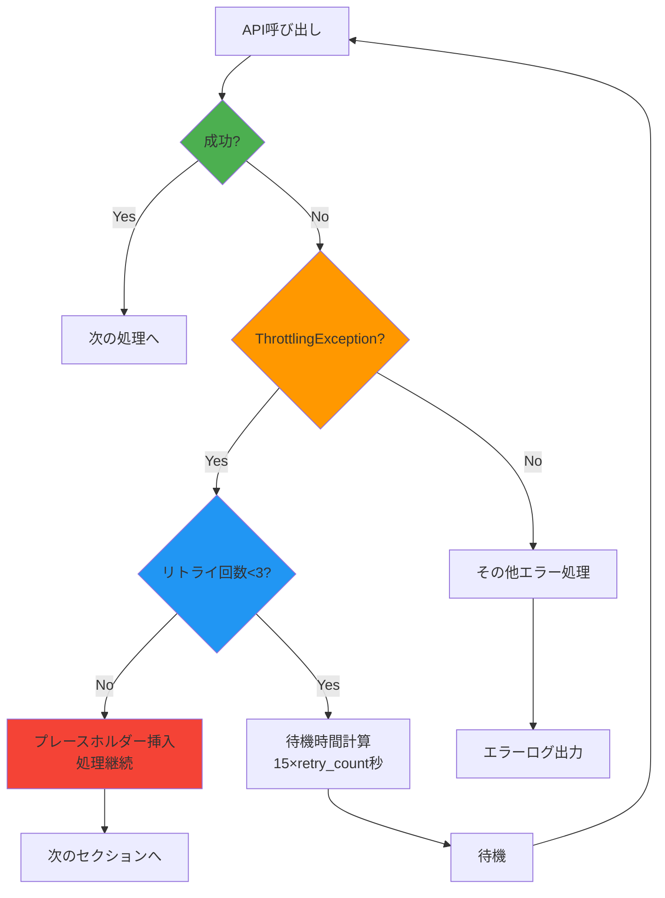

# 新規事業策定支援AIシステム アーキテクチャドキュメント

## 目次
1. [システム概要](#システム概要)
2. [AWSレベルアーキテクチャ](#awsレベルアーキテクチャ)
3. [機能モジュール構成](#機能モジュール構成)
4. [データフロー](#データフロー)
5. [処理シーケンス](#処理シーケンス)
6. [主要コンポーネント](#主要コンポーネント)

---

## システム概要

### システム名
新規事業策定支援AIシステム v3

### 目的
企業の新規事業計画を、AI（Claude Sonnet 4.5）と複数の専門家エージェントを活用して自動生成するシステム

### 主要技術スタック
- **フロントエンド**: Streamlit (Python)
- **AI/LLM**: AWS Bedrock (Claude Sonnet 4.5)
- **エージェント**: Claude Agent SDK
- **データ保存**: ローカルJSON形式
- **言語**: Python 3.x

---

## AWSレベルアーキテクチャ



---

## 機能モジュール構成



---

## データフロー

### 全体データフロー図

```mermaid
flowchart TD
    Start([開始]) --> Step1[Step 1: 企業情報入力]

    Step1 --> Save1[(saved_data/<br/>company_info_*.json)]
    Save1 --> Step2[Step 2: 外部環境分析]

    Step2 --> Step2a[2-1: 事業機会調査<br/>10候補抽出]
    Step2a --> Step2b[2-2: 専門家による絞込<br/>10→5候補]
    Step2b --> Step2c[2-3: 脅威調査<br/>10候補抽出]
    Step2c --> Step2d[2-4: 専門家による絞込<br/>10→5候補]
    Step2d --> Step2e[2-5: 競合企業調査]

    Step2e --> Save2[(saved_data/<br/>step2_external_*.json)]
    Save2 --> Step3[Step 3: アイディア出し]

    Step3 --> Step3a[3-1: 6専門家が提案<br/>各1アイディア]
    Step3a --> Step3b[3-2: 6専門家が投票<br/>詳細評価プロセス記録]
    Step3b --> Step3c[3-3: 最多得票を選定]

    Step3c --> Save3[(saved_data/<br/>step3_idea_*.json)]
    Save3 --> Step4[Step 4: 事業計画書作成]

    Step4 --> Step4a[4-1: 第1部作成<br/>企業情報統合]
    Step4a --> Step4b[4-2: 第2部作成<br/>11セクション生成]
    Step4b --> Step4c[4-3: Appendix作成<br/>検討過程統合]

    Step4c --> Save4[(saved_data/<br/>step4_business_*.json)]
    Save4 --> Output[📋 統合事業計画書<br/>完成]

    Output --> End([終了])

    style Start fill:#4CAF50
    style End fill:#4CAF50
    style Step1 fill:#2196F3
    style Step2 fill:#2196F3
    style Step3 fill:#2196F3
    style Step4 fill:#2196F3
    style Output fill:#FF9800
```



---

## 処理シーケンス

### Step 3: アイディア出しの詳細シーケンス



### Step 4: 事業計画書作成の詳細シーケンス



---

## 主要コンポーネント

### 1. Streamlit UI (streamlit_app_v3.py)

**責務**: ユーザーインターフェース、ワークフロー制御

**主要機能**:
- 4ステップのワークフロー管理
- リアルタイムログ表示
- データ保存・読み込み機能
- 3ボタンオプション（保存して次へ、保存しないで次へ、保存のみ）

**主要関数**:
```python
- init_session_state(): セッション初期化
- step1_company_info(): 企業情報入力
- step2_external_analysis_with_logs(): 外部環境分析
- step3_idea_generation(): アイディア出し
- step4_business_plan(): 事業計画書作成
- display_log_monitor(): ログモニター表示
```

### 2. Orchestrator (orchestrator.py)

**責務**: 6名の専門家エージェント管理

**専門家構成**:
1. マーケティング専門家
2. 営業専門家
3. 経営企画専門家
4. 技術戦略専門家
5. 人事戦略専門家
6. 財務経理専門家

**主要メソッド**:
```python
- __init__(): 6専門家の初期化
- get_specialists(): 専門家リスト取得
```

### 3. Research Agent (research_agent_with_logs.py)

**責務**: 外部環境調査、情報収集

**主要機能**:
- 事業機会の調査・抽出
- 脅威の調査・抽出
- 競合分析
- ログコールバック対応

**主要メソッド**:
```python
- execute_research(): 調査実行
- _send_query(): Bedrock APIへクエリ送信
```

### 4. Bedrock Client (bedrock_client.py)

**責務**: AWS Bedrock API通信

**主要機能**:
- 非同期通信（AsyncIO）
- ストリーミング応答処理
- タイムアウト設定（読取300秒、接続60秒）
- リトライ機能（最大3回）

**主要メソッド**:
```python
- connect(): 接続確立
- query(): クエリ送信
- receive_response(): 応答受信
- disconnect(): 接続切断
```

**設定**:
```python
Config(
    read_timeout=300,
    connect_timeout=60,
    retries={'max_attempts': 3, 'mode': 'adaptive'}
)
```

### 5. Data Manager (data_manager.py)

**責務**: データ永続化、ファイル管理

**保存形式**: JSON
**保存場所**: `saved_data/`ディレクトリ

**主要メソッド**:
```python
- save_company_info(): 企業情報保存
- save_analysis_result(): 分析結果保存
- load_analysis_result(): データ読み込み
- list_step_files(): ステップ別ファイル一覧
- get_latest_step_file(): 最新ファイル取得
```

**ファイル命名規則**:
```
company_info_YYYYMMDD_HHMMSS.json
step2_external_analysis_YYYYMMDD_HHMMSS.json
step3_idea_generation_YYYYMMDD_HHMMSS.json
step4_business_plan_YYYYMMDD_HHMMSS.json
```

### 6. Log Manager (log_manager.py)

**責務**: リアルタイムログ管理

**ログレベル**:
- `info`: 情報
- `success`: 成功
- `warning`: 警告
- `error`: エラー
- `debug`: デバッグ（詳細情報付き）

**主要メソッド**:
```python
- log(): ログ追加
- get_logs(): ログ取得
- clear_logs(): ログクリア
```

---

## データ構造

### 企業情報 (company_info)
```json
{
  "company_overview": "企業概要",
  "existing_business_name": "既存事業名",
  "existing_products_services": "製品・サービス名",
  "existing_products_details": "製品詳細",
  "target_market": "ターゲット市場",
  "pricing_revenue": "価格・売上",
  "implementation_structure": "実施体制",
  "business_location": "事業実施場所",
  "industry_code": "業種",
  "strengths_input": "強み",
  "weaknesses_input": "課題",
  "saved_at": "2025-01-22T10:30:00"
}
```

### 外部環境分析結果 (step2_external_analysis)
```json
{
  "opportunities_filtered": "事業機会トップ5",
  "threats_filtered": "脅威トップ5",
  "competitors_result": "競合分析",
  "saved_at": "2025-01-22T11:00:00"
}
```

### アイディア生成結果 (step3_idea_generation)
```json
{
  "selected_idea": "選定されたアイディア詳細\n全6アイディア\n評価プロセス",
  "all_ideas": [
    {
      "specialist": "専門家名",
      "text": "アイディア内容",
      "votes": 2
    }
  ],
  "saved_at": "2025-01-22T11:30:00"
}
```

### 事業計画書 (step4_business_plan)
```json
{
  "business_plan_result": "統合事業計画書\n(第1部+第2部+Appendix)",
  "saved_at": "2025-01-22T12:00:00"
}
```

---

## エラーハンドリング戦略

### ThrottlingException対策



### 待機時間戦略

| 状況 | 待機時間 |
|------|----------|
| 通常のAPI呼び出し間隔 | 7秒 |
| 1回目のリトライ | 15秒 |
| 2回目のリトライ | 30秒 |
| 3回目のリトライ | 45秒 |

---

## パフォーマンス特性

### 処理時間の目安

| ステップ | 所要時間 | 主要処理 |
|---------|---------|---------|
| Step 1 | 1-2分 | ユーザー入力 |
| Step 2 | 15-20分 | 5回のAI調査 + 待機時間 |
| Step 3 | 15-20分 | 12回のAPI呼び出し (6提案+6投票) + 待機時間 |
| Step 4 | 20-30分 | 11回のAPI呼び出し + リトライ + 待機時間 |
| **合計** | **50-70分** | |

### API呼び出し回数

| ステップ | 呼び出し回数 | 備考 |
|---------|-------------|------|
| Step 2 | 5回 | 機会調査、絞込、脅威調査、絞込、競合 |
| Step 3 | 12回 | 6提案 + 6投票 |
| Step 4 | 11回 (最大33回) | 11セクション、リトライ最大3回 |
| **合計** | **28回 (最大50回)** | |

---

## セキュリティ考慮事項

### 認証・認可
- AWS Bedrock: IAMロールベースの認証
- 環境変数による認証情報管理 (`.env`)

### データ保護
- ローカルストレージ: ファイルシステムアクセス制御
- 転送中の暗号化: HTTPS (AWS Bedrock API)

### 機密情報管理
```python
# .env ファイル (Gitignoreに含める)
AWS_REGION=ap-northeast-1
AWS_ACCESS_KEY_ID=xxxxx
AWS_SECRET_ACCESS_KEY=xxxxx
```

---

## デプロイメント

### ローカル実行
```bash
# 依存関係インストール
pip install -r requirements.txt

# 環境変数設定
cp .env.sample .env
# .envを編集

# 起動
./start_v3.sh
# または
streamlit run streamlit_app_v3.py
```

### 推奨システム要件
- **OS**: macOS, Linux, Windows
- **Python**: 3.8以上
- **メモリ**: 2GB以上
- **ストレージ**: 500MB以上
- **ネットワーク**: インターネット接続（AWS Bedrockアクセス用）

---

## 拡張性

### 将来的な拡張ポイント

1. **専門家の追加**
   - `orchestrator.py`に新しいSpecialistを追加
   - 専門分野をカスタマイズ

2. **他のLLMモデルの対応**
   - `bedrock_client.py`を拡張
   - GPT-4、Geminiなどへの対応

3. **データベース対応**
   - `data_manager.py`をリファクタリング
   - PostgreSQL、MongoDBなどへの対応

4. **マルチテナント対応**
   - ユーザー認証機能追加
   - データ分離機能追加

5. **API化**
   - FastAPIでRESTful API提供
   - フロントエンドとバックエンドの分離

---

## トラブルシューティング

### よくある問題と解決策

#### 1. ThrottlingException
**症状**: "Too many requests" エラー

**解決策**:
- 待機時間を延長（現在7秒 → 10秒など）
- リトライ回数を増やす
- AWS Bedrockのクォータ引き上げを申請

#### 2. タイムアウトエラー
**症状**: "Read timeout" エラー

**解決策**:
- `bedrock_client.py`のタイムアウト設定を延長
- 現在: 読取300秒、接続60秒

#### 3. メモリ不足
**症状**: プロセスがクラッシュ

**解決策**:
- ログの保存数を制限
- セッションステートのクリア頻度を上げる

#### 4. 保存データが見つからない
**症状**: "保存されたデータはありません"

**解決策**:
- `saved_data/`ディレクトリの存在確認
- ファイル権限の確認

---

## まとめ

このシステムは、以下の特徴を持つ新規事業策定支援システムです：

✅ **AI駆動**: Claude Sonnet 4.5による高度な分析・生成
✅ **マルチエージェント**: 6名の専門家による多角的評価
✅ **トレーサビリティ**: 全プロセスを記録・可視化
✅ **堅牢性**: リトライ・エラーハンドリング機能
✅ **統合レポート**: 企業情報から検討過程まで一体化

このアーキテクチャにより、企業は効率的かつ高品質な新規事業計画を策定できます。
