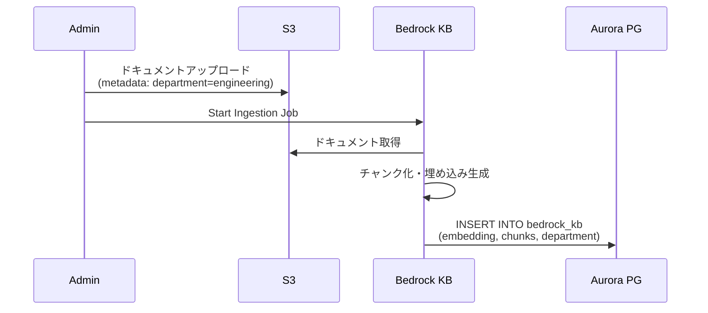
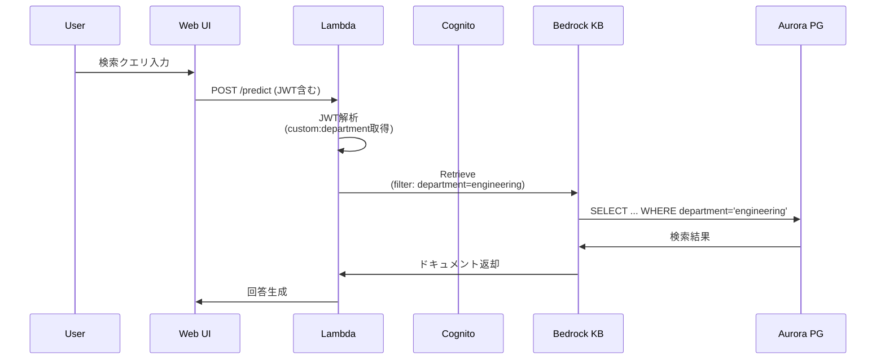
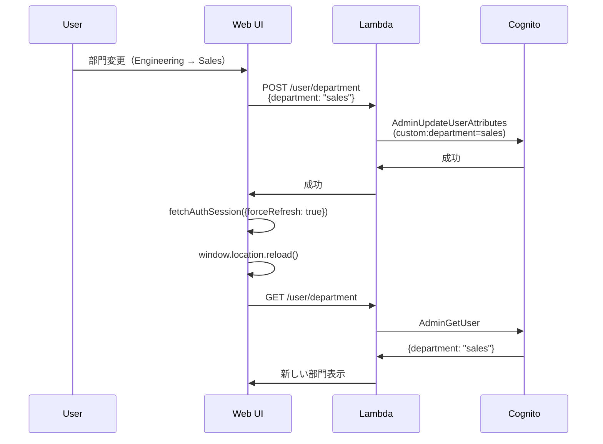

# GenU V2実装 差分資料

## 概要

本資料は、AWS generative-ai-use-cases（GenU）の標準実装（V1）に対して、Phase 1で実装した部門ベースのドキュメントフィルタリング機能（V2）の差分をまとめたものです。

---

## 1. 追加機能の概要

### 1.1 主要機能
**Aurora PostgreSQL Knowledge Base with 部門ベースフィルタリング**

- Aurora PostgreSQL + pgvectorを使用したKnowledge Base
- ユーザーの所属部門に基づいた自動的なドキュメントアクセス制御
- UIから部門を切り替え可能（リアルタイム反映）

### 1.2 ユースケース
- **マルチテナント環境**: 複数部門が同じシステムを利用し、それぞれ独自のドキュメントにアクセス
- **セキュリティ要件**: 部門間でのドキュメント隔離が必要
- **動的な権限管理**: ユーザーの部門異動に柔軟に対応

---

## 2. アーキテクチャ差分

### 2.1 インフラストラクチャ

| コンポーネント | V1（標準） | V2（本実装） |
|---|---|---|
| Knowledge Base | OpenSearch Serverless | Aurora PostgreSQL Serverless v2 + pgvector |
| ベクトルストレージ | OpenSearch index | PostgreSQL table with HNSW index |
| メタデータフィルタ | なし | `department` カラムによる自動フィルタリング |
| Cognito属性 | 標準属性のみ | `custom:department` 追加 |

### 2.2 新規追加スタック

**`AuroraKbStack`** (`packages/cdk/lib/aurora-kb-stack.ts`)
```
├─ Aurora PostgreSQL Serverless v2 Cluster
│  ├─ pgvector extension
│  ├─ bedrock_integration schema
│  └─ bedrock_kb table (id, embedding, chunks, metadata, department)
├─ S3 Bucket (ドキュメントアップロード用)
├─ Bedrock Knowledge Base (Aurora接続)
├─ Bedrock Data Source (S3 → Aurora)
└─ Lambda (スキーマ初期化)
```

---

## 3. バックエンド実装差分

### 3.1 新規Lambda関数

#### 3.1.1 GetUserDepartment
**ファイル**: `packages/cdk/lambda/getUserDepartment.ts`

**機能**:
- Cognitoから現在ログイン中のユーザーの `custom:department` 属性を取得
- JWT ID Tokenから `sub` (ユーザーID) を抽出

**API**: `GET /user/department`

**レスポンス例**:
```json
{
  "department": "engineering"
}
```

#### 3.1.2 UpdateUserDepartment
**ファイル**: `packages/cdk/lambda/updateUserDepartment.ts`

**機能**:
- Cognitoのユーザー属性 `custom:department` を更新
- 更新後、最大5回のリトライで変更を検証

**API**: `POST /user/department`

**リクエスト例**:
```json
{
  "department": "sales"
}
```

### 3.2 RAG検索時の自動フィルタリング

**ファイル**: `packages/cdk/lambda/predictStream.ts`

**変更内容**:
```typescript
// JWT tokenから department 属性を抽出
const department = decodedToken['custom:department'];

// 部門フィルタをKnowledge Base検索に自動適用
const departmentFilter = {
  equals: {
    key: 'department',
    value: department
  }
};

// Bedrock Knowledge Base検索時に適用
await bedrockAgentRuntime.retrieve({
  knowledgeBaseId: auroraKbId,
  retrievalQuery: { text: query },
  retrievalConfiguration: {
    vectorSearchConfiguration: {
      filter: departmentFilter  // 自動適用
    }
  }
});
```

**重要**: ユーザーがUIで指定したフィルタに加えて、**必ず部門フィルタが自動的に追加**されます。

---

## 4. フロントエンド実装差分

### 4.1 新規Hook

**ファイル**: `packages/web/src/hooks/useDepartment.ts`

**機能**:
- ユーザーの現在の部門を取得（マウント時に自動取得）
- 部門の変更（Cognito更新 → トークンリフレッシュ → ページリロード）
- エラーハンドリング

**使用例**:
```typescript
const { department, setDepartment, refreshTokenAndReload, loading } = useDepartment();

// 部門変更
await setDepartment('sales');
await refreshTokenAndReload(); // ログアウトせずにページリロード
```

### 4.2 RAG Aurora Knowledge Base ページ

**ファイル**: `packages/web/src/pages/RagAuroraKnowledgeBasePage.tsx`

#### 4.2.1 部門表示
```tsx
<span className="rounded border border-gray-300 bg-white px-3 py-2">
  部門: {department === 'engineering' ? 'Engineering' : 'Sales'}
</span>
```

#### 4.2.2 設定画面（部門切り替え）
```tsx
<ExpandableField label="部門設定" defaultOpened={true}>
  <Select
    value={selectedDepartment || 'engineering'}
    onChange={(value) => setSelectedDepartment(value)}
    options={[
      { value: 'engineering', label: 'Engineering' },
      { value: 'sales', label: 'Sales' }
    ]}
  />
  <Button onClick={async () => {
    await setDepartment(selectedDepartment);
    await refreshTokenAndReload();
  }}>
    保存
  </Button>
</ExpandableField>
```

#### 4.2.3 検索時の自動フィルタ適用
```typescript
const getExtraDataFromFilters = useCallback(() => {
  const filterExtra = [...]; // ユーザー指定フィルタ

  // 部門フィルタを自動追加
  if (department) {
    const departmentFilter: RetrievalFilter = {
      equals: {
        key: 'department',
        value: department
      }
    };
    filterExtra.push({
      type: 'json',
      name: 'filter',
      source: {
        type: 'json',
        mediaType: 'application/json',
        data: JSON.stringify(departmentFilter)
      }
    });
  }

  return filterExtra;
}, [filters, department]);
```

---

## 5. 認証・認可の実装差分

### 5.1 Cognito User Pool設定

**ファイル**: `packages/cdk/lib/generative-ai-use-cases-stack.ts`

```typescript
// カスタム属性の追加
const userPool = new cognito.UserPool(this, 'UserPool', {
  // ... 既存設定
  customAttributes: {
    department: new cognito.StringAttribute({
      mutable: true  // ユーザーが変更可能
    })
  }
});
```

### 5.2 トークンリフレッシュフロー

**従来のログアウト方式（V1相当）**:
```
部門変更 → Cognito更新 → signOut() → ログイン画面 → 再ログイン
```

**新しいトークンリフレッシュ方式（V2）**:
```
部門変更 → Cognito更新 → fetchAuthSession({ forceRefresh: true }) → ページリロード
（ログアウト不要、セッション維持）
```

**実装**:
```typescript
const refreshTokenAndReload = async () => {
  try {
    // Cognitoセッションを強制リフレッシュ（新しいID Tokenを取得）
    await fetchAuthSession({ forceRefresh: true });
  } catch (error) {
    console.error('Token refresh failed:', error);
    // エラーでもログアウトせず、ページリロード
  }

  // 新しいトークンで自動的に正しい部門が取得される
  window.location.reload();
};
```

---

## 6. データモデル差分

### 6.1 Aurora PostgreSQL スキーマ

**テーブル**: `bedrock_integration.bedrock_kb`

| カラム | 型 | 説明 |
|---|---|---|
| `id` | UUID | 主キー |
| `embedding` | VECTOR(1024) | Amazon Titan Embeddings V2のベクトル（1024次元） |
| `chunks` | TEXT | ドキュメントのチャンク |
| `metadata` | JSONB | メタデータ（ファイル名、ソースURIなど） |
| **`department`** | **TEXT** | **部門識別子（engineering/salesなど）** |

**インデックス**:
```sql
-- ベクトル類似検索用（HNSW）
CREATE INDEX bedrock_kb_embedding_idx
ON bedrock_integration.bedrock_kb
USING hnsw (embedding vector_cosine_ops);

-- 部門フィルタ用（B-tree）
CREATE INDEX bedrock_kb_department_idx
ON bedrock_integration.bedrock_kb (department);
```

### 6.2 ドキュメントアップロード時のメタデータ

S3にアップロード時、以下のメタデータを付与:
```json
{
  "metadataAttributes": {
    "department": "engineering"  // または "sales"
  }
}
```

Bedrock Knowledge Baseがこのメタデータを読み取り、Aurora PostgreSQLの`department`カラムに保存します。

---

## 7. デプロイ・設定差分

### 7.1 環境変数の追加

**`packages/cdk/cdk.json`**:
```json
{
  "auroraKnowledgeBase": {
    "enabled": true,
    "deployStack": true,
    "embeddingModel": "amazon.titan-embed-text-v2:0",
    "chunkingStrategy": "FIXED_SIZE",
    "maxTokens": 300,
    "overlapPercentage": 20
  }
}
```

### 7.2 新規リソース

| リソース | 説明 | コスト目安 |
|---|---|---|
| Aurora Serverless v2 Cluster | 最小0.5 ACU、最大1.0 ACU | ~$43/月（常時稼働） |
| Bedrock Knowledge Base | Aurora統合 | 無料（検索時のBedrockコストのみ） |
| S3 Bucket | ドキュメントストレージ | 従量課金 |

---

## 8. 運用フロー

### 8.1 ドキュメント登録フロー



### 8.2 検索フロー



### 8.3 部門変更フロー



---

## 9. セキュリティ考慮事項

### 9.1 実装済みセキュリティ対策

| 項目 | 実装内容 |
|---|---|
| 認証 | AWS Cognito User Pool（JWT認証） |
| 認可 | JWT内の`custom:department`属性による自動フィルタ |
| SQL Injection対策 | Bedrock Knowledge Base API経由（直接SQL実行なし） |
| トークン検証 | Lambda Authorizerで署名検証 |
| 通信暗号化 | HTTPS/TLS 1.2+ |

### 9.2 留意事項

1. **フロントエンドでのフィルタ指定は信頼しない**
   - バックエンドで必ずJWTから部門を取得し、フィルタを再構築
   - ユーザーが改ざんしたフィルタは無視

2. **部門属性の整合性**
   - `custom:department`属性は必須ではない（nullの場合はデフォルト値を設定）
   - 現在の実装では`engineering`をデフォルトとして使用

3. **Aurora PostgreSQLアクセス制御**
   - Knowledge BaseからのアクセスのみをSecrets Managerで管理
   - 直接DBアクセスは不可

---

## 10. 既知の制限事項

1. **部門の種類**
   - 現在は`engineering`と`sales`の2種類のみ
   - 拡張する場合はUIとバリデーションロジックを修正

2. **部門の階層構造**
   - フラットな部門構造のみサポート
   - 親子関係や組織階層は未実装

3. **マルチテナント完全分離**
   - 同じAurora Clusterを共有
   - 完全なマルチテナント（テナント毎にCluster分離）は未実装

4. **部門変更時のリアルタイム反映**
   - ページリロードが必要
   - WebSocket等によるリアルタイム更新は未実装

---

## 11. 今後の拡張可能性

### 11.1 短期的な拡張（Phase 2候補）

- [ ] 部門の動的管理（Admin画面での追加・削除）
- [ ] 複数部門への所属（カンマ区切り or 配列）
- [ ] ドキュメント単位での公開範囲設定（public, department, private）
- [ ] 監査ログ（誰がいつどのドキュメントにアクセスしたか）

### 11.2 長期的な拡張

- [ ] 組織階層構造のサポート
- [ ] ロールベースアクセス制御（RBAC）
- [ ] 外部IdP連携（SAML/OIDC）での部門属性マッピング
- [ ] マルチリージョン展開

---

## 12. まとめ

### V1からV2への主な変更点

| 観点 | V1 | V2 |
|---|---|---|
| Knowledge Base | OpenSearch Serverless | Aurora PostgreSQL + pgvector |
| アクセス制御 | なし | 部門ベースの自動フィルタリング |
| Cognito | 標準属性のみ | `custom:department`追加 |
| Lambda関数 | - | GetUserDepartment, UpdateUserDepartment追加 |
| フロントエンド | - | 部門表示・切り替えUI追加 |
| セッション管理 | - | トークンリフレッシュ実装 |

### 追加された主要機能

1. **部門ベースのドキュメント隔離**: ユーザーは自部門のドキュメントのみ検索可能
2. **動的な部門切り替え**: ログアウト不要で部門を変更可能
3. **自動的なアクセス制御**: バックエンドで強制的にフィルタ適用

これにより、マルチテナント環境での安全なRAGシステムが実現されました。

---

## 13. 変更ファイル一覧

### CDK（インフラ）
- `packages/cdk/lib/aurora-kb-stack.ts` - 新規作成（Aurora Knowledge Base スタック）
- `packages/cdk/lib/generative-ai-use-cases-stack.ts` - 修正（Cognito custom属性、Lambda関数追加）
- `packages/cdk/lambda/getUserDepartment.ts` - 新規作成
- `packages/cdk/lambda/updateUserDepartment.ts` - 新規作成
- `packages/cdk/lambda/predictStream.ts` - 修正（部門フィルタ自動適用）
- `packages/cdk/lambda/utils/models.ts` - 修正（Aurora KB設定追加）

### Web（フロントエンド）
- `packages/web/src/hooks/useDepartment.ts` - 新規作成
- `packages/web/src/pages/RagAuroraKnowledgeBasePage.tsx` - 新規作成
- `packages/web/src/main.tsx` - 修正（ルート追加）

### 共通
- `packages/common/src/custom/rag-knowledge-base.ts` - 修正（フィルタ設定）

---

## 付録A: 主要コミット履歴

以下は、Phase 1実装における主要なコミットのハイライトです：

1. **Aurora Knowledge Base スタックの追加**
   - Aurora PostgreSQL Serverless v2 + pgvector
   - Bedrock Knowledge Base統合

2. **Cognito custom:department 属性の追加**
   - User Pool設定の修正
   - Lambda関数での属性読み書き実装

3. **部門ベースフィルタリングの実装**
   - predictStream.tsでの自動フィルタ適用
   - JWT解析とフィルタ構築ロジック

4. **フロントエンド部門管理UIの実装**
   - useDepartment hookの作成
   - RagAuroraKnowledgeBasePageの実装
   - トークンリフレッシュ機能

5. **トークンリフレッシュの改善**
   - ログアウトを回避するリフレッシュフロー
   - エラーハンドリングの強化

---

## 付録B: トラブルシューティング

### B.1 部門が正しく表示されない

**症状**: UIで部門が表示されない、またはデフォルト値（engineering）のまま

**原因と対処**:
1. Cognito属性が設定されていない
   - AWS Consoleで該当ユーザーの`custom:department`を確認
   - 設定されていない場合は手動で設定

2. JWT tokenに属性が含まれていない
   - ブラウザのDevToolsでJWT tokenをデコード
   - `custom:department`が含まれているか確認
   - 含まれていない場合はログアウト→再ログイン

### B.2 部門変更後も検索結果が変わらない

**症状**: 部門を変更しても、検索結果が以前の部門のまま

**原因と対処**:
1. ページリロードが完了していない
   - 強制リロード（Cmd+Shift+R / Ctrl+Shift+R）

2. CloudFrontキャッシュが残っている
   - CloudFront Invalidation実行
   - `/index.html` と `/assets/*` をInvalidate

3. バックエンドでフィルタが適用されていない
   - CloudWatch Logsで`predictStream`のログを確認
   - `[predictStream] Department filter`で検索

### B.3 Aurora Knowledge Baseへのドキュメント取り込み失敗

**症状**: Ingestion Jobが失敗する、またはドキュメントが検索できない

**原因と対処**:
1. S3メタデータが不足
   - S3オブジェクトに`x-amz-meta-department`が設定されているか確認

2. Aurora接続エラー
   - RDS Data APIでクエリ実行可能か確認
   - Secrets Managerの認証情報を確認

3. pgvector extensionが有効になっていない
   - RDS Data APIで以下を実行:
     ```sql
     SELECT * FROM pg_extension WHERE extname = 'vector';
     ```

---

## 付録C: パフォーマンスチューニング

### C.1 Aurora Serverless v2のスケーリング

現在の設定:
- 最小ACU: 0.5
- 最大ACU: 1.0

推奨設定（本番環境）:
- 最小ACU: 1.0（コールドスタート回避）
- 最大ACU: 2.0〜4.0（高負荷対応）

### C.2 HNSW インデックスのチューニング

現在のインデックス:
```sql
CREATE INDEX bedrock_kb_embedding_idx
ON bedrock_integration.bedrock_kb
USING hnsw (embedding vector_cosine_ops);
```

チューニングパラメータ（ドキュメント数に応じて調整）:
```sql
CREATE INDEX bedrock_kb_embedding_idx
ON bedrock_integration.bedrock_kb
USING hnsw (embedding vector_cosine_ops)
WITH (m = 16, ef_construction = 64);
```

- `m`: グラフの接続数（デフォルト16、範囲2-100）
- `ef_construction`: 構築時の探索幅（デフォルト64、範囲4-1000）

### C.3 Knowledge Base検索のチューニング

現在の設定（`packages/cdk/lambda/predictStream.ts`）:
```typescript
numberOfResults: 20  // 検索結果数
```

推奨設定:
- 一般的な質問: 10-20件
- 詳細な分析: 30-50件
- パフォーマンス重視: 5-10件

---

## 付録D: 監視・ログ

### D.1 CloudWatch Logs

重要なログストリーム:
1. `/aws/lambda/GetUserDepartment` - 部門取得ログ
2. `/aws/lambda/UpdateUserDepartment` - 部門更新ログ
3. `/aws/lambda/PredictStream` - RAG検索ログ（フィルタ適用状況）

検索クエリ例:
```
# 部門フィルタが適用されているか確認
fields @timestamp, @message
| filter @message like /Department filter/
| sort @timestamp desc
| limit 100

# エラーログ
fields @timestamp, @message
| filter @logStream like /ERROR/
| sort @timestamp desc
```

### D.2 監視メトリクス

推奨する監視項目:
1. **Aurora**
   - ACU使用率
   - クエリレイテンシ
   - 接続数

2. **Lambda**
   - GetUserDepartment: 実行時間、エラー率
   - UpdateUserDepartment: 実行時間、エラー率
   - PredictStream: 実行時間、コンカレンシー

3. **Bedrock Knowledge Base**
   - Retrieve API呼び出し回数
   - レスポンスタイム

---

**ドキュメント作成日**: 2025-12-09
**作成者**: Claude Code
**バージョン**: Phase 1 完了版
