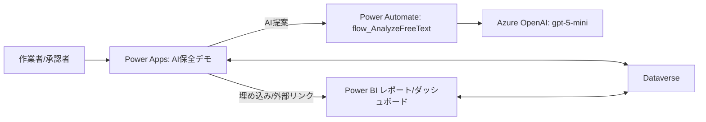
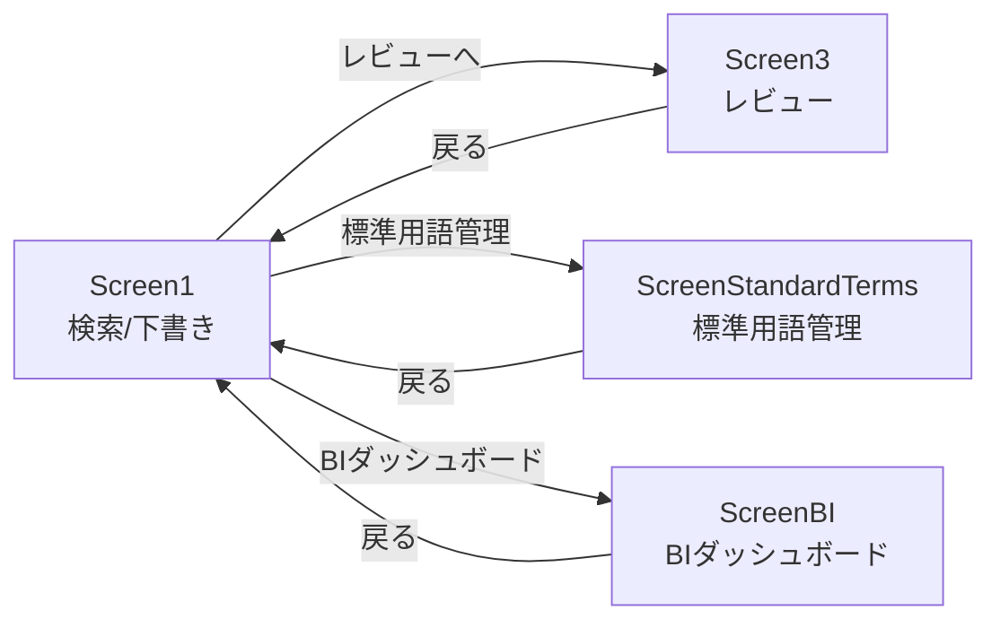
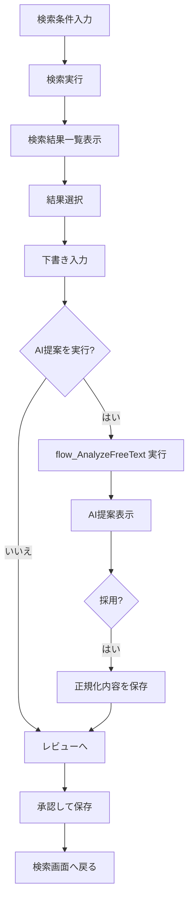
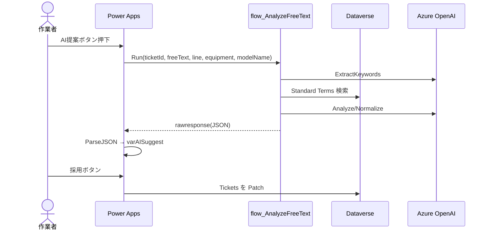
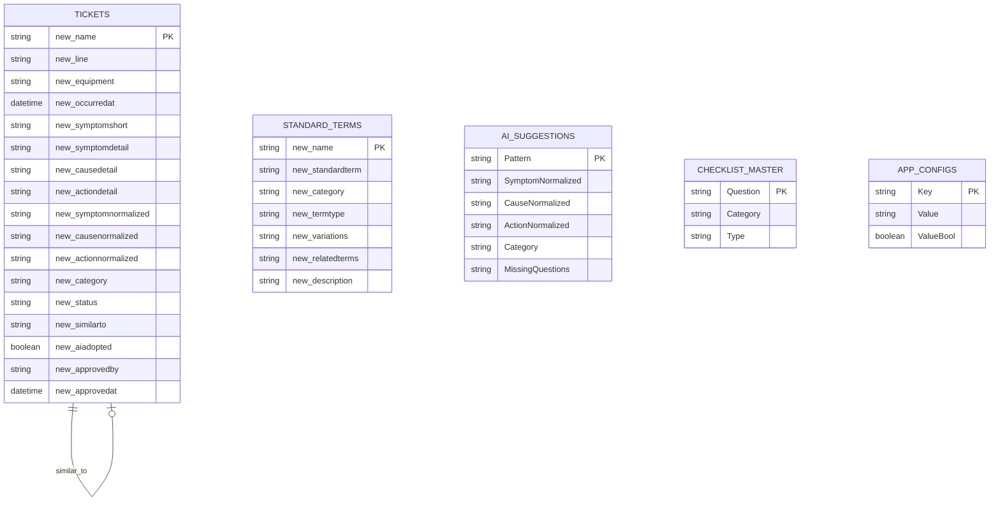

# AI保全デモ 設計資料

## 1. 目的と範囲
- 目的: 保全報告の検索・下書き作成・AI提案・レビュー承認を一連で体験できるデモを提供する。
- 対象: Power Apps（キャンバスアプリ）+ Dataverse + Power Automate + Azure OpenAI + Power BI。
- 前提: AI提案は標準用語（Standard Terms）を優先し、JSON形式で返す。

## 2. 全体構成（アーキテクチャ）


## 3. UI設計（画面一覧）
| 画面 | 目的 | 主な要素 |
|---|---|---|
| Screen1（検索/下書き） | 類似検索・下書き入力・AI提案 | 検索条件、検索結果一覧、下書き入力、AI提案/採用、レビュー遷移、デバッグ |
| Screen3（レビュー） | 承認・保存 | チケット情報表示、承認ボタン |
| ScreenStandardTerms（標準用語管理） | 標準用語の参照/編集 | 検索、用語一覧、詳細編集、保存/削除 |
| ScreenBI（BIダッシュボード） | KPI/可視化の参照 | Power BI 埋め込み、Power BI を開く |

### Screen1（検索/下書き）
- 検索条件: ライン/設備/分類/症状（短文）
- 検索結果: `colSearchResults` をギャラリー表示
- 選択結果を `varDraft` に反映し、下書き入力へ
- AI提案ボタン: `flow_AnalyzeFreeText` を呼び出し、`varAISuggest` に反映
- 採用ボタン（症状/原因/処置ごと）: 正規化テキストを Dataverse に反映
- デバッグ: `varDebug` トグルで表示/非表示

### Screen3（レビュー）
- 下書き内容の最終確認
- 「承認して保存」で `new_status=有効`、承認者/日時を保存
- 保存後に Screen1 へ戻る

### ScreenStandardTerms（標準用語管理）
- 検索/フィルタ（用語種別）
- 一覧→詳細編集（標準用語/カテゴリ/用語種別/表記ゆれ/関連用語/説明）
- 新規追加・保存・削除

### ScreenBI（BIダッシュボード）
- Power BI タイル埋め込み（`PowerBITileUrl`）
- Power BI を別タブで開く（`PowerBIReportUrl`）
- 未設定時はダッシュボードのプレースホルダを表示

## 4. 画面遷移図


## 5. 処理フロー（ユーザー操作）


## 6. シーケンス図（AI提案）


## 7. ユースケース図
```mermaid
usecaseDiagram
  actor Operator as 作業者
  actor Approver as 承認者
  actor Admin as 用語管理者
  actor Viewer as BI閲覧者

  Operator --> (類似検索)
  Operator --> (下書き入力)
  Operator --> (AI提案取得)
  Operator --> (AI提案採用)
  Approver --> (レビュー/承認)
  Admin --> (標準用語の追加/編集)
  Viewer --> (BIダッシュボード参照)
```

## 8. データベース設計（Dataverse）
### 8.1 テーブル一覧（主要列）
- Tickets (`new_ticket`)
  - `new_name` (TicketID, Primary)
  - `new_line`, `new_equipment`, `new_occurredat`
  - `new_symptomshort`, `new_symptomdetail`, `new_causedetail`, `new_actiondetail`
  - `new_symptomnormalized`, `new_causenormalized`, `new_actionnormalized`
  - `new_category`, `new_status`
  - `new_similarto`, `new_aiadopted`, `new_approvedby`, `new_approvedat`
- Standard Terms (`new_standardterms`)
  - `new_name`, `new_standardterm`
  - `new_category`, `new_termtype`（選択肢）
  - `new_variations`, `new_relatedterms`, `new_description`
- AI Suggestions (`new_aisuggestion`) ※モック用
  - `Pattern`, `SymptomNormalized`, `CauseNormalized`, `ActionNormalized`, `Category`, `MissingQuestions`
- Checklist Master (`new_checklistmaster`) ※任意
  - `Category`, `Question`, `Type`
- App Configs (`new_appconfig`)
  - `Key`, `Value`, `Value (Bool)`

### 8.2 ER図


## 9. Power Automate（flow_AnalyzeFreeText）
### 入力
`ticketId`, `freeText`, `line`, `equipment`, `modelName`（`useAiSearch` は未使用）

### 処理手順（要約）
1. **ExtractKeywords**: `freeText` から重要語を抽出（JSON）
2. **Parse Keywords**: JSON をパースして配列化
3. **Build Filter Query**: `contains` で Dataverse 検索用クエリを生成
4. **List Standard Terms**: Dataverse から標準用語を取得
5. **Build StandardTerms Context**: JSON整形
6. **Analyze/Normalize**: 標準用語を使って症状/原因/処置を正規化
7. **Respond to PowerApps**: `rawresponse` として返却

## 10. AIプロンプト設計
### 10.1 キーワード抽出（ExtractKeywords）
```json
{
  "model": "gpt-5-mini",
  "max_tokens": 300,
  "messages": [
    {
      "role": "system",
      "content": "あなたは保全作業記録から重要な用語を抽出する専門家です。症状、原因、処置に関連する名詞と動詞のみを抽出してください。JSON形式でのみ応答してください。"
    },
    {
      "role": "user",
      "content": "以下の作業メモから、症状・原因・処置に関する重要な用語を抽出してください。\n\n作業メモ: {freeText}\n\n出力形式: {\"keywords\": [\"用語1\", \"用語2\", ...]}"
    }
  ]
}
```

### 10.2 分析・標準化（Analyze/Normalize）
```json
{
  "model": "gpt-5-mini",
  "max_tokens": 800,
  "messages": [
    {
      "role": "system",
      "content": "あなたは保全作業記録を分析し、標準用語を使って整理する専門家です。JSON形式でのみ応答してください。"
    },
    {
      "role": "user",
      "content": "以下の作業メモを分析し、標準用語を使って整理してください。\n\n【コンテキスト】\nライン: {line}\n設備: {equipment}\n\n【作業メモ】\n{freeText}\n\n【利用可能な標準用語】\n{standardTermsJSON}\n\n【出力形式】\n{\n  \"symptomNormalized\": \"標準用語を使った症状詳細（1-2文）\",\n  \"causeNormalized\": \"標準用語を使った原因詳細（1-2文）\",\n  \"actionNormalized\": \"標準用語を使った処置詳細（1-2文）\",\n  \"category\": \"機械/電気/油圧/制御/安全\",\n  \"termMapping\": [\n    {\n      \"original\": \"元の表現\",\n      \"standardized\": \"標準用語\",\n      \"termId\": \"TERM-XXX\",\n      \"category\": \"症状/原因/処置\"\n    }\n  ],\n  \"confidence\": \"high/medium/low\",\n  \"missingInfo\": \"不足情報\"\n}\n\n出力表現ルール:\n- symptomNormalized/causeNormalized/actionNormalized は必ず「<標準用語>：<具体説明>」の形式\n- 標準用語が無い場合は、LLMが校正した適切な表現を先頭に置く\n- 標準用語は括弧で補足しない\n- 説明は1〜2文、先頭語を本文で重複させない"
    }
  ]
}
```

## 11. 設定値（App Configs）
| Key | 用途 | 例 |
|---|---|---|
| UseAI | AI提案の有効/無効 | `true` / `false` |
| UseAISearch | AI Search 使用フラグ（現状未使用） | `false` |
| ModelName | AI モデル/デプロイ名 | `gpt-5-mini` |
| PowerBIReportUrl | Power BI レポートURL（外部起動） | `https://app.powerbi.com/...` |
| PowerBITileUrl | Power BI 埋め込みURL | `https://app.powerbi.com/reportEmbed?...` |

## 12. Power BI 連携
- データソース: Dataverse `new_ticket`
- レポート: 「AI保全デモ_保守レポート」
- ダッシュボード: レポートの各ビジュアルをピン留め
- Power Apps: ScreenBI でタイル埋め込み + 「Power BIを開く」ボタン

