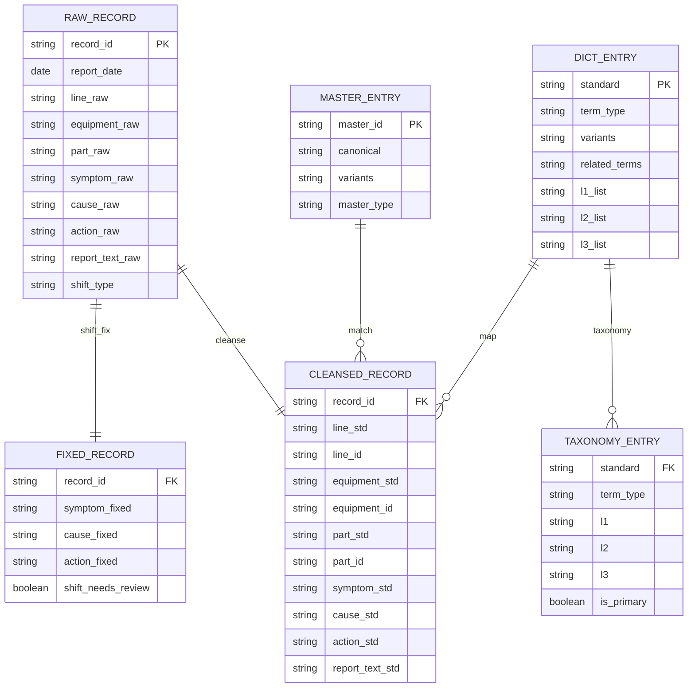
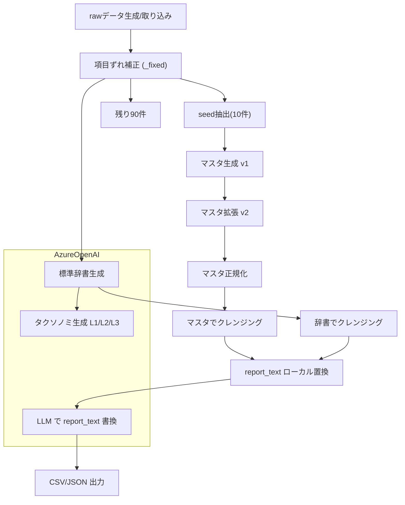
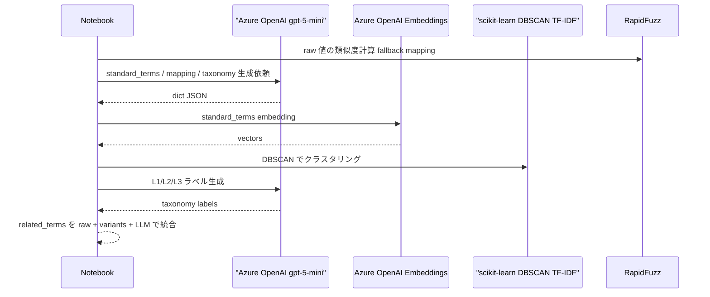
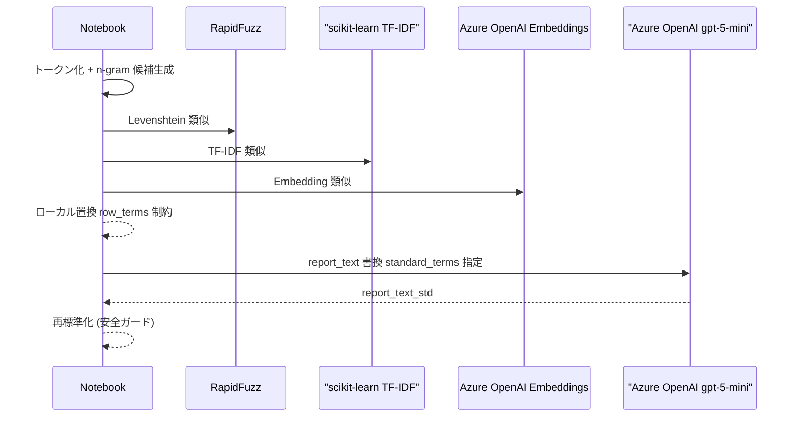
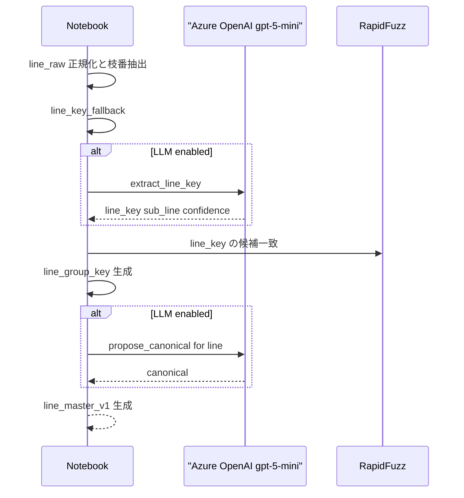
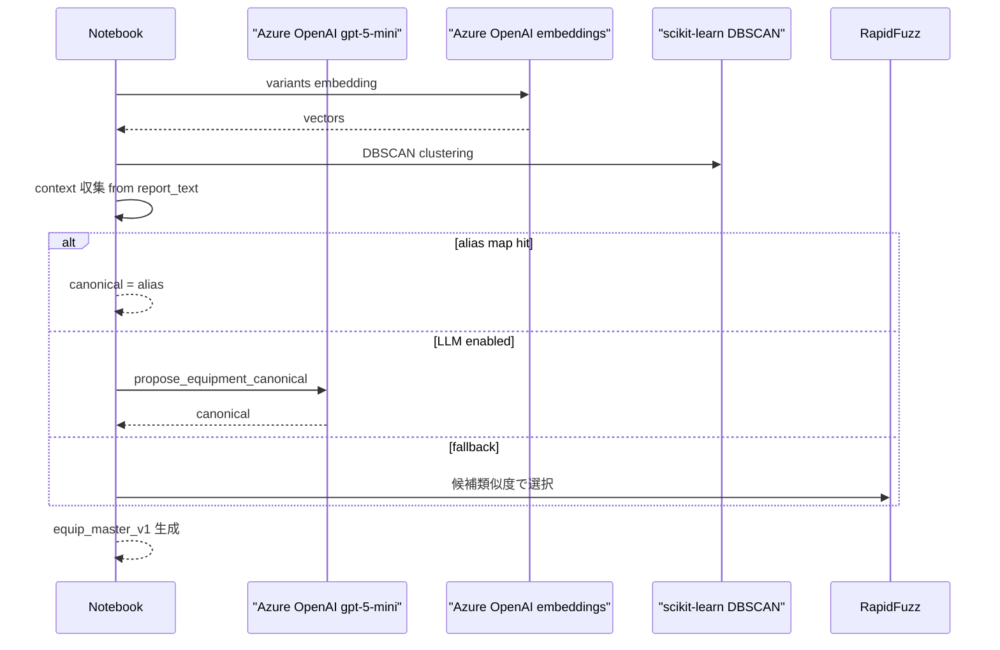
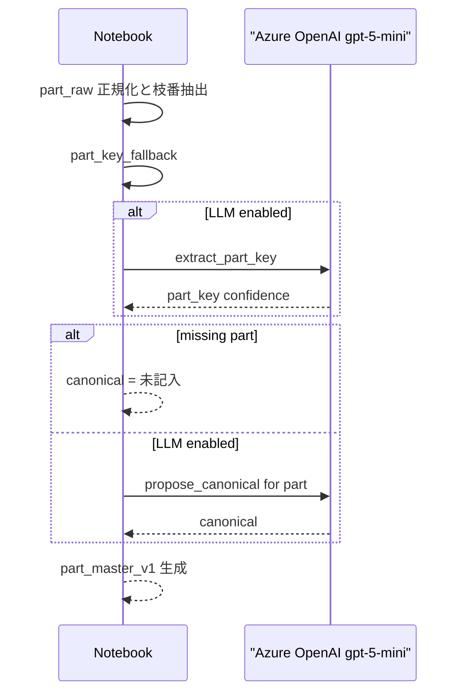

# フィジビリティ設計書: feasibility_master_generation_gpt5mini.ipynb

本資料は、ノートブック `feasibility_master_generation_gpt5mini.ipynb` の実装内容を詳細設計として整理したものです。
標準マスタ／標準辞書の自動生成、100件クレンジング、report_text の標準化を対象とします。

---

## 1. 目的とスコープ

### 1.1 目的
- 保全データの表記ゆれ・項目ずれを吸収し、標準マスタ／標準辞書を自動生成する。
- 100件データに対するクレンジング結果を可視化し、report_text の標準用語置換を実施する。

### 1.2 対象範囲
- マスタ生成（ライン/設備/部品）
- 標準辞書生成（現象/原因/処置）
- L1/L2/L3 タクソノミ生成（自動クラスタリング + LLM）
- report_text の標準用語置換（ローカル + LLM）
- 出力ファイル生成（CSV/JSON）

### 1.3 非対象
- UI 画面実装（Power Apps 画面側）
- 学習済みモデルの永続管理

---

## 2. 主要コンポーネント

| コンポーネント | 役割 | 入力 | 出力 | LLM/Embeddings |
| --- | --- | --- | --- | --- |
| データ生成 | サンプル100件の raw データ生成 | 乱数シード | `df` | なし |
| 項目ずれ補正 | symptom/cause/action の入替・欠落補正 | `*_raw`, `report_text_raw` | `*_fixed` | 任意 |
| マスタ生成 v1 | seed 10件から初期マスタ生成 | `line_raw/equipment_raw/part_raw` | `*_master_v1` | 任意 |
| マスタ拡張 v2 | 残り 90 件で拡張 | `rest` | `*_master_v2` | 条件付き（USE_LLM_FOR_MASTER & USE_AZURE_LLM） |
| 標準辞書生成 | raw 値から標準語・対応表を生成 | `*_fixed` | `dict_*` | あり |
| タクソノミ生成 | L1/L2/L3 を自動生成 | `standard_terms` | `taxonomy` | あり |
| report_text 標準化 | 用語置換 + LLM書き換え | `report_text_raw` | `report_text_std` | あり |
| 出力 | CSV/JSON へ保存 | DataFrame/Dict | ファイル群 | なし |

---

## 3. データモデル

### 3.1 ER 図（Mermaid）



### 3.2 主要データ構造

| 構造 | 主なフィールド | 備考 |
| --- | --- | --- |
| MasterEntry | `master_id`, `canonical`, `variants` | ライン/設備/部品で共通 |
| dict_* (JSON) | `standard_terms`, `mapping`, `taxonomy` | LLM で生成 |
| dict_* (CSV) | `standard`, `variants`, `related_terms`, `l1_list`... | UI/分析向け |
| term_category_map | `standard`, `l1`, `l2`, `l3`, `is_primary` | taxonomy 正規化 |
| cleansed_100 | raw/fixed/std/score/needs_review | 可視化用 |

---

## 4. 処理フロー

### 4.1 全体フロー図（Mermaid）



### 4.2 主処理ステップ詳細

| ステップ | 処理内容 | 主な関数/ロジック | 出力 |
| --- | --- | --- | --- |
| 1 | raw データ生成 | `sample_record`, `make_dirty` | `df` |
| 2 | 項目ずれ補正 | `fix_field_shift_rule` | `*_fixed` |
| 3 | v1 マスタ生成 | `build_line_master`, `build_equipment_master`, `build_part_master` | `*_master_v1` |
| 4 | v2 マスタ拡張 | `expand_*_master` | `*_master_v2` |
| 5 | 標準辞書生成 | `build_standard_dictionary` | `dict_*` |
| 6 | タクソノミ生成 | `build_taxonomy_from_terms` | `taxonomy` |
| 7 | クレンジング | `cleanse_with_master`, `cleanse_with_dict` | `*_std` |
| 8 | report_text 置換 | `standardize_report_text_value`, `apply_report_text_llm` | `report_text_std` |
| 9 | 出力 | CSV/JSON 書き出し | `out_feasibility/*` |

---

## 5. シーケンス図

### 5.1 標準辞書 + タクソノミ生成



### 5.2 report_text 標準化



### 5.3 ラインマスタ生成



### 5.4 設備マスタ生成



### 5.5 部品マスタ生成



### 5.6 マスタ拡張 v2（既存マスタへのマージ／新規追加）

```mermaid
sequenceDiagram
    participant NB as Notebook
    participant AOAI as "Azure OpenAI gpt-5-mini"
    participant RF as RapidFuzz
    participant EMB as "Azure OpenAI embeddings"
    participant SK as "scikit-learn DBSCAN"

    NB->>NB: rest から raw 値を抽出
    alt line_master_v1
        NB->>NB: line_key_fallback apply
        NB->>NB: NFKC 正規化 and 空白除去
        NB->>NB: Line と Dai を ライン と 第 に正規化
        NB->>NB: 括弧表記を統一 and 末尾括弧を除去
        NB->>NB: sub_line を括弧 or 末尾から抽出
        NB->>NB: 第N or ラインN or Nライン を検出
        NB->>NB: 充填 包装 塗装 組立 加工 検査 のキーワード補完
        alt LLM enabled
            NB->>AOAI: extract_line_key
            AOAI-->>NB: line_key sub_line confidence
        else LLM disabled
            NB-->>NB: fallback line_key sub_line を採用
        end
        NB->>NB: LINE_CANONICAL_THRESHOLD で候補補正
        NB->>NB: LINE_MERGE_SUBLINE 判定で枝番統合 or 付与
        NB->>NB: line_group_key で既存キー化
        alt LLM enabled
            NB->>AOAI: propose_canonical for line
            AOAI-->>NB: canonical
        else LLM disabled
            NB-->>NB: canonical は key または fallback を採用
        end
        NB-->>NB: 既存マスタにマージ
    end
    alt part_master_v1
        NB->>NB: part_key_fallback apply
        NB->>NB: raw 欠損なら PART_MISSING_KEY
        NB->>NB: 末尾 suffix を抽出
        NB->>NB: 空白除去 and 括弧統一
        NB->>NB: xN and Npcs Npc を除去
        NB->>NB: mm cm m pcs pc 個 本 枚 台 式 set sets を除去
        NB->>NB: 各種 類 一式 を除去
        NB->>NB: 長音 重複 末尾記号を正規化
        NB->>NB: KEEP_SUFFIX_FOR_PART 判定で suffix 付与
        NB->>NB: PART_ALIAS_MAP 優先で正規化
        alt LLM enabled
            NB->>AOAI: extract_part_key
            AOAI-->>NB: part_key confidence
        else LLM disabled
            NB-->>NB: fallback part_key を採用
        end
        NB->>NB: part_key で既存キー化
        alt LLM enabled
            NB->>AOAI: propose_canonical for part
            AOAI-->>NB: canonical
        else LLM disabled
            NB-->>NB: canonical は key または 未記入 を採用
        end
        NB-->>NB: 既存マスタにマージ
    end
    alt equipment_master_v1
        NB->>NB: raw suffix 抽出
        NB->>RF: 既存マスタ候補と類似度照合
        NB->>NB: suffix 一致のみ比較
        NB-->>NB: 閾値以上は variants へ追加
        NB-->>NB: 閾値未満は unmatched に追加
        NB->>EMB: unmatched embedding
        EMB-->>NB: vectors
        NB->>SK: DBSCAN clustering
        NB->>NB: cluster を suffix ごとに分割
        NB->>NB: report_text 文脈を収集
        NB->>NB: equipment_key_fallback apply
        NB->>NB: xN and Npcs Npc を除去
        NB->>NB: 末尾記号を正規化
        NB->>NB: KEEP_SUFFIX_FOR_EQUIPMENT 判定で suffix 付与
        NB->>NB: EQUIP_ALIAS_MAP 優先で正規化
        alt LLM enabled
            NB->>AOAI: propose_equipment_canonical
            AOAI-->>NB: canonical
        else LLM disabled
            NB-->>NB: 類似度で候補選択
        end
        NB-->>NB: 既存 or 新規として追加
    end
    NB-->>NB: *_master_v2 生成
```



---

## 6. アルゴリズム詳細

### 6.1 項目ずれ補正 (`*_fixed`)
- `symptom_raw/cause_raw/action_raw` をヒント語で分類
- `report_text_raw` から原因/処置/症状を抽出して補完
- 入替・補完が発生した場合 `shift_needs_review=True`

### 6.2 マスタ生成（ライン/設備/部品）
- **ライン**: `line_group_key` で枝番を含めたキーを作成（`LINE_MERGE_SUBLINE=False`）
- **設備/部品**: 表記のノイズ除去、alias map による正規化
- **設備**は文脈（report_text）も利用して canonical を選択
- LLM が使えない場合は文字列類似度でフォールバック

#### 6.2.1 文字列正規化ルール（代表例）

| 対象 | ルール | 例（入力） | 例（出力） | 備考 |
| --- | --- | --- | --- | --- |
| line | NFKC 正規化 + 空白除去 | `Dai 3  製造 Line` | `第3製造ライン` | `Line/linee` を `ライン` に統一 |
| line | `Dai/di` を `第` に正規化 | `Dai3製造Linne` | `第3製造ライン` | `Linee` 誤字も吸収 |
| line | 括弧表記を統一し末尾括弧を除去 | `第3製造ライン）` | `第3製造ライン` | 末尾の余分な括弧を除去 |
| line | sub_line 抽出 | `第3製造ライン(B)` | `line_key=第3製造ライン, sub_line=B` | sub_line は枝番として保持 |
| line | `LINE_MERGE_SUBLINE=False` | `第3製造ライン(B)` | `第3製造ラインB` | 枝番を統合せず保持 |
| line | キーワード補完 | `充填工程` | `充填ライン` | キーワード一覧で補完 |
| part | 単位/数量の除去 | `ボルト 10pcs` | `ボルト` | `pcs/pc/個/本/枚/台/式` など |
| part | サイズ情報除去 | `Oリング 5mm` | `Oリング` | `mm/cm/m` を除去 |
| part | 修飾語除去 | `各種パッキン` | `パッキン` | `各種/類/一式` を除去 |
| part | 重複文字の修正 | `パッッキン` | `パッキン` | 長音や重複の補正 |
| part | suffix の扱い | `ナット(A)` | `ナット` or `ナットA` | `KEEP_SUFFIX_FOR_PART` に依存 |
| equip | 数量/記号除去 | `制御盤(2 pcs)` | `制御盤` | `xN` や `pcs` を除去 |
| equip | suffix の扱い | `制御盤(B)` | `制御盤` or `制御盤B` | `KEEP_SUFFIX_FOR_EQUIPMENT` に依存 |
| equip | alias 優先 | `ｺﾝﾍﾞｱ` | `搬送コンベア` | `EQUIP_ALIAS_MAP` に一致 |
| part | 数量パターン除去 | `フィルタ×2` | `フィルタ` | `(?:x|×)\\d+` を除去 |
| part | 数量パターン除去 | `ギア2pc` | `ギア` | `\\d+pcs/pc` を除去 |
| part | 先頭語除去 | `各種ベルト` | `ベルト` | `^各種` を除去 |
| part | 末尾語除去 | `ボルト類` | `ボルト` | `類$` を除去 |
| part | 末尾語除去 | `ナット一式` | `ナット` | `一式$` を除去 |
| part | 長音正規化 | `ﾓｰｰﾀ` | `ﾓｰﾀ` | `ー{2,}` を単一化 |
| part | 末尾記号除去 | `ベルト-` | `ベルト` | `-_/` を除去 |
| equip | 数量パターン除去 | `モータx2` | `モータ` | `(?:x|×)\\d+` を除去 |
| equip | 数量パターン除去 | `制御盤 2pcs` | `制御盤` | `\\d+pcs/pc` を除去 |
| equip | 末尾記号除去 | `ポンプ__` | `ポンプ` | `-_/` を除去 |

#### 6.2.2 フォールバック関数の擬似コード

`line_key_fallback`
```text
function line_key_fallback(raw):
  if raw is None: return {line_key:"", sub_line:"", confidence:0.2}
  t = normalize_nfkc(raw)
  t = remove_spaces(t)
  t = replace(Line/linee -> ライン, Dai/di -> 第)
  t = strip_trailing_paren(t)
  sub_line = extract_parenthesis_or_suffix(t)
  t = remove_parenthesis(t)
  num = extract_number(第N or ラインN or Nライン)
  if num: line_key = "第{num}製造ライン"
  else if contains keyword(充填/包装/塗装/組立/加工/検査):
    line_key = "{keyword}ライン"
  else: line_key = t
  return {line_key, sub_line, confidence:0.3}
```

`part_key_fallback`
```text
function part_key_fallback(raw):
  if raw is None: return {part_key:"", confidence:0.2}
  t = strip_spaces_and_paren(raw)
  suffix = extract_suffix(t)
  base = remove_noise_part(t)   # xN, pcs/pc, mm/cm/m, 各種/類/一式, 長音補正
  if normalize(base) in PART_ALIAS_MAP:
    base = PART_ALIAS_MAP[normalize(base)]
  if KEEP_SUFFIX_FOR_PART and suffix: part_key = base + suffix
  else: part_key = base
  return {part_key, confidence:0.3}
```

`equipment_key_fallback`
```text
function equipment_key_fallback(raw):
  if raw is None: return {equip_key:"", confidence:0.2}
  t = remove_noise_equipment(raw)  # xN, pcs/pc, 末尾記号
  suffix = extract_suffix(raw)
  if normalize(t) in EQUIP_ALIAS_MAP:
    base = EQUIP_ALIAS_MAP[normalize(t)]
  else:
    base = t
  if KEEP_SUFFIX_FOR_EQUIPMENT and suffix: equip_key = base + suffix
  else: equip_key = base
  return {equip_key, confidence:0.3}
```

#### 6.2.3 正規表現一覧

| 対象 | 正規表現 | 意味/用途 | 例 |
| --- | --- | --- | --- |
| line | `\\s+` | 空白除去 | `Dai 3` → `Dai3` |
| line | `(?i)da?i` | `Dai/di` を `第` に正規化 | `Dai3` → `第3` |
| line | `\\([^)]+\\)` | 括弧内の sub_line 抽出 | `ライン(A)` → `A` |
| line | `([A-Za-z0-9]{1,3})$` | 末尾枝番抽出 | `ラインB` → `B` |
| line | `(ライン)([A-Za-z0-9]+)$` | 末尾枝番抽出 | `ライン12` → `12` |
| line | `第(\\d+)` | 製造ライン番号抽出 | `第3製造ライン` → `3` |
| line | `ライン(\\d+)` | 末尾数字抽出 | `ライン2` → `2` |
| line | `(\\d+)ライン` | 先頭数字抽出 | `3ライン` → `3` |
| part | `(?:x|×)\\s*\\d+` | 数量表記除去 | `フィルタ×2` → `フィルタ` |
| part | `\\b\\d+(?:\\.\\d+)?\\s*(mm|cm|m|pcs|pc|個|本|枚|台|式|set|sets)\\b` | サイズ/単位除去 | `Oリング 5mm` → `Oリング` |
| part | `\\b\\d+(?:pcs|pc)\\b` | 数量除去 | `ギア2pc` → `ギア` |
| part | `^各種` | 先頭語除去 | `各種ベルト` → `ベルト` |
| part | `類$` | 末尾語除去 | `ボルト類` → `ボルト` |
| part | `一式$` | 末尾語除去 | `ナット一式` → `ナット` |
| part | `ー{2,}` | 長音の単一化 | `ﾓｰｰﾀ` → `ﾓｰﾀ` |
| part | `[-_/ ]+$` | 末尾記号除去 | `ベルト-` → `ベルト` |
| equip | `(?:x|×)\\s*\\d+` | 数量表記除去 | `モータx2` → `モータ` |
| equip | `\\b\\d+(?:pcs|pc)\\b` | 数量除去 | `制御盤 2pcs` → `制御盤` |
| equip | `[-_/ ]+$` | 末尾記号除去 | `ポンプ__` → `ポンプ` |

#### 6.2.4 入力→出力 追加例

| 対象 | 入力 | 出力 | 補足 |
| --- | --- | --- | --- |
| line | `Dai2製造Line(B)` | `第2製造ラインB` | `sub_line` を枝番として保持 |
| line | `充填Linne` | `充填ライン` | `Linee` 誤字補正 |
| line | `第1製造ライン）` | `第1製造ライン` | 末尾括弧除去 |
| line | `検査工程` | `検査ライン` | キーワード補完 |
| part | `ベルト 2pcs` | `ベルト` | 数量除去 |
| part | `パッッキン(A)` | `パッキンA` or `パッキン` | suffix 保持設定に依存 |
| part | `各種Oリング 5mm` | `Oリング` | 先頭語 + サイズ除去 |
| part | `ボルト類` | `ボルト` | 末尾語除去 |
| part | `ギア×3` | `ギア` | 数量除去 |
| equip | `制御盤(B)` | `制御盤B` or `制御盤` | suffix 保持設定に依存 |
| equip | `油圧U(2 pcs)` | `油圧ユニット` | alias + 数量除去 |
| equip | `搬送ｺﾝﾍﾞｱ` | `搬送コンベア` | alias + 表記ゆれ吸収 |
| equip | `画像ｶﾒﾗ` | `画像検査カメラ` | alias map で正規化 |

### 6.3 標準辞書生成（現象/原因/処置）
- raw 値 → standard_terms / mapping を LLM で生成
- `related_terms` は以下を統合して構築
  - raw と standard の対応
  - 事前 variants（PHENOM/Cause/Action_VARIANTS）
  - LLM による補足語彙

### 6.4 タクソノミ生成（L1/L2/L3）
- standard_terms を埋め込み → DBSCAN でクラスタ
- L1 は候補から選択、該当なしは新規 L1 を生成
- L2/L3 はクラスタ内の代表語を LLM でラベリング

### 6.5 report_text 標準化
- **ローカル**: トークン化 + n-gram 候補 → Levenshtein/TF-IDF/Embedding で置換
- **LLM**: standard_terms のみに限定して自然文へ書換
- LLM 出力後も再度ローカル標準化で安全ガード

---

## 7. 設定・閾値一覧

| パラメータ | 値 | 目的 |
| --- | --- | --- |
| `USE_LLM_FOR_MASTER` | True | マスタ生成で LLM を使用 |
| `USE_LLM_FOR_DICT` | True | 辞書生成で LLM を使用 |
| `USE_LLM_FOR_REPORT_TEXT` | USE_AZURE_LLM | report_text 置換で LLM を使用 |
| `USE_LLM_FOR_SHIFT` | False | 項目ずれ補正を LLM 化 |
| `LINE_MERGE_SUBLINE` | False | 充填ライン/充填ラインB を分離 |
| `KEEP_SUFFIX_FOR_EQUIPMENT/PART` | False | 設備/部品の枝番除外 |
| `L2_CLUSTER_EPS` | 0.35 | L2 DBSCAN の近傍半径 |
| `L3_CLUSTER_EPS` | 0.25 | L3 DBSCAN の近傍半径 |
| `REPORT_TOKEN_MAX_N` | 4 | report_text の最大 n-gram |
| `REPORT_LEVENSHTEIN_THRESHOLD` | 92 | 置換許容の距離閾値 |
| `REPORT_TFIDF_THRESHOLD` | 0.9 | TF-IDF 類似閾値 |
| `REPORT_EMBED_THRESHOLD` | 0.9 | Embedding 類似閾値 |
| `REPORT_LLM_BATCH_SIZE` | 8 | report_text LLM 一括処理 |
| `related_terms_max` | 12 | related_terms の最大保持数 |

---

## 8. 利用ライブラリ / Azure サービス

### 8.1 Python ライブラリ

| ライブラリ | 役割 |
| --- | --- |
| pandas / numpy | データ処理 |
| rapidfuzz | 文字列類似度 (Levenshtein) |
| scikit-learn | TF-IDF, DBSCAN, cosine |
| openai (AzureOpenAI) | LLM/Embedding 連携 |

### 8.2 Azure サービス / モデル

| 要素 | 内容 |
| --- | --- |
| LLM | Azure OpenAI `gpt-5-mini` (デプロイ名) |
| Embedding | Azure OpenAI `text-embedding-3-small` |
| 接続情報 | `AZURE_OPENAI_ENDPOINT`, `AZURE_OPENAI_API_KEY` |

---

## 9. 出力ファイル一覧

| ファイル | 内容 | 主な列 |
| --- | --- | --- |
| `out_feasibility/sample_dirty_100.csv` | raw 100件 | `*_raw`, `report_text_raw` |
| `out_feasibility/cleansed_100.csv` | クレンジング結果 | raw/fixed/std/score/review |
| `out_feasibility/master_v2_line.csv` | ラインマスタ | `master_id`, `canonical`, `variants` |
| `out_feasibility/master_v2_equipment.csv` | 設備マスタ | 同上 |
| `out_feasibility/master_v2_part.csv` | 部品マスタ | 同上 |
| `out_feasibility/dict_symptom.json` | 標準辞書 (現象) | mapping + taxonomy |
| `out_feasibility/dict_cause.json` | 標準辞書 (原因) | mapping + taxonomy |
| `out_feasibility/dict_action.json` | 標準辞書 (処置) | mapping + taxonomy |
| `out_feasibility/dict_symptom.csv` | 標準辞書 (現象) | standard/variants/related_terms/L1-L3 |
| `out_feasibility/dict_cause.csv` | 標準辞書 (原因) | 同上 |
| `out_feasibility/dict_action.csv` | 標準辞書 (処置) | 同上 |
| `out_feasibility/term_category_map.csv` | taxonomy 正規化 | standard/l1/l2/l3 |

---

## 10. cleansed_100.csv 主要列

| カテゴリ | 列 | 補足 |
| --- | --- | --- |
| raw | `line_raw` `equipment_raw` `part_raw` `symptom_raw` `cause_raw` `action_raw` | 入力値 |
| fixed | `symptom_fixed` `cause_fixed` `action_fixed` | 項目ずれ補正結果 |
| std | `line_std` `equipment_std` `part_std` `symptom_std` `cause_std` `action_std` | 標準化結果 |
| ID/評価 | `*_id` `*_score` `*_needs_review` | マスタ一致スコア |
| report | `report_text_raw` `report_text_std` | 自由記述置換 |

---

## 11. 運用拡張ポイント

| 目的 | 方針 |
| --- | --- |
| L1/L2/L3 の拡張 | データ駆動で毎回自動生成し、候補外は新規 L1 を許容 |
| related_terms の拡張 | raw + variants + LLM で自動補完 |
| report_text 精度向上 | row_terms 制約を緩める or LLM の候補拡張 |
| UI 連携 | `dict_*.csv` と `term_category_map.csv` を標準語辞書画面のマスタに利用 |
