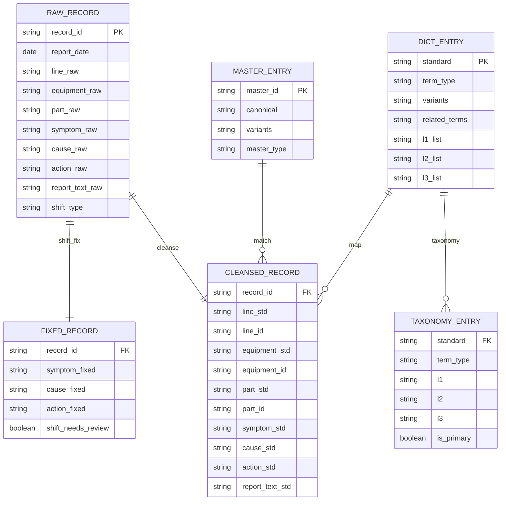
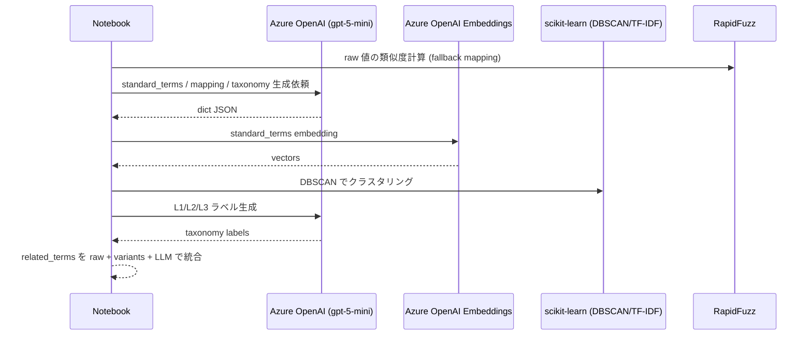
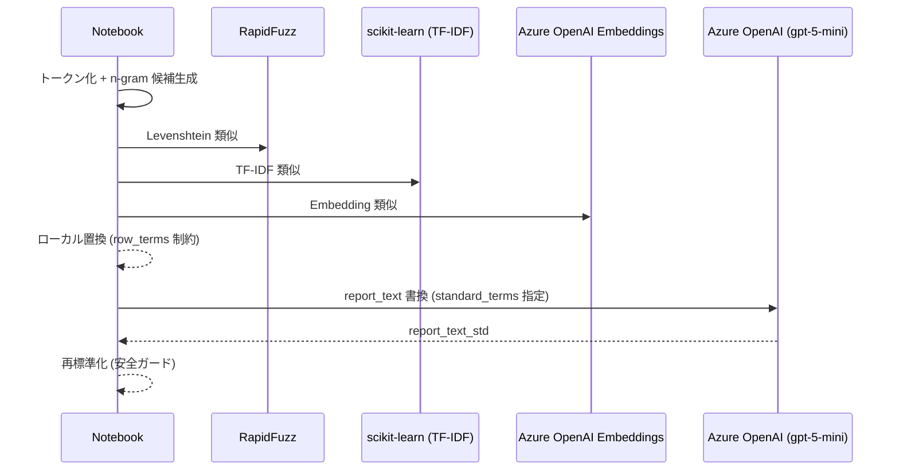

# フィジビリティ設計書: feasibility_master_generation_gpt5mini.ipynb

本資料は、ノートブック `feasibility_master_generation_gpt5mini.ipynb` の実装内容を詳細設計として整理したものです。
標準マスタ／標準辞書の自動生成、100件クレンジング、report_text の標準化を対象とします。

---

## 1. 目的とスコープ

### 1.1 目的
- 保全データの表記ゆれ・項目ずれを吸収し、標準マスタ／標準辞書を自動生成する。
- 100件データに対するクレンジング結果を可視化し、report_text の標準用語置換を実施する。

### 1.2 対象範囲
- マスタ生成（ライン/設備/部品）
- 標準辞書生成（現象/原因/処置）
- L1/L2/L3 タクソノミ生成（自動クラスタリング + LLM）
- report_text の標準用語置換（ローカル + LLM）
- 出力ファイル生成（CSV/JSON）

### 1.3 非対象
- UI 画面実装（Power Apps 画面側）
- 学習済みモデルの永続管理

---

## 2. 主要コンポーネント

| コンポーネント | 役割 | 入力 | 出力 | LLM/Embeddings |
| --- | --- | --- | --- | --- |
| データ生成 | サンプル100件の raw データ生成 | 乱数シード | `df` | なし |
| 項目ずれ補正 | symptom/cause/action の入替・欠落補正 | `*_raw`, `report_text_raw` | `*_fixed` | 任意 |
| マスタ生成 v1 | seed 10件から初期マスタ生成 | `line_raw/equipment_raw/part_raw` | `*_master_v1` | 任意 |
| マスタ拡張 v2 | 残り 90 件で拡張 | `rest` | `*_master_v2` | なし |
| 標準辞書生成 | raw 値から標準語・対応表を生成 | `*_fixed` | `dict_*` | あり |
| タクソノミ生成 | L1/L2/L3 を自動生成 | `standard_terms` | `taxonomy` | あり |
| report_text 標準化 | 用語置換 + LLM書き換え | `report_text_raw` | `report_text_std` | あり |
| 出力 | CSV/JSON へ保存 | DataFrame/Dict | ファイル群 | なし |

---

## 3. データモデル

### 3.1 ER 図（Mermaid）



### 3.2 主要データ構造

| 構造 | 主なフィールド | 備考 |
| --- | --- | --- |
| MasterEntry | `master_id`, `canonical`, `variants` | ライン/設備/部品で共通 |
| dict_* (JSON) | `standard_terms`, `mapping`, `taxonomy` | LLM で生成 |
| dict_* (CSV) | `standard`, `variants`, `related_terms`, `l1_list`... | UI/分析向け |
| term_category_map | `standard`, `l1`, `l2`, `l3`, `is_primary` | taxonomy 正規化 |
| cleansed_100 | raw/fixed/std/score/needs_review | 可視化用 |

---

## 4. 処理フロー

### 4.1 全体フロー図（Mermaid）

```mermaid
flowchart TD
    A[rawデータ生成/取り込み] --> B[項目ずれ補正 (_fixed)]
    B --> C[seed抽出(10件)]
    C --> D[マスタ生成 v1]
    B --> E[残り90件]
    D --> F[マスタ拡張 v2]
    F --> G[マスタ正規化]
    B --> H[標準辞書生成]
    H --> I[タクソノミ生成 L1/L2/L3]
    G --> J[マスタでクレンジング]
    H --> K[辞書でクレンジング]
    J --> L[report_text ローカル置換]
    K --> L
    L --> M[LLM で report_text 書換]
    M --> N[CSV/JSON 出力]

    subgraph AzureOpenAI
        H
        I
        M
    end
```

### 4.2 主処理ステップ詳細

| ステップ | 処理内容 | 主な関数/ロジック | 出力 |
| --- | --- | --- | --- |
| 1 | raw データ生成 | `sample_record`, `make_dirty` | `df` |
| 2 | 項目ずれ補正 | `fix_field_shift_rule` | `*_fixed` |
| 3 | v1 マスタ生成 | `build_line_master`, `build_equipment_master`, `build_part_master` | `*_master_v1` |
| 4 | v2 マスタ拡張 | `expand_*_master` | `*_master_v2` |
| 5 | 標準辞書生成 | `build_standard_dictionary` | `dict_*` |
| 6 | タクソノミ生成 | `build_taxonomy_from_terms` | `taxonomy` |
| 7 | クレンジング | `cleanse_with_master`, `cleanse_with_dict` | `*_std` |
| 8 | report_text 置換 | `standardize_report_text_value`, `apply_report_text_llm` | `report_text_std` |
| 9 | 出力 | CSV/JSON 書き出し | `out_feasibility/*` |

---

## 5. シーケンス図

### 5.1 標準辞書 + タクソノミ生成



### 5.2 report_text 標準化



---

## 6. アルゴリズム詳細

### 6.1 項目ずれ補正 (`*_fixed`)
- `symptom_raw/cause_raw/action_raw` をヒント語で分類
- `report_text_raw` から原因/処置/症状を抽出して補完
- 入替・補完が発生した場合 `shift_needs_review=True`

### 6.2 マスタ生成（ライン/設備/部品）
- **ライン**: `line_group_key` で枝番を含めたキーを作成（`LINE_MERGE_SUBLINE=False`）
- **設備/部品**: 表記のノイズ除去、alias map による正規化
- **設備**は文脈（report_text）も利用して canonical を選択
- LLM が使えない場合は文字列類似度でフォールバック

### 6.3 標準辞書生成（現象/原因/処置）
- raw 値 → standard_terms / mapping を LLM で生成
- `related_terms` は以下を統合して構築
  - raw と standard の対応
  - 事前 variants（PHENOM/Cause/Action_VARIANTS）
  - LLM による補足語彙

### 6.4 タクソノミ生成（L1/L2/L3）
- standard_terms を埋め込み → DBSCAN でクラスタ
- L1 は候補から選択、該当なしは新規 L1 を生成
- L2/L3 はクラスタ内の代表語を LLM でラベリング

### 6.5 report_text 標準化
- **ローカル**: トークン化 + n-gram 候補 → Levenshtein/TF-IDF/Embedding で置換
- **LLM**: standard_terms のみに限定して自然文へ書換
- LLM 出力後も再度ローカル標準化で安全ガード

---

## 7. 設定・閾値一覧

| パラメータ | 値 | 目的 |
| --- | --- | --- |
| `USE_LLM_FOR_MASTER` | True | マスタ生成で LLM を使用 |
| `USE_LLM_FOR_DICT` | True | 辞書生成で LLM を使用 |
| `USE_LLM_FOR_REPORT_TEXT` | USE_AZURE_LLM | report_text 置換で LLM を使用 |
| `USE_LLM_FOR_SHIFT` | False | 項目ずれ補正を LLM 化 |
| `LINE_MERGE_SUBLINE` | False | 充填ライン/充填ラインB を分離 |
| `KEEP_SUFFIX_FOR_EQUIPMENT/PART` | False | 設備/部品の枝番除外 |
| `L2_CLUSTER_EPS` | 0.35 | L2 DBSCAN の近傍半径 |
| `L3_CLUSTER_EPS` | 0.25 | L3 DBSCAN の近傍半径 |
| `REPORT_TOKEN_MAX_N` | 4 | report_text の最大 n-gram |
| `REPORT_LEVENSHTEIN_THRESHOLD` | 92 | 置換許容の距離閾値 |
| `REPORT_TFIDF_THRESHOLD` | 0.9 | TF-IDF 類似閾値 |
| `REPORT_EMBED_THRESHOLD` | 0.9 | Embedding 類似閾値 |
| `REPORT_LLM_BATCH_SIZE` | 8 | report_text LLM 一括処理 |
| `related_terms_max` | 12 | related_terms の最大保持数 |

---

## 8. 利用ライブラリ / Azure サービス

### 8.1 Python ライブラリ

| ライブラリ | 役割 |
| --- | --- |
| pandas / numpy | データ処理 |
| rapidfuzz | 文字列類似度 (Levenshtein) |
| scikit-learn | TF-IDF, DBSCAN, cosine |
| openai (AzureOpenAI) | LLM/Embedding 連携 |

### 8.2 Azure サービス / モデル

| 要素 | 内容 |
| --- | --- |
| LLM | Azure OpenAI `gpt-5-mini` (デプロイ名) |
| Embedding | Azure OpenAI `text-embedding-3-small` |
| 接続情報 | `AZURE_OPENAI_ENDPOINT`, `AZURE_OPENAI_API_KEY` |

---

## 9. 出力ファイル一覧

| ファイル | 内容 | 主な列 |
| --- | --- | --- |
| `out_feasibility/sample_dirty_100.csv` | raw 100件 | `*_raw`, `report_text_raw` |
| `out_feasibility/cleansed_100.csv` | クレンジング結果 | raw/fixed/std/score/review |
| `out_feasibility/master_v2_line.csv` | ラインマスタ | `master_id`, `canonical`, `variants` |
| `out_feasibility/master_v2_equipment.csv` | 設備マスタ | 同上 |
| `out_feasibility/master_v2_part.csv` | 部品マスタ | 同上 |
| `out_feasibility/dict_symptom.json` | 標準辞書 (現象) | mapping + taxonomy |
| `out_feasibility/dict_cause.json` | 標準辞書 (原因) | mapping + taxonomy |
| `out_feasibility/dict_action.json` | 標準辞書 (処置) | mapping + taxonomy |
| `out_feasibility/dict_symptom.csv` | 標準辞書 (現象) | standard/variants/related_terms/L1-L3 |
| `out_feasibility/dict_cause.csv` | 標準辞書 (原因) | 同上 |
| `out_feasibility/dict_action.csv` | 標準辞書 (処置) | 同上 |
| `out_feasibility/term_category_map.csv` | taxonomy 正規化 | standard/l1/l2/l3 |

---

## 10. cleansed_100.csv 主要列

| カテゴリ | 列 | 補足 |
| --- | --- | --- |
| raw | `line_raw` `equipment_raw` `part_raw` `symptom_raw` `cause_raw` `action_raw` | 入力値 |
| fixed | `symptom_fixed` `cause_fixed` `action_fixed` | 項目ずれ補正結果 |
| std | `line_std` `equipment_std` `part_std` `symptom_std` `cause_std` `action_std` | 標準化結果 |
| ID/評価 | `*_id` `*_score` `*_needs_review` | マスタ一致スコア |
| report | `report_text_raw` `report_text_std` | 自由記述置換 |

---

## 11. 運用拡張ポイント

| 目的 | 方針 |
| --- | --- |
| L1/L2/L3 の拡張 | データ駆動で毎回自動生成し、候補外は新規 L1 を許容 |
| related_terms の拡張 | raw + variants + LLM で自動補完 |
| report_text 精度向上 | row_terms 制約を緩める or LLM の候補拡張 |
| UI 連携 | `dict_*.csv` と `term_category_map.csv` を標準語辞書画面のマスタに利用 |

