# 保全業務DXおよび既存データ資産化プロジェクト 提案書

---

## 目次

1. タイトル  
2. 本日のアジェンダ  
3. プロジェクト背景（弊社理解）  
4. ご提案サマリ（3つの柱）  
5. 現状の課題：負の連鎖（Vicious Cycle）  
6. 技術アプローチの全体像（LLM主導：3フロー構成）  
7. 提案要旨①の詳細：AIクレンジング＆マスタ自動生成  
8. アルゴリズム詳細①：ラインマスタ（文字列距離＋LLM）  
9. アルゴリズム詳細②：設備・部品マスタ（LLM＋Embedding＋Pythonクラスタリング）  
10. アルゴリズム詳細③：分類マスタ・標準用語辞書  
11. 提案要旨②の詳細：RAG検索＆AI入力支援アプリ（Power Automate中心）  
12. 提案要旨③の詳細：  
    「少し試す → 確かめる → 全体に広げる」と  
    マスタ／保全データを“育てる”運用  
13. 「育てる」① 初期構築でマスタを育てる（10％ → 90％）  
14. 「育てる」② 運用しながらマスタを育てる  
15. 「育てる」③ 運用しながら保全報告データを育てる  
16. システムアーキテクチャ（バッチ基盤と運用基盤の分離）  
17. Power Platform ライセンス選択ガイド  
18. プロジェクトロードマップ（3ヶ月）  
19. 概算費用とROI（投資対効果）  
20. 将来の発展イメージ（本スコープ外：予防保全）  
21. 次のアクション（Next Steps）  
22. 体制とDATUM STUDIOの強み  
23. Appendix：技術メンバー向け詳細フロー  

---

# 1. タイトル

**タイトル**  
保全業務DXおよび既存データ資産化プロジェクトのご提案  

**サブタイトル**  
Power Platform × Generative AI (GPT-5) による「ナレッジ駆動型保全」への変革  

**宛名**  
いすゞ自動車株式会社 御中  

**日付**  
2026年1月  

**提案者**  
DATUM STUDIO  

---

# 2. 本日のアジェンダ

1. プロジェクト背景とご提案サマリ  
2. 現状の課題：「負の連鎖」と23万件データの状態  
3. 技術アプローチの全体像（LLM主導：3フロー構成）  
4. 提案要旨①：AIクレンジング＆マスタ自動生成の詳細  
5. 提案要旨②：RAG検索＆AI入力支援アプリの詳細  
6. 提案要旨③：「少し試す → 確かめる → 全体に広げる」と“育てる”運用  
7. システムアーキテクチャ  
8. ライセンス・ロードマップ・概算費用とROI  
9. 将来の発展イメージ（予防保全）  
10. 次のアクション／体制  

---

# 3. プロジェクト背景（弊社理解）

## 3-1. ヘッダーメッセージ

> 「23万件の埋蔵データの資産化」と「現場入力業務の高度化」の課題に対し、  
> Azure OpenAI × Power Platform による保全ナレッジDX基盤の構築を提案する。  
> 生成AIによるデータクレンジングの自動化と、検索・入力支援アプリの実装により、  
> 現場の負荷を増やさずに高品質な保全データを継続的に蓄積できる仕組みを実現する。

## 3-2. 現状の理解

- 既存の**保全履歴23万件**は、すでにCSVおよびDBとして構造化されている。  
- しかし、以下のような**品質課題**が存在している。  
  - 表記揺れ（例：モータ／モーター／Mtr）  
  - 略語・誤字・俗語  
  - 項目のズレ（原因欄に処置内容が入っている 等）  
- このため、現状のままでは**検索や分析に耐えない**状態となっている。  
- 全件を人手で修正した場合、  
  - 23万件 × 5分/件 = 約19,000時間  
  - 現場のリソースでは事実上対応不可能な規模である。  

---

# 4. ご提案サマリ（3つの柱）

## 4-1. 提案要旨①  
### AIクレンジング＆マスタ自動生成による「23万件の一括資産化」

- GPT-5を用いた構造化・補正エンジンと、Python（Scikit-learn）によるクラスタリング・名寄せロジックを組み合わせる。  
- 既存23万件の保全データから、  
  - ラインマスタ  
  - 設備・部品マスタ  
  - 現象・原因・処置マスタ  
  - 標準用語辞書（略語・表記揺れ → 正式名称）  
  を自動生成し、これを用いて全件をクレンジングする。  
- 約19,000時間相当の人手作業をAIで代替し、データを「資産」として再利用可能な状態にする。  

**位置づけ：**  
蓄積済みの23万件を一気に整える、**「過去（Stock）の資産化」**の施策。

## 4-2. 提案要旨②  
### RAG検索＆AI入力支援アプリによる「勝手に整うデータ運用」

- Power Apps上に、Azure OpenAIと連携した保全アプリを構築する。  
- 現場担当者は「日本語で素直に入力」するだけで、  
  - 過去の類似事例の提示（RAG検索）  
  - 標準用語への変換サジェスト  
  - 現象／原因／処置などへの自動振り分け  
  - 不足情報の指摘・質問  
  が自動的に行われる。  
- 結果として、**「現場が楽になればなるほど、データが勝手に整っていく」**運用サイクルを実現する。  

**位置づけ：**  
日々の入力・検索の負荷を下げながら、良質なデータを継続的に生む、**「今後の運用（Flow）の効率化」**の施策。

## 4-3. 提案要旨③  
### 「少し試す → 確かめる → 全体に広げる」と  
### マスタ／保全データを少しずつ“育てる”運用設計

- いきなり全自動ではなく、以下の3段階で進める構成とする。  
  1. **少し試す**：データの約10％を用いて、AIがマスタのたたき台を自動生成。  
  2. **確かめる**：たたき台だけ人が確認・修正し、初期マスタとして確定。  
  3. **全体に広げる**：残り90％をクレンジングしながら、未知の設備・事象をマスタに追加。  
- 運用フェーズでは、  
  - 新しい設備や現象が出てきた際のマスタへの追加  
  - 類似案件検索のタイミングでの“ついで補正”  
  を通じて、**マスタと保全報告データの双方を運用の中で継続的に育てる**。

**位置づけ：**  
データとマスタを少しずつ磨き上げることで、将来的な予防保全や高度分析にもつながる**「Future」への橋渡し**となる運用設計。

---

# 5. 現状の課題：負の連鎖（Vicious Cycle）

## 5-1. 顧客のペイン

> 「データを使って業務を効率化したいが、検索しても過去の類似事象がヒットしない。  
>  結果として入力の手間も減らず、ナレッジも活用できない。」

## 5-2. 負の連鎖のメカニズム

1. 過去データに表記揺れ・項目ズレ・欠損が多く、検索してもヒットしない。  
2. データ整備には約19,000時間が必要であり、現場では工数を確保できない。  
3. 整備が後回しになる中、日々の業務で新たな揺らぎデータが蓄積し続ける。  
4. 時間が経つほど「データ量は増えるが、活用は難しくなる」状況に陥っている。  

## 5-3. 「約19,000時間の壁」

- 23万件 × 5分/件 ≒ 約19,000時間という、人手では現実的に超えられない工数が「壁」となり、データ活用を阻んでいる。  
- この壁を、人を増やすのではなく、AIという仮想労働力で乗り越えることが本プロジェクトのポイントである。  

## 5-4. 解決の方向性

- 足りていないのは「やる気」ではなく「工数」である。  
- 必要な約19,000時間分を、GPT-5という**仮想労働力**によって肩代わりすることで、負の連鎖と「約19,000時間の壁」を同時に突破する。  

---

# 6. 技術アプローチの全体像（LLM主導：3フロー構成）

## 6-1. 全体構成

本提案における処理フローは、次の3つの層で構成される。

1. **バッチ1：マスタ初期生成バッチ（10％サンプル）**  
2. **バッチ2：初期データクレンジングバッチ（23万件全件）**  
3. **運用フロー：AI入力補助付き保全データ登録（オンライン）**  

これらを、**2つの技術基盤**に分けて実装します。

- **データ整備バッチ基盤（Backend for Setup）**  
  - Azure Functions (Python) 上で動作。  
  - Scikit-learn によるクラスタリング（DBSCAN/KMeans等）、  
    Levenshtein距離計算、Pandasによる集計など、  
    計算量の大きい処理を一括実行する役割。  

- **運用アプリケーション基盤（Runtime）**  
  - Power Apps ＋ Power Automate を中心に構成。  
  - Power Automate から直接  
    - Azure OpenAI（HTTPコネクタ）  
    - Azure AI Search（コネクタ）  
    を呼び出し、**Pythonランタイムを運用時には使わない**構成とする。  

## 6-2. 処理フローのイメージ（テキスト図）

```text
[既存保全DB (23万件)]
        |
        | ① 10% サンプル抽出
        v
[バッチ1：マスタ初期生成 (Azure Functions / Python + Scikit-learn)]
        |
        v
[初期マスタ + 標準用語辞書]
        |
        | ② 全件クレンジング
        v
[バッチ2：クレンジングバッチ (Azure Functions / Python)]
        |
        +--> [クレンジング済DB (Dataverse)]
        |
        +--> [要確認フラグ付きデータ]
        |
        +--> [マスタ追加候補リスト]

日々の運用:
  現場作業員
        |
        v
  [保全アプリ (Power Apps)]
        |
        v
  [Power Automate]
        |
        +--> Azure OpenAI (構造化・補正・サジェスト)
        +--> Azure AI Search (RAG検索)
        +--> Dataverse (保全DB/マスタ/辞書の更新)
```

## 6-3. この構成によるメリット

- **コスト最適化**  
  - 重いPython処理（クラスタリングなど）は、初期構築や再学習時の**バッチ**に限定。  
  - 日常運用では Power Platform + Azure OpenAI / AI Search の従量課金のみで動作し、  
    常時稼働のFunctionsやPython環境の運用コストを抑制できる。  

- **保守性・内製化のしやすさ**  
  - 現場での仕様変更・画面改修は、主に Power Apps / Power Automate のローコード開発で完結。  
  - Pythonコードに触るのは「マスタ生成ロジックの見直し」など限定的な場面に絞られるため、  
    内製チームでもキャッチアップしやすい。  

- **処理性能の確保**  
  - 23万件のクラスタリング・名寄せ等は、  
    Azure Functions 上で Scikit-learn や各種数値計算ライブラリをフル活用することで、  
    精度と速度のバランスを確保できる。  

---

# 7. 提案要旨①の詳細：AIクレンジング＆マスタ自動生成

## 7-1. 目的

- 既存23万件の保全データを、短期間で「検索・分析・入力支援に耐える品質」に引き上げる。  
- そのために、  
  - 各種マスタ（ライン／設備／部品／現象／原因／処置）  
  - 標準用語辞書（略語や揺らぎ → 正式名称）  
  を生成AIとPythonベースの分析ロジックで自動生成し、  
  これらを用いて一括クレンジングを行う。  

## 7-2. 処理フローのイメージ（テキスト図）

```text
STEP1: サンプル抽出 (約10%)
    既存DB 23万件 → 代表性のある約10%を抽出

STEP2: サンプルからマスタのたたき台を自動生成
    ・Azure Functions (Python) から Azure OpenAI に
      テキストのベクトル化(Embedding)を依頼
    ・返却されたベクトルを Python + Scikit-learn でクラスタリング
    ・クラスタごとに GPT-5 に名称・代表語・別名リストの案を生成させる

STEP3: たたき台マスタを人が確認
    担当者 → クラスタ単位で名称を確認・微修正
           → 初期マスタとして確定

STEP4: 確定マスタを用いて23万件を一括クレンジング
    ・Azure Functions (Python) がレコードを1件ずつ読み込み
    ・GPT-5 に構造化・補正を依頼（項目ズレ修正・表記揺れ標準化）
    ・信頼度の低いものは「要確認フラグ」を付与

STEP5: 結果をクレンジング済DBとして保存
    ・検索・分析・RAG用のベースデータ
    ・要確認データは運用フェーズで少しずつ補正
```

## 7-3. シーケンス図（バッチ1＋バッチ2の全体像）

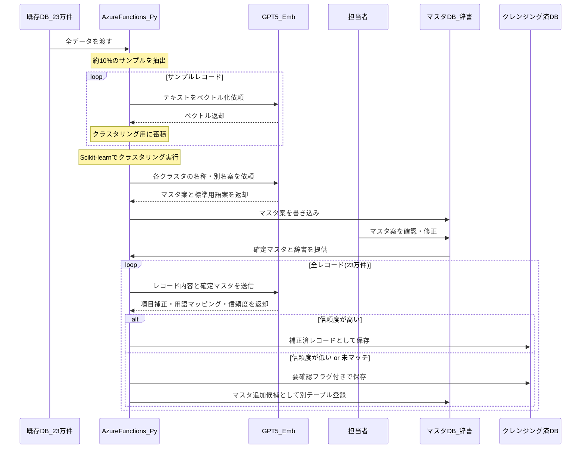

---

# 8. アルゴリズム詳細①：ラインマスタ（文字列距離＋LLM）

## 8-1. 目的

- 「Aライン」「A-Line」「Line A」などの表記揺れを1つのラインとして扱えるようにする。  
- ライン名は「意味」よりも「記号としての違い」が重要であるため、  
  Embeddingよりも**文字列距離（Levenshtein）**を主軸としたアプローチを採用する。  

## 8-2. 処理フローのイメージ（テキスト図）

```text
1) ライン名候補を既存DBから抽出 (Azure Functions / Python)
2) 全角/半角・英大文字/小文字・記号などを正規化
3) PythonでLevenshtein距離を計算し、距離の近いものをグルーピング
   例) "Aライン" と "A-Line" は同じグループ
4) 各グループの中身をGPT-5に渡し、
   ・代表となる正式名称
   ・その他の別名
   を決定
5) 「ラインマスタ」および
   「別名 → 正式名称」の辞書として保存
```

## 8-3. シーケンス図（ラインマスタ生成）

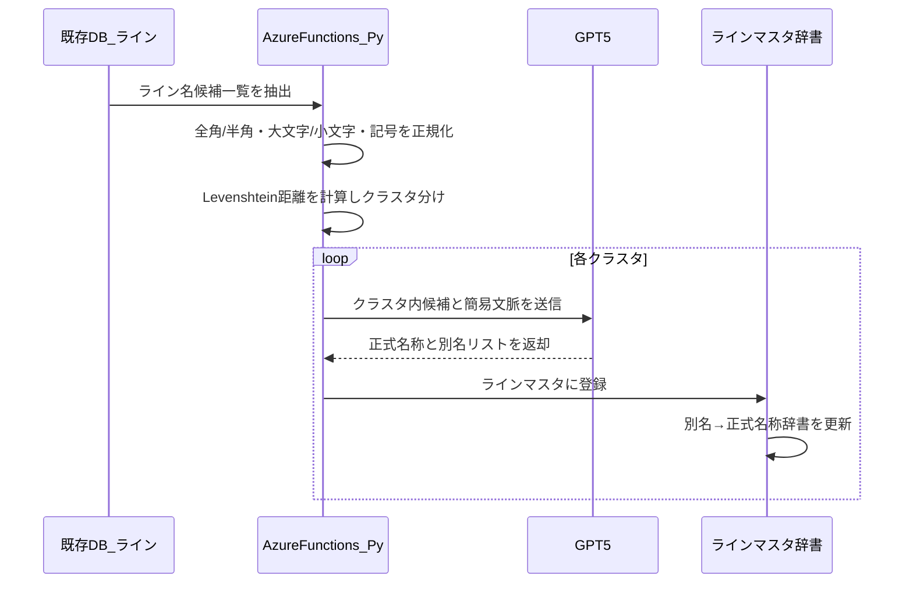

---

# 9. アルゴリズム詳細②：設備・部品マスタ  
## （LLM＋Embedding＋Pythonクラスタリング）

## 9-1. 目的

- 記録の中から「設備」「部品」を抽出し、  
  - 設備マスタ  
  - 部品マスタ  
  - 設備 ＞ 部品の階層関係  
  を構造化して定義する。  

## 9-2. 処理フローのイメージ（テキスト図）

```text
1) レコードから「設備名・部品名」を含むテキストを抽出
   (Azure Functions / Python)
2) GPT-5で、
   「設備」「部品」「部位」などの候補を抽出
3) 抽出された用語を Azure OpenAI Embeddings でベクトル化
4) Azure Functions (Python + Scikit-learn) で
   DBSCAN / KMeans によるクラスタリング
   例) 「CV-1」「1号コンベア」など
5) クラスタごとにGPT-5が
   ・標準設備名
   ・標準部品名
   ・設備と部品の親子関係
   を決定
6) 設備マスタ・部品マスタとして保存
```

## 9-3. シーケンス図（設備・部品マスタ）

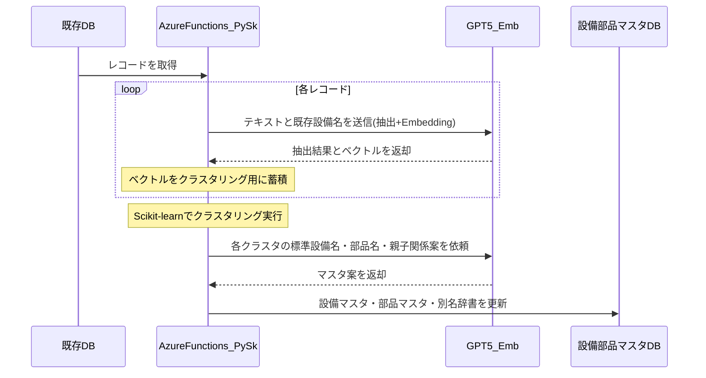

---

# 10. アルゴリズム詳細③：分類マスタ・標準用語辞書

## 10-1. 目的

- 現象・原因・処置を  
  - 大分類  
  - 中分類  
  - 小分類  
  の階層に整理し、分析や検索に利用しやすい形にする。  
- 略語・俗語・表記揺れを標準用語にまとめる辞書を生成する。  

## 10-2. 処理フローのイメージ（テキスト図）

```text
1) クレンジング候補データから
   「現象」「原因」「処置」テキストを抽出 (Python)
2) GPT-5で各テキストを解析し、
   現象/原因/処置の候補ラベルを付与
3) 用語を Azure OpenAI Embeddings でベクトル化
4) Azure Functions (Python + Scikit-learn) でクラスタリング
5) 各クラスタごとにGPT-5が、
   ・大分類
   ・中分類
   ・小分類
   を一括生成
6) 同じ意味の単語 (例: Mtr, モータ, Motor) を、
   標準用語へのマッピングとして整理
7) 分類マスタ・標準用語辞書として保存
```

## 10-3. シーケンス図（分類マスタ・辞書）

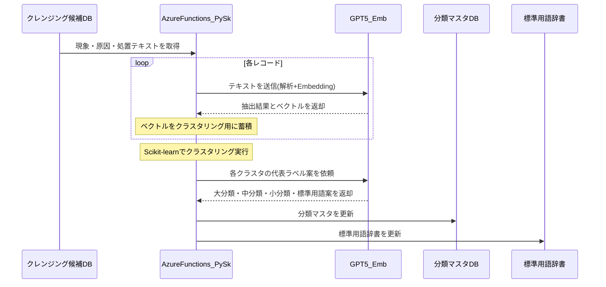

## 10-4. 技術的補足：なぜMeCab / SudachiではなくLLMか

- MeCabやSudachiは、「単語を区切る」こと（形態素解析）は得意ですが、今回必要となる  
  - 項目のズレ（原因欄に処置が入っている等）の修正  
  - 略語・誤記を文脈から補正する処理  
  を単独では行うことができない。  
- また、現場特有の略語・俗語・品番をすべて辞書登録するには、事前に多大な人手が必要となり、  
  「人手をかけずに整える」という本プロジェクトの方向性と相反する。  
- そのため、  
  - **「文脈を理解して、どの項目に何を入れるべきかを判断する」部分はLLM（GPT-5）**  
  - **ベクトル化結果のクラスタリングや距離計算は、Azure Functions上のPython + Scikit-learnで実施**  
  - **全文検索エンジン内部での日本語分かち書きには、MeCab相当の技術（Azure AI Search側）**  
  という役割分担を前提とした設計としている。  

---

# 11. 提案要旨②の詳細：RAG検索＆AI入力支援アプリ  
## （Power Automate中心・Functionsレス構成）

## 11-1. 目的

- 現場作業員が、  
  - 過去の類似案件  
  - 関連マニュアル  
  をすぐに参照できるようにし、復旧時間を短縮する。  
- 同時に、入力作業を軽くしながら、  
  高品質で標準化されたデータを自動的に蓄積する。  

## 11-2. 処理フローのイメージ（テキスト図）

```text
1) 現場作業員が、タブレット等から現象・対応内容を自由入力
2) 保全アプリ (Power Apps) から Power Automate を起動
3) Power Automate が Azure OpenAI (HTTPコネクタ) に対して、
   ・入力文の構造化
   ・標準用語辞書に基づく揺らぎの補正
   ・不足情報の抽出
   を依頼
4) Power Automate が Azure AI Search (コネクタ) に対して、
   ・ベクトル検索
   ・キーワード検索
   を実行し、類似案件を取得
5) Power Automate が、
   ・構造化結果
   ・標準用語変換案
   ・類似案件一覧
   をPower Appsに返却
6) ユーザーは、変換案を確認・修正し、確定データとして登録
7) Power Automate が Dataverse に保全データ・マスタ更新を反映
```

## 11-3. シーケンス図（RAG＋入力支援：Functionsレス）

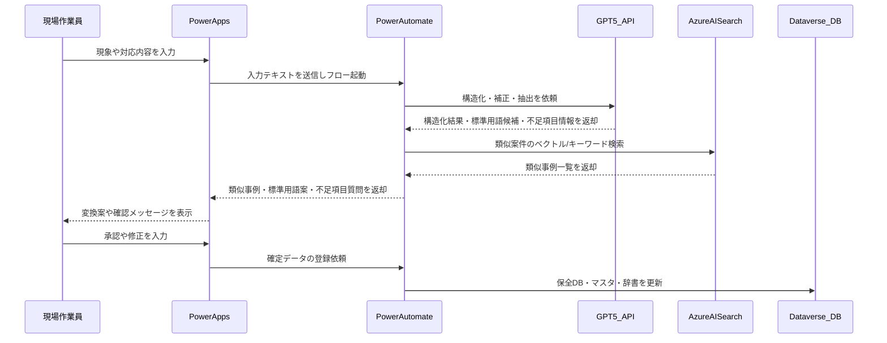

---

# 12. 提案要旨③の詳細：  
## 「少し試す → 確かめる → 全体に広げる」と  
## マスタ／保全データを“育てる”運用

## 12-1. 3つの「育てる」

1. **初期構築でマスタを育てる（10％ → 90％）**  
2. **運用しながらマスタを育てる（新しい設備・事象への対応）**  
3. **運用しながら保全報告データを育てる（要確認項目の“ついで補正”）**  

---

# 13. 「育てる」① 初期構築でマスタを育てる（10％ → 90％）

```text
1) 既存23万件のうち、バランス良く約10%を抽出
2) 10%サンプルから、AIが各種マスタを自動生成
3) 生成されたマスタ案を人が確認し、初期マスタとして確定
4) 確定マスタを使って、残り90%をクレンジング
5) このとき、マスタに当てはまらない新しいパターンを
   「マスタ追加候補」として記録
6) 候補を人が確認し、必要なものだけ正式なマスタに取り込む
→ 結果として、マスタの品質と網羅性が一段階向上した「v2マスタ」が完成
```

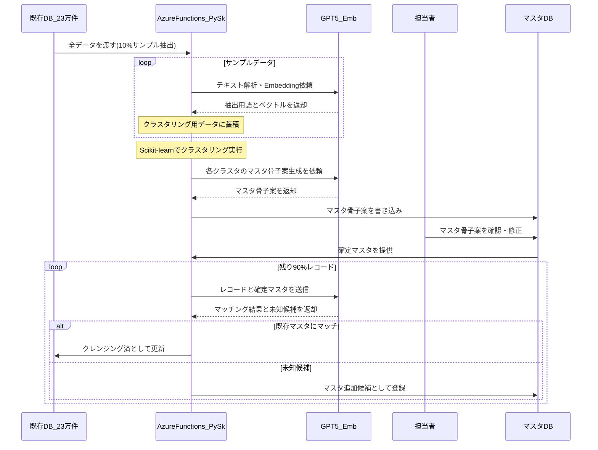

---

# 14. 「育てる」② 運用しながらマスタを育てる

```text
1) 新しい設備や新種の現象が発生
2) 現場作業員が保全アプリに自由入力
3) Power Automate から Azure OpenAI へ問い合わせ、
   既存マスタとの類似度を判定
   ・類似度が高い → 既存マスタへの紐づけを提案
   ・類似度が低い → 「新しいマスタとして登録」を提案
4) ユーザーが画面上で確認・承認
5) 承認された内容をPower AutomateがDataverseのマスタDBに即時反映
6) 以後、同じ用語は自動で同じマスタIDに紐づくようになる
```

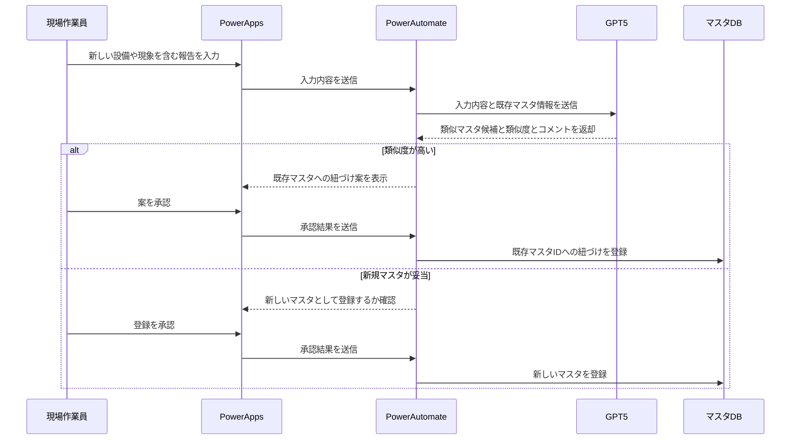

---

# 15. 「育てる」③ 運用しながら保全報告データを育てる

```text
1) 初期クレンジング時、信頼度が低い項目は無理に補完せず、
   ・項目は空欄のまま
   ・「要確認フラグ」をON
   として保全DBに登録
2) 現場担当者が、類似案件検索から過去案件を閲覧
3) 閲覧した案件に「要確認フラグ」があれば、
   画面上で「この案件は原因が未入力です。可能であれば、ワンタップで補足をお願いします」と控えめに表示
4) 担当者は時間に余裕がある範囲で、「原因」を1行だけ追記する、
   またはAIが提案した内容をワンタップで承認
5) Power Automate がAzure OpenAIを使って補足内容をチェックし、
   保全DBを更新
6) 更新後、その案件のフラグをOFFにして「確定データ」に昇格
→ 補正はあくまで任意のマイクロタスクとして扱い、
   日常業務の“ついで”で無理なく品質が向上していく設計とします。
```

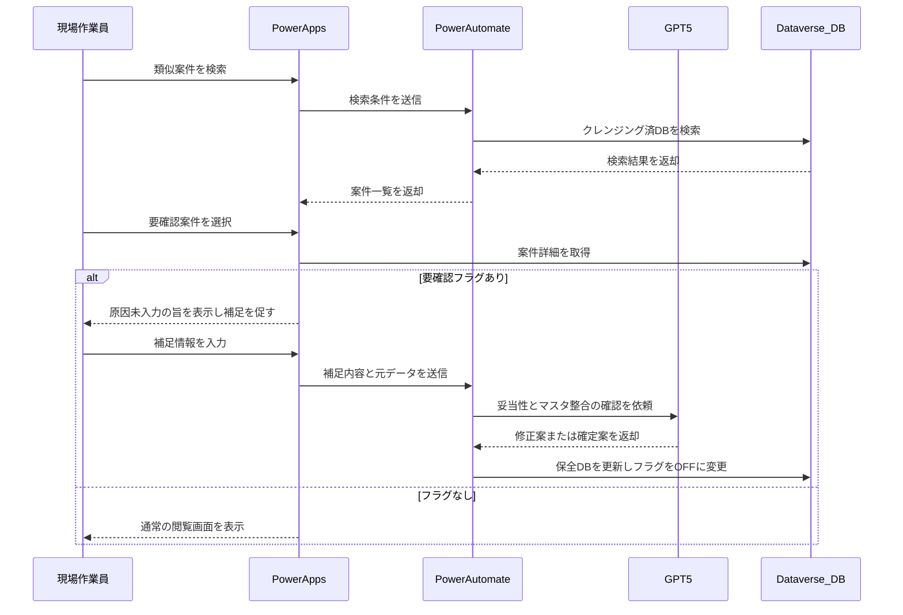

---

# 16. システムアーキテクチャ  
## （データ整備バッチ基盤と運用アプリ基盤の分離）

## 16-1. 構成要素

### データ整備バッチ基盤（Backend for Setup）

- **Azure Functions (Python)**  
  - Scikit-learn（クラスタリング：DBSCAN / KMeans 他）  
  - Pandas（集計・変換）  
  - 文字列距離ライブラリ（Levenshtein 等）  
- **Azure OpenAI (GPT-5 / Embeddings)**  
  - ベクトル化・テキスト要約・マスタ命名・構造化補正ロジック  
- **Dataverse**  
  - マスタDB・クレンジング済DBの格納先  

※初期構築および大規模バッチ処理でのみ使用。

### 運用アプリケーション基盤（Runtime）

- **Power Apps**  
  - 現場作業員向け保全アプリUI。  
- **Power Automate**  
  - オーケストレーター。Azure OpenAI / Azure AI Search / Dataverse コネクタを直接利用。  
- **Azure OpenAI (GPT-5)**  
  - 入力支援・標準用語サジェスト・不足項目指摘など。  
- **Azure AI Search**  
  - RAG検索（ベクトル検索＋キーワード検索）。  
- **Dataverse**  
  - 保全データ本体・マスタ・標準辞書を格納。  

※運用時には Pythonランタイムを使わず、Power Platform の範囲＋AIサービスで完結。

## 16-2. 全体イメージ（テキスト図）

```text
【A. データ資産化フェーズ（バッチ）】

[CSV / 既存保全DB (23万件)]
        |
        v
[Azure Functions (Python)]
        |
        +--> Azure OpenAI (Embedding / GPT-5)
        |       - 用語抽出
        |       - ベクトル化
        |       - マスタ命名
        |
        +--> Scikit-learn
        |       - クラスタリング
        |       - 名寄せロジック
        |
        v
[Dataverse]
    - マスタDB
    - クレンジング済DB
    - 標準用語辞書


【B. 保全業務フェーズ（オンライン運用）】

[現場作業員]
        |
        v
[Power Apps 保全アプリ]
        |
        v
[Power Automate]
        |
        +--> Azure OpenAI (GPT-5)
        |       - 入力文の構造化
        |       - 標準用語サジェスト
        |       - 不足項目指摘
        |
        +--> Azure AI Search
        |       - 類似案件検索 (RAG)
        |
        +--> Dataverse
                - 保全データ登録/更新
                - マスタの参照/更新
```

---

# 17. Power Platform ライセンス選択ガイド

## 17-1. ライセンス体系の考え方

- Power Apps を正式利用するには、有償ライセンスが必要。  
- 利用範囲・頻度に応じて、以下の3パターンから選択いただく。  

## 17-2. 代表的な3つのパターン

### Case A：全社・全部署で広く活用したい

- **推奨プラン**：Power Apps Premium（旧 Per User Plan）  
- **目安単価**： 約2,500円/ユーザー/月  
- **特徴**：  
  - アプリ作成数・利用数に制限なし。  
  - 将来的に他業務アプリも含め「内製の標準基盤」として活用したい場合に最適。  

### Case B：特定部署・特定アプリのみで利用したい

- **推奨プラン**：Power Apps Per App プラン  
- **目安単価**： 約625円/ユーザー/アプリ/月  
- **特徴**：  
  - 特定アプリ（本保全アプリなど）のみに絞ってコストを抑えたい場合に適合。  
  - スモールスタートから段階的に拡大する構成に向いている。  

### Case C：利用頻度が極めて低い（月1回程度）

- **推奨プラン**：Pay-as-you-go（従量課金）  
- **目安単価**： 約1,250円/アクティブユーザー/アプリ/月  
- **特徴**：  
  - Azureサブスクリプション経由の課金モデル。  
  - 「使った月だけ」課金されるため、頻度が低い部門・拠点向け。  

## 17-3. プラン選定フローチャート（テキスト）

```text
Q1. 利用するアプリは何個くらいですか？
    ├─ 複数（今後も増やす可能性あり） → Case A: Power Apps Premium
    └─ 1つ、もしくは少数に限定          → Q2へ

Q2. 利用頻度はどの程度を想定しますか？
    ├─ ほぼ毎日 / 毎週利用               → Case B: Per Appプラン
    └─ 月1回以下の利用が中心             → Case C: Pay-as-you-go
```

---

# 18. プロジェクトロードマップ（3ヶ月）

## 18-1. フェーズ概要

- **Month 1：データ理解とマスタのたたき台生成（Seed）**  
  - サンプルデータの受領・分析  
  - AIによる各種マスタ案の自動生成  
  - お客様とのレビュー・初期マスタ確定  

- **Month 2：全件クレンジングとアプリ開発（Scale）**  
  - v1マスタを用いた全件クレンジングバッチの実行  
  - マスタ拡張（未知パターンの追加）・v2マスタ確定  
  - Power Apps 画面・Power Automate フローの実装  

- **Month 3：結合・チューニングと現場展開（Go Live）**  
  - RAG検索精度のチューニング  
  - 現場担当者向けトレーニング  
  - PoC的運用開始と、フィードバック反映  

## 18-2. スケジュール（Mermaidガントチャート）

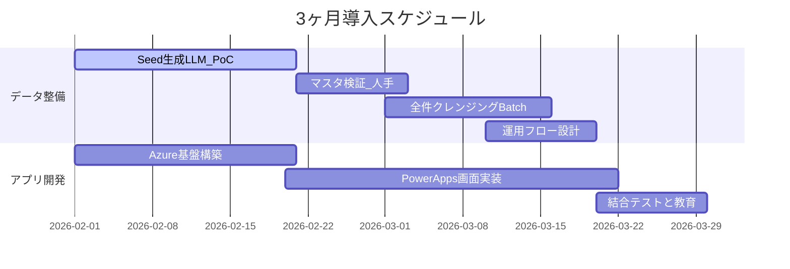

---

# 19. 概算費用とROI（投資対効果）

## 19-1. 概算費用（例）

- **合計：約1,300万円（税抜）**  
  - PM：120万円  
  - Data Scientist（マスタ生成・AIロジック）：625万円  
  - エンジニア（Azure・Power Platform実装）：450万円  
  - 予備費：105万円  

※ライセンス費用・Azure利用料は別途。正式なお見積もりはスコープ確定後に提示。

## 19-2. 定量的な効果（例）

### 1. コスト回避（Stock Effect）

- 人手によるデータ整備コストをAIで代替。  
- 試算：23万件 × 5分/件 ≒ **約19,000時間**  
- これは、1人がフルタイムで約2年強かけて行う作業量に相当。  
- 本プロジェクトにより、**3ヶ月間で一気に実施**することが可能となる。  

### 2. 業務削減（Flow Effect）

- 入力・調査工数の削減。  
- 例：50名 × 15分短縮/日 × 240日 ≒ **3,000時間/年**  
- 年間約3,000時間分の余力を創出し、予防保全活動や改善活動に振り向け可能。  

## 19-3. 定性的な価値（リスク低減と技術継承）

### リスク低減（Risk Mitigation）

- 過去の重大故障やレアケースの対応履歴が「検索可能」になることで、  
  - 担当者の経験不足による対応ミス  
  - 対応漏れ・手戻り  
  を防止。  
- 結果として、大規模なライン停止や事故のリスク低減に寄与。  

### 技術継承（Legacy Transformation）

- ベテランの頭の中にしかなかった「暗黙知（あの音がしたらここを見る）」を、  
  - AIによる構造化  
  - マスタと事例データの紐づけ  
  を通じて、若手でも参照できる「形式知」として保存。  
- 人の入れ替わりによる技術断絶リスクを抑え、「技術の見える化」を実現。  

---

# 20. 将来の発展イメージ（本スコープ外：予防保全）

> 本提案のスコープはあくまで「過去データの資産化」と「入力・検索業務の高度化」です。  
> ただし、その先の将来像として、以下のような発展が可能です。

## 20-1. 設備モニタリングデータとの連携

- 本プロジェクトで整備された  
  - クレンジング済の保全履歴データ  
  - 設備・部品マスタ  
  - 現象・原因・処置の分類マスタ  
  と、設備のモニタリングデータ（振動・温度・電流など）を組み合わせることで、  
  故障の**兆候**を早期に検知するモデルの構築が可能。  

## 20-2. 予防保全モデルの方向性

- 予防保全の例：  
  - 「同じ設備＋似た振動パターン＋過去の異音事例」が揃った場合に、  
    「○○部品の摩耗が進んでいる可能性が高い」とアラート。  
- その前提として、  
  - 設備名・部品名  
  - 現象・原因・処置  
  が**一貫したマスタで整理されていること**が極めて重要。  

## 20-3. 今回スコープとの関係

- 今回のプロジェクトは、将来の予防保全・高度分析に向けた**「土台づくり」**となる。  
- まずは、  
  - 既存23万件の資産化  
  - 日々の保全データの高品質化  
  を短期間で実現し、その上でモニタリングデータ連携や予兆検知モデルの検討に進むことが可能。  

---

# 21. 次のアクション（Next Steps）

1. **スコープ・ゴールの最終確認**  
   - 本提案に含める機能範囲・対象データ範囲の確定。  

2. **PoCデータのご提供**  
   - サンプルデータ（例：数千〜数万件のCSV）のご提供  
     - 機密情報はマスキングで問題なし。  

3. **PoC（精度確認）の実施**  
   - 提案アルゴリズムを用いて、  
     - マスタ自動生成のイメージ  
     - データクレンジングの精度  
   を確認いただくための小規模PoCを実施。  

4. **正式プロジェクトのキックオフ**  
   - スケジュール・体制・役割分担の合意  
   - Azure / Power Platform 環境の準備  

---

# 22. 体制とDATUM STUDIOの強み

## 22-1. プロジェクト体制（例）

- **PM（1名）**  
  - 全体統括・スケジュール管理・品質管理・コミュニケーション窓口。  
- **Data Scientist（1名）**  
  - マスタ生成ロジック・AIクレンジングアルゴリズムの設計・検証。  
- **Power Platform Engineer（1名）**  
  - Power Apps / Power Automate / Dataverse / Azure AI Search の実装。  

※必要に応じてAzureインフラエンジニアやUI/UXデザイナーを追加アサイン。

## 22-2. DATUM STUDIOの強み

- **データ分析 × アプリケーション開発の両輪**  
  - データサイエンスと業務アプリ開発の両方を内製しており、  
    「分析はできるが現場で使えない」・「アプリはあるが中身のロジックが弱い」  
    といったギャップを避けられる。  

- **製造業におけるAI活用実績**  
  - 不良検知・需要予測・保全業務DXなど、製造分野でのプロジェクト経験。  
  - 現場への負荷を抑えつつ成果を出す「現実解」を重視した設計ノウハウ。  

- **クラウドネイティブなアーキテクチャ設計**  
  - Azure OpenAI / Azure Functions / Power Platform を組み合わせた、  
    拡張性とコストバランスに優れた構成提案が可能。  

---

# Appendix：技術メンバー向け詳細版

## A-1. 全体の4フロー構成（技術者視点）

```text
(1) Batch A: Seedマスタ生成 (10% サンプル)  
     … Azure Functions / Python + Scikit-learn

(2) Batch B: マスタ拡張 (残り90%で未知パターン検出)  
     … Azure Functions / Python

(3) Batch C: 本番クレンジング (v2マスタで23万件全件)  
     … Azure Functions / Python

(4) Flow D: オンラインAI入力補助 (運用)  
     … Power Apps + Power Automate + Azure OpenAI / AI Search

データの流れ:

既存DB(23万件) ──> Batch A ──> マスタDB v1  
既存DB(23万件) ──> Batch B (v1参照) ──> マスタDB v2  
既存DB(23万件) + マスタDB v2 ──> Batch C ──> クレンジング済DB(要確認含む)  

現場作業員 ──> 保全アプリ ──> Power Automate  
              └─> Azure OpenAI / Azure AI Search / Dataverse を参照しながら入力・補正
```

---

## A-2. Batch A：Seed マスタ生成バッチ（10％サンプル）

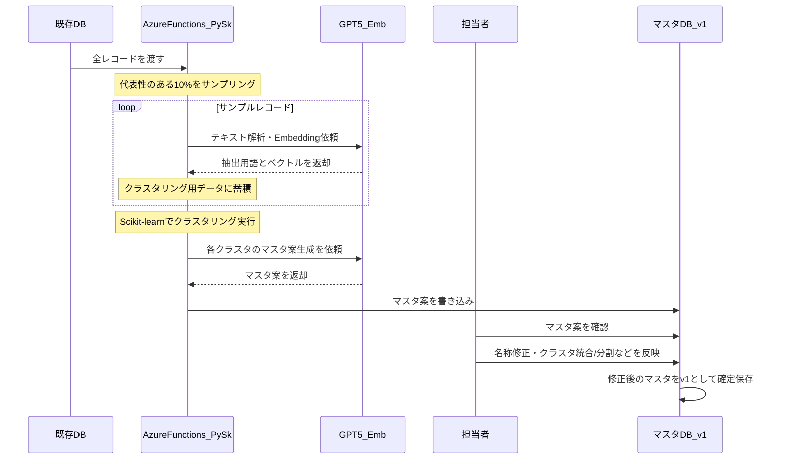

---

## A-3. Batch B：マスタ拡張バッチ（残り90％でマスタを育てる）

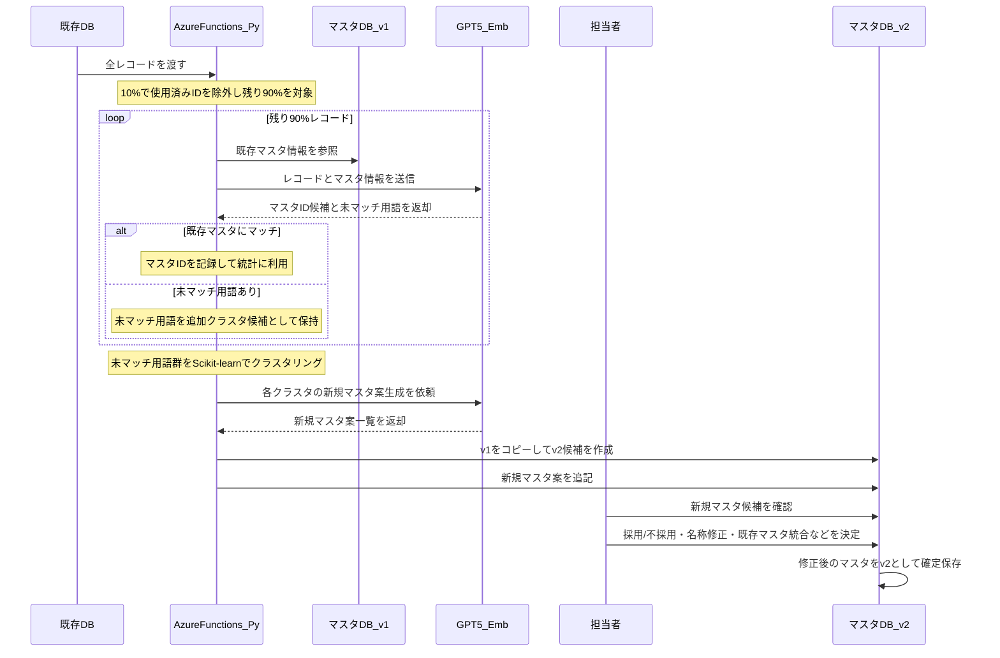

---

## A-4. Batch C：本番クレンジングバッチ（v2マスタで全件クレンジング）

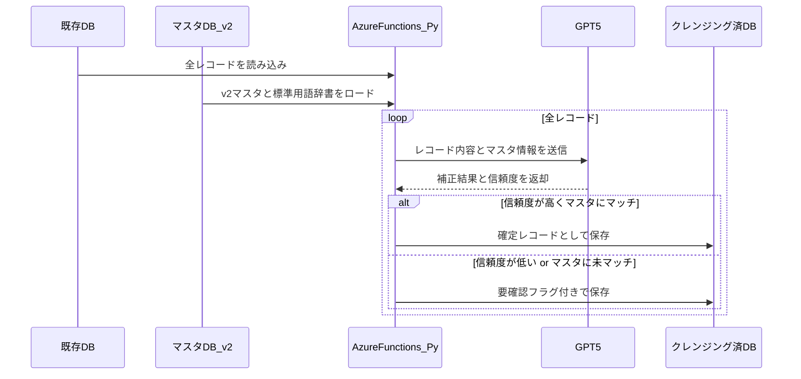

---

## A-5. Flow D：オンラインAI入力補助フロー（運用）

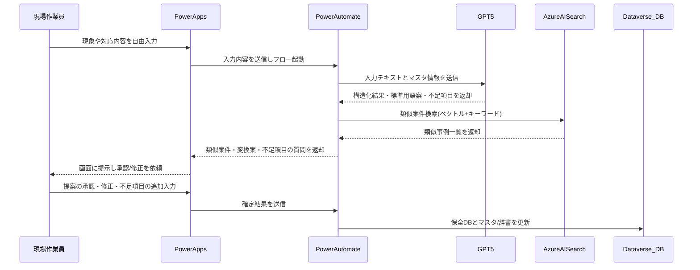
