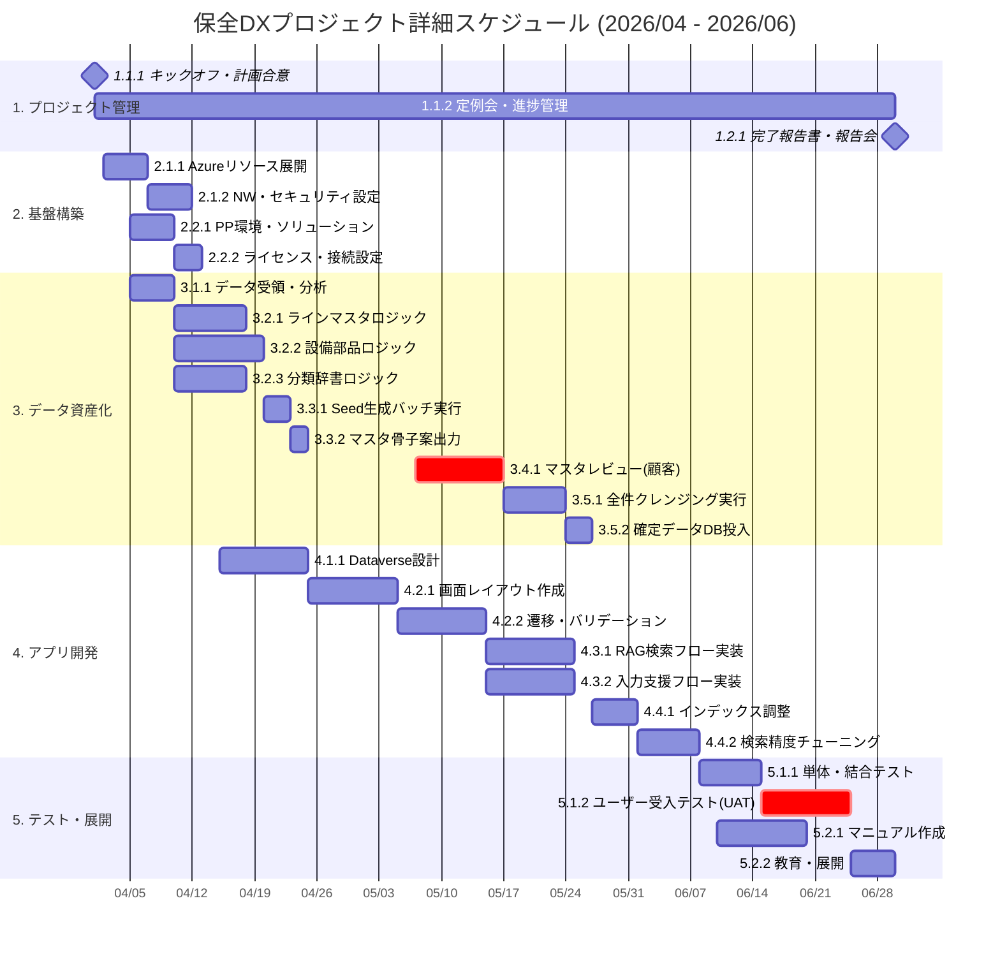

# 保全業務DX・データ資産化プロジェクト WBS & スケジュール

## 1. WBS（作業分解構成図） - Level 3

| Level 1 (フェーズ) | Level 2 (大項目) | Level 3 (タスク詳細) | 担当 |
| :--- | :--- | :--- | :--- |
| **1. プロジェクト管理** | 1.1 立ち上げ | 1.1.1 キックオフ・全体計画合意 | PM |
| | | 1.1.2 定例会・進捗管理 (週次) | PM |
| | 1.2 クロージング | 1.2.1 完了報告書作成・報告会 | PM |
| **2. 基盤構築** | 2.1 Azure環境構築 | 2.1.1 Azureリソース展開 (OpenAI, AI Search, Func, Storage) | Eng |
| | | 2.1.2 ネットワーク・セキュリティ設定 (VNET/Entra ID) | Eng |
| | 2.2 Power Platform環境 | 2.2.1 環境作成・ソリューション設定 | Eng |
| | | 2.2.2 ライセンス割り当て・接続設定 | Eng/Client |
| **3. データ資産化** | 3.1 データ受領・分析 | 3.1.1 生データ受領・プロファイリング (23万件) | DS |
| **(Pythonバッチ)** | 3.2 アルゴリズム開発 | 3.2.1 ラインマスタ生成ロジック実装 | DS |
| | | 3.2.2 設備・部品抽出/クラスタリングロジック実装 | DS |
| | | 3.2.3 分類マスタ生成/標準辞書化ロジック実装 | DS |
| | 3.3 Seed生成 (10%) | 3.3.1 10%サンプリング・Seed生成バッチ実行 | DS |
| | | 3.3.2 マスタ骨子案 (Excel) の出力・提示 | DS |
| | 3.4 マスタ確定 (Verify) | 3.4.1 マスタ骨子案のレビュー・修正・承認 | Client |
| | 3.5 全件処理 (Scale) | 3.5.1 マスタ拡張・全件クレンジングバッチ実行 | DS |
| | | 3.5.2 クレンジング済データ・確定マスタのDB投入 | DS/Eng |
| **4. アプリ開発** | 4.1 データベース設計 | 4.1.1 Dataverseテーブル設計 (保全/マスタ/辞書) | Eng |
| **(Power Platform)** | 4.2 UI実装 (Power Apps) | 4.2.1 画面レイアウト作成 (一覧/入力/検索) | Eng |
| | | 4.2.2 画面遷移・バリデーション実装 | Eng |
| | 4.3 ロジック実装 | 4.3.1 Power Automate フロー実装 (RAG検索) | Eng |
| | (Power Automate) | 4.3.2 Power Automate フロー実装 (入力支援・補正) | Eng |
| | 4.4 検索精度調整 | 4.4.1 Azure AI Search インデックス調整 | DS/Eng |
| | | 4.4.2 検索・サジェスト精度のチューニング | DS/Eng |
| **5. テスト・展開** | 5.1 テスト実施 | 5.1.1 単体テスト・結合テスト | Eng |
| | | 5.1.2 ユーザー受入テスト (UAT) | Client |
| | 5.2 導入支援 | 5.2.1 操作マニュアル作成 | Eng |
| | | 5.2.2 ユーザー教育・展開 | PM/Eng |

---

## 2. ガントチャート（2026年4月〜6月）

WBS Level 3 のタスクに対応したスケジュールです。  
ゴールデンウィーク（5月上旬）を考慮し、お客様によるマスタ確認はGW明けに設定しています。

