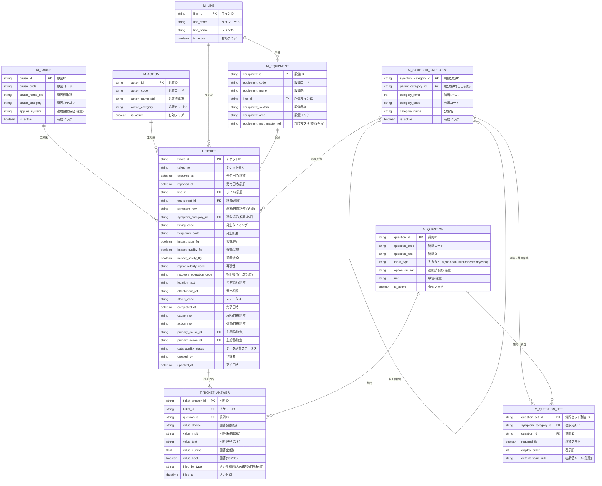

# 保全・修理受付データモデル ER図（Mermaid）

以下は、先ほど提示したテーブル（マスタ／トランザクション）に基づくER図です。  
Mermaid対応のMarkdownビューア（GitHub / VS Code拡張 / Notion等）で表示できます。

## 補足
- **M_SYMPTOM_CATEGORY** は自己参照で階層（例：機械 → 異音）を表現します。  
- 「カテゴリ別の固定補足質問」は **M_QUESTION_SET**（分類→質問割当）で管理し、回答は **T_TICKET_ANSWER** に縦持ちで保存します。  
- 主原因・主処置は **T_TICKET.primary_cause_id / primary_action_id** で1つずつ確定し、必要なら別途「副要因」「複数処置」用の関連テーブルを追加します。
