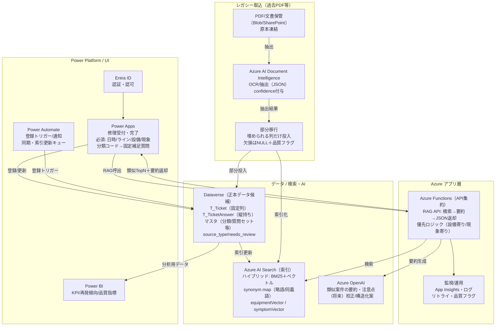

# To-Be アーキテクチャ図（Mermaid）
以下は、保全日報入力・修理受付のAI活用（Power Apps × Azure AI Search × Azure OpenAI）を想定した To-Be アーキテクチャ図です。

## 読み方（要点）
- **Power Apps** は薄い入力フォーム（必須入力＋分類コード→固定補足質問）  
- **Azure Functions** が RAG（AI Search検索→OpenAI要約）を集約し、Power AppsへJSONを返す  
- **Dataverse** は新規・レガシーを同一スキーマで保持しつつ、欠損は品質フラグで管理  
- **AI Search** は検索用索引（ハイブリッド＋シノニム）として利用  
- **過去PDF** は Document Intelligence で抽出し、埋められる箇所だけ新スキーマへ部分移行（欠損はNULL）
