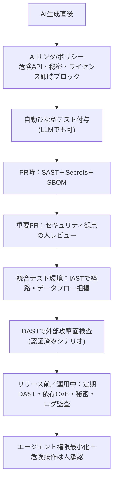
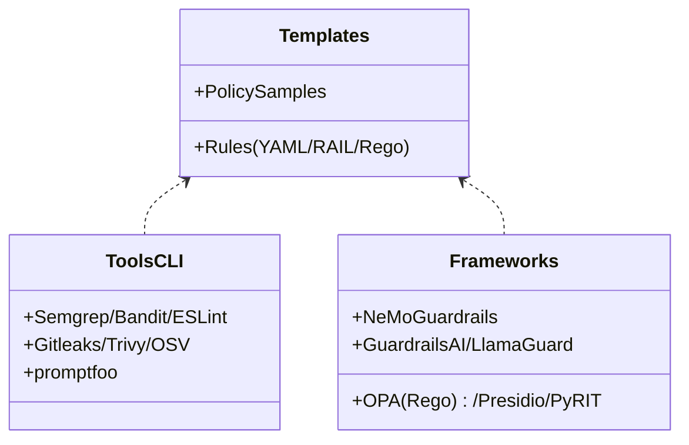
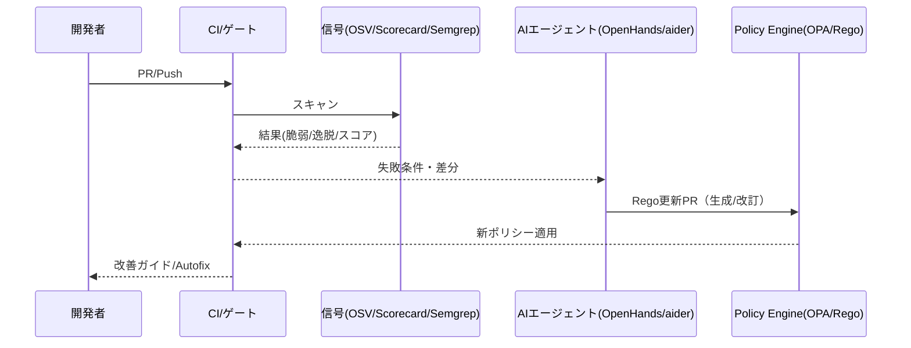
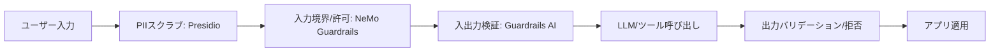
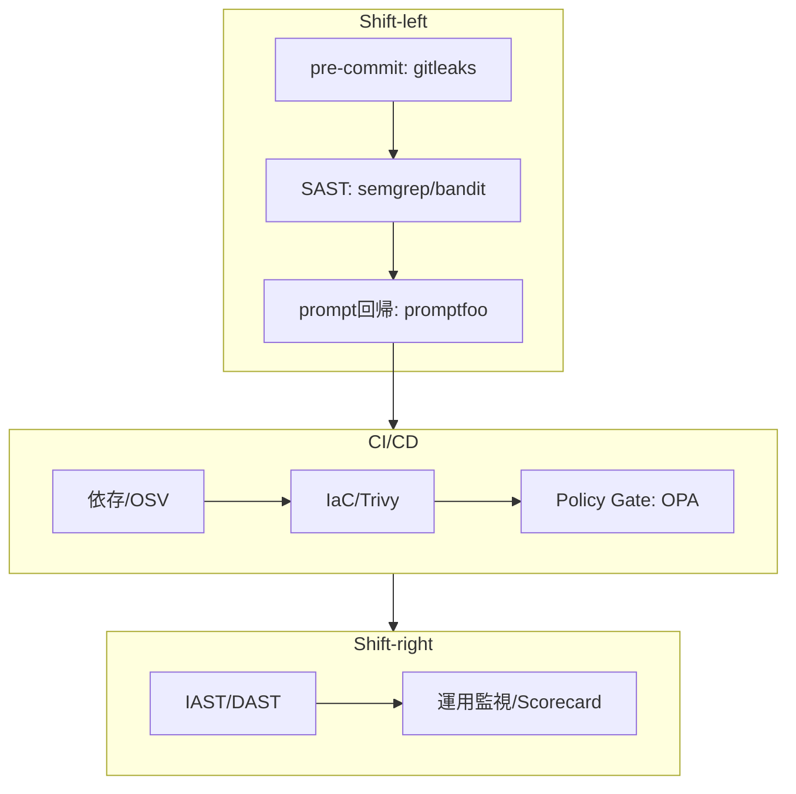
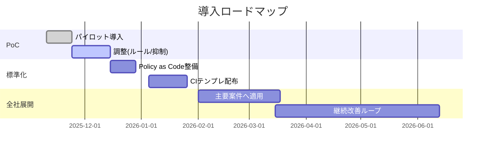
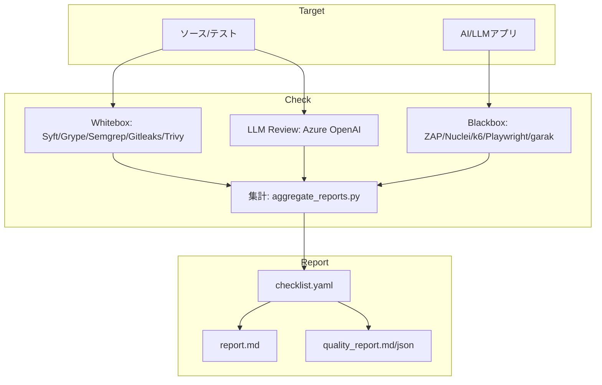
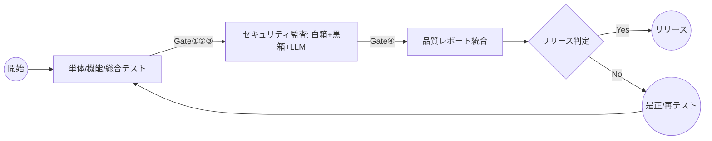

# バイブ品質・セキュリティ監査：プレゼン目次＋設計図表（Mermaid／改訂版・理想像＋OSS根拠入り）

> 構成：課題意識（リスク顕在化）→当社リスク→**なぜOSSか**→理想の姿（抽象）→理想へ至るステップ（OSS特性・デザインパターン）→**MVPの主張**→導入ステップ（社内提案）→Codex-CLI実装の概要。  
> 実装の全量は別資料。ここでは理想像と導入論点を中心に整理。

---

## 0. タイトル＆要旨（Executive Summary）
- バイブコーディング拡大と品質・セキュリティの断絶
- 当社におけるリスク、影響、対策の全体像
- 結論：**“ゲートもバイブ化”**で適応的な品質・セキュリティ監査へ

---

## 1. 課題意識（リスク顕在化事例の要旨）
- ゼロクリック間接プロンプトインジェクション（外部メタ情報からの汚染）
- 生成コード起因の RCE／メモリ破壊・権限昇格
- ガイドライン適合要求の高まりと、**情報漏えい**の継続的発生
- **示唆**：「動く」と「安全」のギャップを埋める**継続監査**が必須

---

## 2. 当社（ITベンダ）にとってのリスク・脅威
- 顧客：情報流出・脆弱性露呈による**損害・信頼失墜**
- 事業：**賠償・再作業・SLA違反**、入札失点
- 法務：**個人情報・著作権・ライセンス**不整合
- 内部：**技術負債・生産性低下**、採用/育成への悪影響

---

## 3. なぜ **OSS** が理想の解決ピースか（採用ロジック）
- **透明性と検証可能性**：セキュリティツールは**検証可能性**が命。OSSは検査ロジック/ルール/ポリシーを**可視**にし、監査証跡にも適合。  
- **適応速度**：脅威は日々変化。OSSは**コミュニティの更新速度**（ルール/テンプレ/シグネチャ）を取り込め、社内運用に即時反映しやすい。  
- **拡張性/相互運用**：CLI/JSON/SARIF等で**パイプライン連結**が容易。**Policy as Code**や**自動PR運用**との親和性が高い。  
- **コスト最適**：商用ツールのロックインを避け、**必要部分のみ**を組み合わせてMVP→標準化へ段階投入できる。  
- **学習資産化**：ルール/ポリシー/テンプレを**社内知識**として保有でき、プロジェクト特性に合わせた**内製調整**が可能。

> まとめ：**透明性×適応速度×相互運用性**を満たすため、OSSは「理想の組み合わせ可能部品（Composable Pieces）」である。

---

## 4. 対策としての「理想の姿」（抽象像）
- **生成直後から運用まで**一貫して「自動ゲート」が働く（**Shift-left × Shift-right**）
- **AIリンタ/ポリシー**で、生成物（コード/プロンプト/設定）を**即時に安全化**し**社内ルール適合**を強制
- **SAST / IAST / DAST**の多層で、「作る前に止める → 動かしながら抑える → 外から破る視点」の三位一体
- **Policy as Code（OPA/Rego）**で**組織ルール**を実装し、**AIエージェント**が状況に応じてポリシーやルールを**自動調整**（ただし**最終承認は人**）
- 生成物には **SBOM・ライセンス・セキュリティメタ情報**を必ず付与

> ざっくり式：**SAST＝作る前に止める／IAST＝動かしながら抑える／DAST＝外から破る視点**。これを **CI/CD の自動ゲート**として重ね掛け。

---

## 5. 理想へ至るためのステップ（OSSパーツと特性整理）

### 5.1 役割分担と選定のコツ
- **SAST**：言語/フレームワーク対応、誤検知率、CI統合、チューニング容易性
- **DAST**：認証済みクロール、API/GraphQL対応、レポート再現性
- **IAST**：対応ランタイム、オーバーヘッド、運用性（オンプレ/クラウド）
- **AIリンタ/ポリシー**：既存リンタ＋セキュリティ拡張＋**社内ルール**、Rego等で**入力境界/権限**の機械化、**SBOM/ライセンス**強制

### 5.2 よくある落とし穴（回避指針）
- 「動くからOK」バイアス → **IAST/DAST** を必ず入れる
- **誤検知疲れ** → **SASTルールの調整/抑制**を運用前に実施
- **秘密鍵の迷子** → シークレット検出を **pre-commit と CI の二重化**
- **エージェント過剰権限** → 外部送信・ファイル操作・コマンド実行は**原則オフ**、必要時のみ昇格＋**人承認**

### 5.3 OSS ピース（ツール / フレーム / 雛形）
- **ツール（CLI/ゲート向き）**：Semgrep, Bandit, ESLint, Gitleaks, Trivy, OSV-Scanner, promptfoo
- **フレーム（組み込み安全層）**：NeMo Guardrails, Guardrails AI, Llama Guard, OPA/Rego, Presidio, PyRIT
- **雛形（テンプレ/ルール集）**：各ツールに同梱（YAML/RAIL/Rego/ルール集）を**最小変更で内製化**

---

## 6. デザインパターン整理（理想運用＋解説付き）

### 6.1 パターンA：適応型セキュリティゲート（信号駆動）
**特徴**：OSV/Scorecard/Semgrep などの**信号**を集約し、**AIエージェント**がポリシー/ルールを**自動改訂**。最終承認は人。  
**長所**：脅威変化に素早く追随／ルール運用の負荷を自動化／**Policy as Code**で再現性。  
**短所**：誤改訂のリスク→**承認ゲート必須**／信号の質に依存。  
**適用シーン**：多言語・多案件での統一ガバナンス／PRが多い高速開発。

---

### 6.2 パターンB：プロンプト/エージェントのガードレール
**特徴**：**入力境界**（許可/禁止）と**入出力検証**を多層化。PIIスクラブ、ポリシー適用、スキーマ検証、出力バリデーション。  
**長所**：**間接PI**や**データ越境**を早期遮断／運用ルールを**コード化**。  
**短所**：過度な制約でUX低下の懸念→**例外経路**や**人承認**の設計が必要。  
**適用シーン**：RAG/外部ツール実行を伴う生成AIアプリ／エージェントの自動操作がある系。

---

### 6.3 パターンC：CI 統合（Shift-left/Right）
**特徴**：pre-commit→CI→運用の**三位一体**。**SAST/Secrets/SBOM**＋**IAST/DAST**＋**Scorecard**。  
**長所**：**早期検知**と**実害検証**の両立／**SARIF/JSON**で自動集計しやすい。  
**短所**：初期は**誤検知調整**が必要／CI時間の増加。  
**適用シーン**：既存のCI/CDがあり、**段階導入**でゲート強化したい現場。

---

## 7. 推奨パイプライン（実務の流れ）
- **AI生成の直後**  
  - **AIリンタ（コード／プロンプト）**→ 危険API・秘密・依存ライセンスを即時ブロック  
  - 生成コードに**ひな型テスト**を自動付与（LLMでもOK）  
- **PR時（開発段階）**  
  - **SAST**：静的解析＋シークレット検出＋SBOM  
  - **重要PR**はセキュリティ観点の**人レビュー**（人間ゲート）  
- **統合テスト環境**  
  - **IAST**（可能なら）で実行経路とデータフローを把握  
  - **DAST**で外部からの攻撃面検査（認証ありシナリオも）  
- **リリース前／運用中**  
  - 重要エンドポイントは**DASTの定期ジョブ**  
  - **依存CVE監視・シークレット監視・ログ監査**  
  - **エージェントの権限最小化**、危険操作は**常に人の承認**

> コア戦略：**SAST／AIリンタで“作る前に止める” → IASTで“動かしながら抑える” → DASTで“外から破る視点”**を**CI/CDの自動ゲート**として挿入。

---

## 8. 当社のスタンス：まずは **MVP** として整備したい範囲
- **必須ゲート**：Semgrep（＋言語別リンタ）／Gitleaks／Trivy／OSV-Scanner／promptfoo  
- **常時ガード**：Presidio（PII）／NeMo Guardrails（入力境界）／Guardrails AI（入出力検証）  
- **組織ルール**：OPA/Rego で外部送信・ファイル操作・コマンド実行を**明示制御**  
- **ポリシー適応**：OpenHands/aider により、`.github/workflows/*.yml`／`semgrep/*.yaml`／`policy/*.rego` を**自動編集PR**  
- **人の最終承認**：PR-Agent 等で差分要約→**レビュア承認**後に適用

---

## 9. 導入ステップ（社内提案）
1. **個別プロジェクトで実践**（PoC）  
   - 既存テンプレ（雛形）を**最小変更**で適用、誤検知調整を最優先  
2. **知見蓄積 → 標準化**  
   - ルール/ワークフローを**社内標準ツール**・**品質ゲート**として**Policy as Code**に格納  
3. **全社展開**  
   - CI/CD テンプレ配布、各案件へオンボーディング、**四半期KPIレビュー**で継続改善

---

## 10. 参考：今回 Codex-CLI で実装してみた品質・セキュリティ監査システム（概要）
> 詳細な実装は別途「Appendix（実装全量）」資料を参照。ここでは**概要のみ**。

### 10.1 アーキテクチャ概要
- `security-check/`：黒箱＋白箱の監査フレーム（Dockerベース）  
- `runners/*`：集計・レポート自動化、`llm_code_review.py`（LLM白箱レビュー）  
- `report/`：`report.md`、`quality_report.md`、`quality_summary.json`（統合レポート）

### 10.2 システムフロー（抜粋）

---

## 11. KPI とモニタリング（要点）
- **ブロック率** / **検知→修正MTTR**
- **誤検知率**・レビュー時間・復旧時間
- **プロンプト安全テスト（pass率）**
- **Scorecard スコア**の分布 / 推移

---

## 12. ガバナンスと責任分担（RACI・表）
| 活動領域 | Responsible | Accountable | Consulted | Informed |
|---|---|---|---|---|
| ルール設計 | セキュリティ室 | 開発リード | QA | PM |
| 運用・改善 | 開発チーム | セキュリティ室 | SRE / QA | 経営層 |

---

## 13. まとめと次アクション
- まとめ：**“ゲートもバイブ化”**で品質とスピードを両立  
- 次アクション：**PoC対象案件の選定／標準テンプレ配布／計測基盤の用意**

---

# Appendix A：採用OSSの説明（分類ラベル付き）

> ラベル凡例：**[T] ツール**（CLI/実行コマンド中心）／**[F] フレームワーク**（組み込み基盤）／**[Tm] 雛形**（ルール・設定テンプレ）。

## 1) ゲート設定やCI/YAMLを自動編集するAIエージェント
- **OpenHands（旧 OpenDevin 系） [F]＋[T]**  
  CLI/ヘッドレス実行・GitHub Actions 連携。Issue/コマンドをトリガに**リポを編集→PR作成**まで自動化。ゲート用 YAML／Rego／Semgrep ルールを**AIが変更**する役に向く。
- **aider [T]**  
  LLM でコード/設定ファイルを編集し**自動コミット**する軽量CLI。既存CIに**ポリシー雛形を流し込む→微修正**の用途に適する。
- **PR-Agent（qodo-ai） [T]**  
  PRレビュー自動化。ポリシー逸脱をコメントし、必要なら**修正パッチ提案**。最終承認前の**人ゲート強化**に。

## 2) ポリシー自体をAIで生成/更新（Policy as Code × LLM）
- **OPA Policy Generator（コミュニティ） [T]＋[Tm]**  
  GPTで **Regoポリシーを生成・検証・管理**。ポリシー雛形の「たたき台」作成を自動化。
- **OPA/Rego 本体 [F]**  
  生成された Rego を**強制ゲート**として実行。認可/準拠の**実行基盤**。

## 3) セキュリティ信号（脆弱性・健全性）を自動取り込み
- **OSV-Scanner / GitHub Action [T]**  
  11+言語対応。**PR差分で新規脆弱性を検出→Fail**運用が可能。AIエージェントが検出結果を読み、**依存/ルール更新PR**を出せる。
- **OpenSSF Scorecard Action [T]**  
  リポのセキュア開発慣行を**スコア化**。閾値割れをトリガに、CIルール/ブランチ保護の**設定変更PR**を自動で出す設計が容易。
- **Renovate（OSS） [T]**  
  依存更新の**自動PR**。OSV/Scorecard 結果に基づき、AIが Renovate 設定を**強化・例外管理**する役割分担が現実的。

## 4) ルール／スキャンの自動修正や“雛形からの差分適用”
- **Semgrep（Autofix） [T]＋[Tm]**  
  検出に対して**自動修正パッチ**をコメント可能（`autofix`）。AIエージェントはここを足場に、プロジェクト特性に合わせた**ルール微調整**を継続PR化。  
- **（参考：非OSS）CodeQL × Copilot Autofix**  
  **検知→自動修正→人承認**の運用モデル例。考え方の参照用。

## 5) プロンプト/ガードの継続評価（ゲート品質の自己点検）
- **promptfoo（CI対応） [T]＋[Tm]**  
  プロンプト/ガードレールの**回帰テスト**。設定変更の影響を数値化し、悪化時に**ロールバック**判断を補助。
- **OpenAI Guardrails（Python/TS） [F]＋[Tm]**  
  入出力の**バリデーション雛形**を多数提供。CIでガード結果を収集し、**悪化時にポリシー修正PR**というループを構成しやすい。

---

> 以上で、**OSS 採用のロジック**と**各OSSの役割**、**パターン別の解説**を追記しました。スライド化の際は要約版/詳細版に分割可能です。
