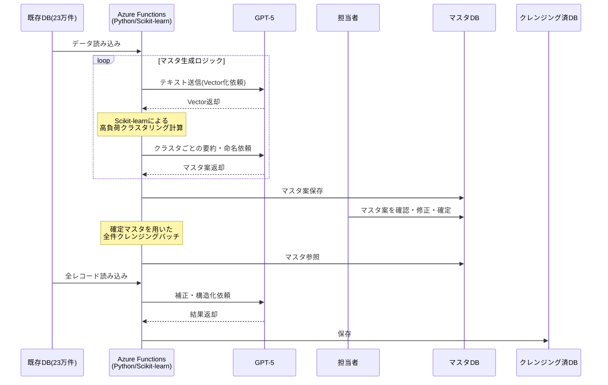
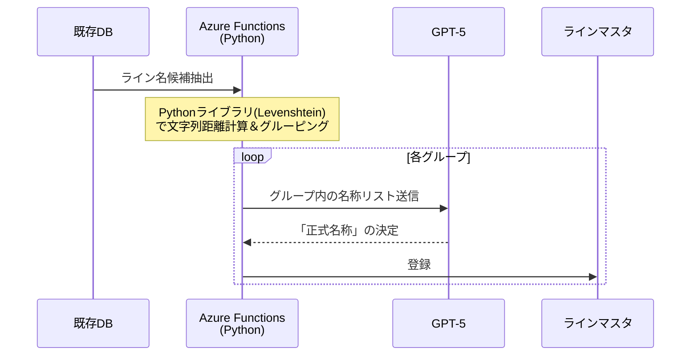
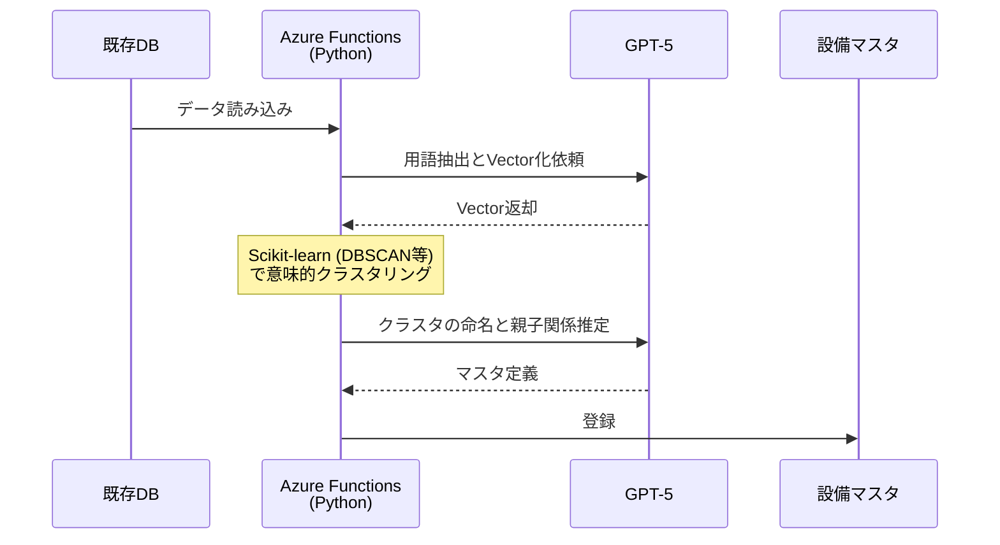
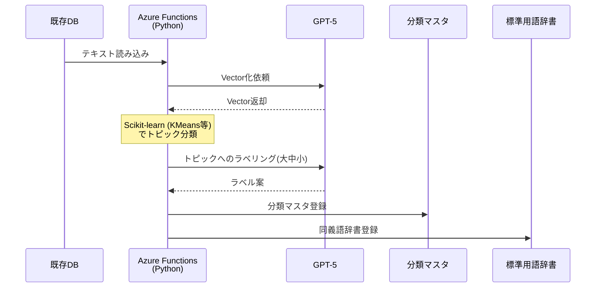
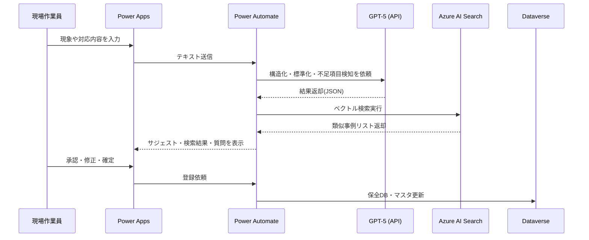
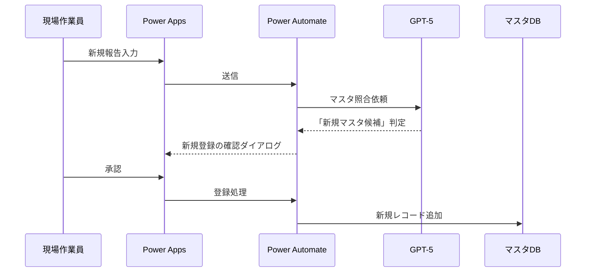
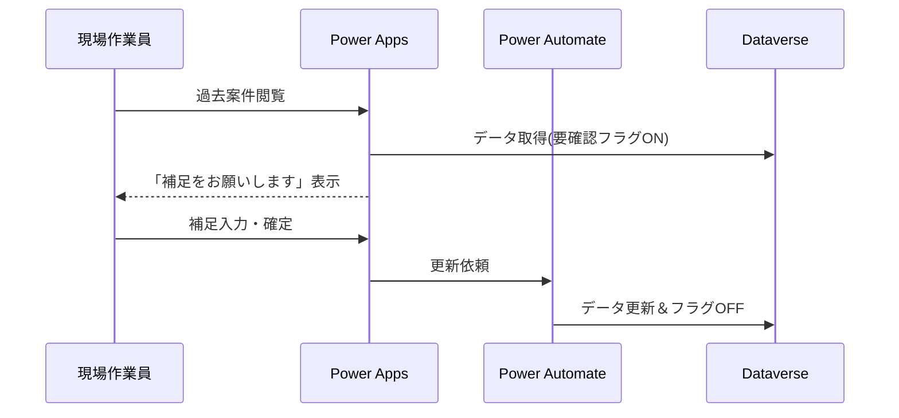

# 保全業務DXおよび既存データ資産化プロジェクト 提案書

---

## 目次

1. タイトル  
2. 本日のアジェンダ  
3. プロジェクト背景（弊社理解）  
4. ご提案サマリ（3つの柱）  
5. 現状の課題：負の連鎖（Vicious Cycle）  
6. 技術アプローチの全体像（LLM主導：3フロー構成）  
7. 提案要旨①の詳細：AIクレンジング＆マスタ自動生成  
8. アルゴリズム詳細①：ラインマスタ（文字列距離＋LLM）  
9. アルゴリズム詳細②：設備・部品マスタ（LLM＋Embedding）  
10. アルゴリズム詳細③：分類マスタ・標準用語辞書  
11. 提案要旨②の詳細：RAG検索＆AI入力支援アプリ  
12. 提案要旨③の詳細：  
    「少し試す → 確かめる → 全体に広げる」と  
    マスタ／保全データを“育てる”運用  
13. 「育てる」① 初期構築でマスタを育てる（10％ → 90％）  
14. 「育てる」② 運用しながらマスタを育てる  
15. 「育てる」③ 運用しながら保全報告データを育てる  
16. システムアーキテクチャ  
17. Power Platform ライセンス選択ガイド  
18. プロジェクトロードマップ（3ヶ月）  
19. 概算費用とROI（投資対効果）  
20. 将来の発展イメージ（本スコープ外：予防保全）  
21. 次のアクション（Next Steps）  
22. 体制とDATUM STUDIOの強み  

---

# 1. タイトル

**タイトル**  
保全業務DXおよび既存データ資産化プロジェクトのご提案  

**サブタイトル**  
Power Platform × Generative AI (GPT-5) による「ナレッジ駆動型保全」への変革  

**宛名**  
いすゞ自動車株式会社 御中  

**日付**  
2026年1月  

**提案者**  
DATUM STUDIO  

---

# 2. 本日のアジェンダ

1. プロジェクト背景とご提案サマリ  
2. 現状の課題：「負の連鎖」と23万件データの状態  
3. 技術アプローチの全体像（Batch vs Online）  
4. 提案要旨①：AIクレンジング＆マスタ自動生成の詳細  
5. 提案要旨②：RAG検索＆AI入力支援アプリの詳細  
6. 提案要旨③：「少し試す → 確かめる → 全体に広げる」と“育てる”運用  
7. システムアーキテクチャ（ハイブリッド構成）  
8. ライセンス・ロードマップ・概算費用とROI  
9. 将来の発展イメージ（予防保全）  
10. 次のアクション／体制  

---

# 3. プロジェクト背景（弊社理解）

## 3-1. ヘッダーメッセージ

> 「23万件の埋蔵データの資産化」と「現場入力業務の高度化」の課題に対し、  
> Azure OpenAI × Power Platform による保全ナレッジDX基盤の構築を提案する。  
> 生成AIによるデータクレンジングの自動化と、検索・入力支援アプリの実装により、  
> 現場の負荷を増やさずに高品質な保全データを継続的に蓄積できる仕組みを実現する。

## 3-2. 現状の理解

- 既存の**保全履歴23万件**は、すでにCSVおよびDBとして構造化されている。  
- しかし、以下のような品質課題が存在している。  
  - 表記揺れ（例：モータ／モーター／Mtr）  
  - 略語・誤字・俗語  
  - 項目のズレ（原因欄に処置内容が入っている 等）  
- このため、現状のままでは**検索や分析に耐えない**状態となっている。  
- 全件を人手で修正した場合、  
  - 23万件 × 5分/件 = 約19,000時間  
  - 現場のリソースでは事実上対応不可能な規模である。  

---

# 4. ご提案サマリ（3つの柱）

## 4-1. 提案要旨①  
### AIクレンジング＆マスタ自動生成による「23万件の一括資産化」

- GPT-5による「文脈理解」と、Scikit-learn等による「数理的な名寄せ」を組み合わせたハイブリッド処理を行う。  
- 既存23万件の保全データから、  
  - ラインマスタ  
  - 設備・部品マスタ  
  - 現象・原因・処置マスタ  
  - 標準用語辞書（略語・表記揺れ → 正式名称）  
  を自動生成し、これを用いて全件をクレンジングする。  
- 約19,000時間相当の人手作業をAIで代替し、データを「資産」として再利用可能な状態にする。  

**位置づけ：**  
蓄積済みの23万件を一気に整える、**「過去（Stock）の資産化」**の施策。

## 4-2. 提案要旨②  
### RAG検索＆AI入力支援アプリによる「勝手に整うデータ運用」

- Power Apps上に、Azure OpenAIと連携した保全アプリを構築する。  
- 現場担当者は「日本語で素直に入力」するだけで、  
  - 過去の類似事例の提示（RAG検索）  
  - 標準用語への変換サジェスト  
  - 現象／原因／処置などへの自動振り分け  
  - 不足情報の指摘・質問  
  が自動的に行われる。  
- 運用基盤はPower Automateを活用したローコード構成とし、保守コストを抑制する。

**位置づけ：**  
日々の入力・検索の負荷を下げながら、良質なデータを継続的に生む、**「今後の運用（Flow）の効率化」**の施策。

## 4-3. 提案要旨③  
### 「少し試す → 確かめる → 全体に広げる」と  
### マスタ／保全データを少しずつ“育てる”運用設計

- いきなり全自動ではなく、以下の3段階で進める構成とする。  
  1. **少し試す**：データの約10％を用いて、AIがマスタのたたき台を自動生成。  
  2. **確かめる**：たたき台だけ人が確認・修正し、初期マスタとして確定。  
  3. **全体に広げる**：残り90％をクレンジングしながら、未知の設備・事象をマスタに追加。  
- 運用フェーズでは、  
  - 新しい設備や現象が出てきた際のマスタへの追加  
  - 類似案件検索のタイミングでの“ついで補正”  
  を通じて、**マスタと保全報告データの双方を運用の中で継続的に育てる**。

**位置づけ：**  
データとマスタを少しずつ磨き上げることで、将来的な予防保全や高度分析にもつながる**「Future」への橋渡し**となる運用設計。

---

# 5. 現状の課題：負の連鎖（Vicious Cycle）

## 5-1. 顧客のペイン

> 「データを使って業務を効率化したいが、検索しても過去の類似事象がヒットしない。  
>  結果として入力の手間も減らず、ナレッジも活用できない。」

## 5-2. 負の連鎖のメカニズム

1. 過去データに表記揺れ・項目ズレ・欠損が多く、検索してもヒットしない。  
2. データ整備には約19,000時間が必要であり、現場では工数を確保できない。  
3. 整備が後回しになる中、日々の業務で新たな揺らぎデータが蓄積し続ける。  
4. 時間が経つほど「データ量は増えるが、活用は難しくなる」状況に陥っている。  

## 5-3. 「約19,000時間の壁」

- 23万件 × 5分/件 ≒ 約19,000時間という、人手では現実的に超えられない工数が「壁」となり、データ活用を阻んでいる。  
- この壁を、人を増やすのではなく、AIという仮想労働力で乗り越えることが本プロジェクトのポイントである。  

---

# 6. 技術アプローチの全体像（Batch vs Online）

## 6-1. 全体構成：適材適所のハイブリッド・アーキテクチャ

本提案では、処理の性質に合わせて「バッチ処理（Python）」と「オンライン処理（Power Automate）」を明確に使い分けます。

1.  **データ整備フェーズ（Batch）**:  
    *   **技術**: Azure Functions (Python) + Scikit-learn + Azure OpenAI  
    *   **理由**: 23万件のクラスタリングや複雑な名寄せ計算など、高負荷な処理を高速に実行するため。
2.  **保全業務フェーズ（Online）**:  
    *   **技術**: Power Apps + Power Automate + Azure OpenAI (Connectors)  
    *   **理由**: 運用時のレスポンス維持と保守性向上（ローコード化）のため、Python基盤を経由せず直接AIサービスと連携する。

## 6-2. 処理フローのイメージ（テキスト図）

```text
[既存保全DB (23万件)]
        |
        | (高負荷計算)
        v
[★整備フェーズ: Azure Functions (Python/Scikit-learn)]
    ・Embeddingベクトル化
    ・DBSCAN/KMeansクラスタリング
    ・Levenshtein距離計算
    ・GPT-5によるマスタ生成
        |
        v
[初期マスタ + クレンジング済DB] <---> [Azure AI Search]
        ^
        | (API連携 / 検索・推論)
        |
[★運用フェーズ: Power Automate (Low-code)]
        ^
        |
[保全アプリ (Power Apps)]
        ^
        |
   [現場作業員]
7. 提案要旨①の詳細：AIクレンジング＆マスタ自動生成
7-1. 目的
既存23万件の保全データを、短期間で「検索・分析・入力支援に耐える品質」に引き上げる。
マスタ自動生成においては、計算コストと精度のバランスを最適化するため、LLMだけでなく数理アルゴリズム（Scikit-learn）を併用する。
7-2. 処理フローのイメージ（テキスト図）
```text
STEP1: サンプル抽出 (約10%)
    Pythonバッチ → 既存DBから抽出

STEP2: マスタのたたき台を自動生成 (Python + LLM)
    Azure Functions (Python) が実行:
```
    1. LLMで用語抽出
    2. Embedding (ベクトル化)
    3. Scikit-learn でクラスタリング (似た用語をグルーピング)
    4. LLMで各クラスタに「標準名称」を命名

STEP3: たたき台マスタを人が確認
    担当者 → 初期マスタとして確定

STEP4: 確定マスタを用いて23万件を一括クレンジング
    Pythonバッチ → 全件処理

STEP5: クレンジング済DBとして保存
7-3. シーケンス図（バッチ1＋バッチ2の全体像）

8. アルゴリズム詳細①：ラインマスタ（文字列距離＋LLM）
8-1. 目的
「Aライン」「A-Line」「Line A」などの表記揺れを名寄せする。
ライン名は「記号としての違い」が重要であるため、Embedding（意味）ではなく**文字列距離（Levenshtein）**を主軸とする。
8-2. シーケンス図（ラインマスタ生成）

9. アルゴリズム詳細②：設備・部品マスタ（LLM＋Embedding）
9-1. 目的
「設備」「部品」を抽出し、階層関係を構造化する。
自由記述の揺らぎを吸収するため、Embedding（ベクトル化）とクラスタリングを用いる。
9-2. シーケンス図（設備・部品マスタ）

10. アルゴリズム詳細③：分類マスタ・標準用語辞書
10-1. 目的
「現象」「原因」「処置」を階層化（大・中・小）する。
また、マスタ化の過程で生じた「別名」を標準用語辞書として保存する。
10-2. 技術的補足：なぜMeCab / SudachiではなくLLMか
MeCab等の形態素解析は「単語区切り」は得意だが、「文脈理解（項目ズレの修正）」ができないため。
本提案では、「文脈理解」はLLMが担当し、「全文検索時の分かち書き」はAzure AI Search内部の解析器に任せる構成とする。
10-3. シーケンス図

11. 提案要旨②の詳細：RAG検索＆AI入力支援アプリ
11-1. 目的
現場作業員による入力・検索を支援する。
運用フェーズではAzure Functionsを利用せず、Power Automateを活用して保守性を高める。
11-2. 処理フローのイメージ（テキスト図）
```text
1) 現場作業員がPower Appsに入力
2) Power Automateが起動 (Azure Functionsは経由しない)
3) Power Automate -> Azure OpenAI: 入力文の構造化・補正依頼
4) Power Automate -> Azure AI Search: 類似案件検索
5) Power Automate -> Power Apps: 結果（サジェスト・検索結果）を返却
6) ユーザー確認後、Dataverseに保存
```
11-3. シーケンス図（RAG＋入力支援）

12. 提案要旨③の詳細：「育てる」運用
12-1. コンセプト
運用開始後も、未知のデータや設備の追加に対応できるよう、システム全体を「育てる」設計とする。
13. 「育てる」① 初期構築でマスタを育てる（10％ → 90％）
（※マスタ生成バッチと同様のPython構成で実施）
14. 「育てる」② 運用しながらマスタを育てる
14-1. 処理フロー
現場で新しい設備や現象が入力された際、Power Automate経由でGPT-5が判定し、新規マスタ登録を提案する。
14-2. シーケンス図（育てる②）

15. 「育てる」③ 運用しながら保全報告データを育てる
15-1. 処理フロー
「要確認フラグ」が付いた過去データを閲覧した際、ついでに補正入力を行うフロー。これもPower Automateで完結させる。
15-2. シーケンス図（育てる③）

16. システムアーキテクチャ
16-1. 構成要素（役割の明確化）
データ整備バッチ基盤 (Backend for Setup / Batch)
Azure Functions (Python): 計算リソース。
Scikit-learn / NumPy / Pandas: クラスタリング、文字列距離計算、データ加工等の数理処理を担当。
※初期構築および大規模再学習時のみ稼働。
運用アプリケーション基盤 (Runtime / Online)
Power Apps: UI/UX。
Power Automate: アプリとAIサービスの連携オーケストレーター。
Azure OpenAI / AI Search: 推論・検索API。
※運用時はPython Functionsを経由せず、ローコード基盤で完結させる。
16-2. 全体イメージ
```text
【A. データ資産化フェーズ（バッチ）】
[CSVデータ] 
    |
    v
[Azure Functions (Python)] <=== (Scikit-learn / Levenshtein)
    |
    +---> [Azure OpenAI]
    |
    v
[Dataverse / Azure AI Search] (初期データ投入)


【B. 保全業務フェーズ（オンライン）】
[現場作業員]
    |
    v
[Power Apps]
    |
    v
[Power Automate] <========== (No Python Code)
    |
    +---> [Azure OpenAI]
    +---> [Azure AI Search]
    |
    v
[Dataverse] (データの参照・更新)
```
17. Power Platform ライセンス選択ガイド
（前述の内容と同様）
18. プロジェクトロードマップ（3ヶ月）
（前述の内容と同様）
19. 概算費用とROI（投資対効果）
（前述の内容と同様）
20. 将来の発展イメージ（本スコープ外：予防保全）
（前述の内容と同様）
21. 次のアクション（Next Steps）
（前述の内容と同様）
22. 体制とDATUM STUDIOの強み
（前述の内容と同様）
Appendix：技術メンバー向け詳細版
A-1. 全体の4フロー構成（技術者視点）
```text
(1) Batch A (Python): Seedマスタ生成 (10% サンプル)
(2) Batch B (Python): マスタ拡張 (残り90% で未知パターン検出)
(3) Batch C (Python): 本番クレンジング (v2マスタで23万件全件)
(4) Flow D (Power Automate): オンラインAI入力補助 (運用)
A-2〜A-4. バッチ処理詳細 (Pythonベース)
（※Section 7〜10のシーケンス図と同様、Azure Functions (Python) が主体となるフロー）
A-5. Flow D：オンラインAI入力補助フロー (Power Automateベース)
code
Mermaid
sequenceDiagram
    participant User as 現場作業員
    participant App as Power Apps
    participant Flow as Power Automate
    participant LLM as GPT-5
    participant DV as Dataverse

    User->>App: 入力
    App->>Flow: 送信
    Flow->>LLM: 解析依頼 (HTTP Request)
    LLM-->>Flow: 結果 (JSON)
    Flow-->>App: 結果返却
    User->>App: 確定
    App->>Flow: 登録
    Flow->>DV: 更新
code
Code
```