# 保全業務DXおよび既存データ資産化プロジェクト 提案書

---

## 目次

1. タイトル  
2. 本日のアジェンダ  
3. プロジェクト背景（弊社理解）  
4. ご提案サマリ（3つの柱）  
5. 現状の課題：負の連鎖（Vicious Cycle）  
6. 技術アプローチの全体像（LLM主導：3フロー構成）  
7. 提案要旨①の詳細：AIクレンジング＆マスタ自動生成  
8. アルゴリズム詳細①：ラインマスタ（文字列距離＋LLM）  
9. アルゴリズム詳細②：設備・部品マスタ（LLM＋Embedding）  
10. アルゴリズム詳細③：分類マスタ・標準用語辞書  
11. 提案要旨②の詳細：RAG検索＆AI入力支援アプリ  
12. 提案要旨③の詳細：  
    「少し試す → 確かめる → 全体に広げる」と  
    マスタ／保全データを“育てる”運用  
13. 「育てる」① 初期構築でマスタを育てる（10％ → 90％）  
14. 「育てる」② 運用しながらマスタを育てる  
15. 「育てる」③ 運用しながら保全報告データを育てる  
16. システムアーキテクチャ  
17. Power Platform ライセンス選択ガイド  
18. プロジェクトロードマップ（3ヶ月）  
19. 概算費用とROI（投資対効果）  
20. 将来の発展イメージ（本スコープ外：予防保全）  
21. 次のアクション（Next Steps）  
22. 体制とDATUM STUDIOの強み  

---

# 1. タイトル

**タイトル**  
保全業務DXおよび既存データ資産化プロジェクトのご提案  

**サブタイトル**  
Power Platform × Generative AI (GPT-5) による「ナレッジ駆動型保全」への変革  

**宛名**  
いすゞ自動車株式会社 御中  

**日付**  
2026年1月  

**提案者**  
DATUM STUDIO  

---

# 2. 本日のアジェンダ

1. プロジェクト背景とご提案サマリ  
2. 現状の課題：「負の連鎖」と23万件データの状態  
3. 技術アプローチの全体像（LLM主導：3フロー構成）  
4. 提案要旨①：AIクレンジング＆マスタ自動生成の詳細  
5. 提案要旨②：RAG検索＆AI入力支援アプリの詳細  
6. 提案要旨③：「少し試す → 確かめる → 全体に広げる」と“育てる”運用  
7. システムアーキテクチャ  
8. ライセンス・ロードマップ・概算費用とROI  
9. 将来の発展イメージ（予防保全）  
10. 次のアクション／体制  

---

# 3. プロジェクト背景（弊社理解）

## 3-1. ヘッダーメッセージ

> 「23万件の埋蔵データの資産化」と「現場入力業務の高度化」の課題に対し、  
> Azure OpenAI × Power Platform による保全ナレッジDX基盤の構築を提案する。  
> 生成AIによるデータクレンジングの自動化と、検索・入力支援アプリの実装により、  
> 現場の負荷を増やさずに高品質な保全データを継続的に蓄積できる仕組みを実現する。

## 3-2. 現状の理解

- 既存の**保全履歴23万件**は、すでにCSVおよびDBとして構造化されている。  
- しかし、以下のような品質課題が存在している。  
  - 表記揺れ（例：モータ／モーター／Mtr）  
  - 略語・誤字・俗語  
  - 項目のズレ（原因欄に処置内容が入っている 等）  
- このため、現状のままでは**検索や分析に耐えない**状態となっている。  
- 全件を人手で修正した場合、  
  - 23万件 × 5分/件 = 約19,000時間  
  - 現場のリソースでは事実上対応不可能な規模である。  

---

# 4. ご提案サマリ（3つの柱）

## 4-1. 提案要旨①  
### AIクレンジング＆マスタ自動生成による「23万件の一括資産化」

- GPT-5を用いた構造化・補正エンジンと、Embedding＋クラスタリングによる名寄せロジックを組み合わせる。  
- 既存23万件の保全データから、  
  - ラインマスタ  
  - 設備・部品マスタ  
  - 現象・原因・処置マスタ  
  - 標準用語辞書（略語・表記揺れ → 正式名称）  
  を自動生成し、これを用いて全件をクレンジングする。  
- 約19,000時間相当の人手作業をAIで代替し、データを「資産」として再利用可能な状態にする。  

## 4-2. 提案要旨②  
### RAG検索＆AI入力支援アプリによる「勝手に整うデータ運用」

- Power Apps上に、Azure OpenAIと連携した保全アプリを構築する。  
- 現場担当者は「日本語で素直に入力」するだけで、  
  - 過去の類似事例の提示（RAG検索）  
  - 標準用語への変換サジェスト  
  - 現象／原因／処置などへの自動振り分け  
  - 不足情報の指摘・質問  
  が自動的に行われる。  
- 結果として、**「現場が楽になればなるほど、データが勝手に整っていく」**運用サイクルを実現する。  

## 4-3. 提案要旨③  
### 「少し試す → 確かめる → 全体に広げる」と  
### マスタ／保全データを少しずつ“育てる”運用設計

- いきなり全自動ではなく、以下の3段階で進める構成とする。  
  1. **少し試す**：データの約10％を用いて、AIがマスタのたたき台を自動生成。  
  2. **確かめる**：たたき台だけ人が確認・修正し、初期マスタとして確定。  
  3. **全体に広げる**：残り90％をクレンジングしながら、未知の設備・事象をマスタに追加。  
- 運用フェーズでは、  
  - 新しい設備や現象が出てきた際のマスタへの追加  
  - 類似案件検索のタイミングでの“ついで補正”  
  を通じて、**マスタと保全報告データの双方を運用の中で継続的に育てる**。

---

# 5. 現状の課題：負の連鎖（Vicious Cycle）

## 5-1. 顧客のペイン

> 「データを使って業務を効率化したいが、検索しても過去の類似事象がヒットしない。  
>  結果として入力の手間も減らず、ナレッジも活用できない。」

## 5-2. 負の連鎖のメカニズム

1. 過去データに表記揺れ・項目ズレ・欠損が多く、検索してもヒットしない。  
2. データ整備には約19,000時間が必要であり、現場では工数を確保できない。  
3. 整備が後回しになる中、日々の業務で新たな揺らぎデータが蓄積し続ける。  
4. 時間が経つほど「データ量は増えるが、活用は難しくなる」状況に陥っている。  

## 5-3. 解決の方向性

- 足りていないのは「やる気」ではなく「工数」である。  
- 必要な約19,000時間分を、GPT-5という**仮想労働力**によって肩代わりすることで、  
  負の連鎖を断ち切る。  

---

# 6. 技術アプローチの全体像（LLM主導：3フロー構成）

## 6-1. 全体構成

本提案における処理フローは、次の3つの層で構成される。

1. **バッチ1：マスタ初期生成バッチ（10％サンプル）**  
2. **バッチ2：初期データクレンジングバッチ（23万件全件）**  
3. **運用フロー：AI入力補助付き保全データ登録**  

## 6-2. 処理フローのイメージ（テキスト図）

```text
[既存保全DB (23万件)]
        |
        | ① 10% サンプル抽出
        v
[バッチ1：マスタ初期生成]
        |
        v
[初期マスタ + 標準用語辞書]
        |
        | ② 全件クレンジング
        v
[バッチ2：クレンジングバッチ]
        |
        +--> [クレンジング済DB]
        |
        +--> [要確認フラグ付きデータ]
        |
        +--> [マスタ追加候補リスト]

日々の運用:
  現場作業員
        |
        v
  [保全アプリ (Power Apps)]
        |
        +--> 生成AIによる標準用語変換・構造化
        +--> 類似案件検索 (RAG)
        +--> 新しい設備/現象のマスタ追加
        +--> 要確認データの“ついで補正”
```

---

# 7. 提案要旨①の詳細：AIクレンジング＆マスタ自動生成

## 7-1. 目的

- 既存23万件の保全データを、短期間で「検索・分析・入力支援に耐える品質」に引き上げる。  
- そのために、  
  - 各種マスタ（ライン／設備／部品／現象／原因／処置）  
  - 標準用語辞書（略語や揺らぎ → 正式名称）  
  を生成AI中心で自動生成し、これらを用いて一括クレンジングを行う。  

## 7-2. 処理フローのイメージ（テキスト図）

```text
STEP1: サンプル抽出 (約10%)
    既存DB 23万件 → 代表性のある約10%を抽出

STEP2: サンプルからマスタのたたき台を自動生成
    生成AI → 設備/部品/現象/原因/処置候補を抽出
           → Embedding + クラスタリングで似た用語をグルーピング
           → クラスタ単位で標準名称・別名リストを提案

STEP3: たたき台マスタを人が確認
    担当者 → クラスタ単位で名称を確認・微修正
           → 初期マスタとして確定

STEP4: 確定マスタを用いて23万件を一括クレンジング
    生成AI → 各レコードを読み直し
           → 項目ズレ修正・表記揺れ標準化・必要に応じて補完
           → 信頼度の低いものは「要確認フラグ」を付与

STEP5: 結果をクレンジング済DBとして保存
    ・検索・分析・RAG用のベースデータ
    ・要確認データは運用フェーズで少しずつ補正
```

## 7-3. シーケンス図（バッチ1＋バッチ2の全体像）

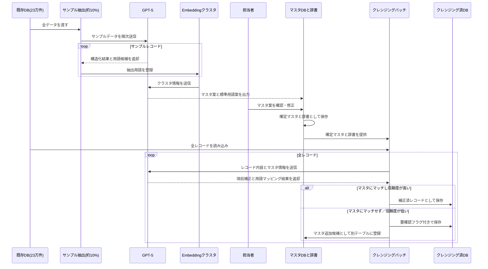

---

# 8. アルゴリズム詳細①：ラインマスタ（文字列距離＋LLM）

## 8-1. 目的

- 「Aライン」「A-Line」「Line A」などの表記揺れを1つのラインとして扱えるようにする。  
- ライン名は「意味」よりも「記号としての違い」が重要であるため、  
  Embeddingよりも文字列距離を主軸としたアプローチを採用する。  

## 8-2. 処理フローのイメージ（テキスト図）

```text
1) ライン名候補を既存DBから抽出
2) 全角/半角・英大文字/小文字・記号などを正規化
3) Levenshtein距離などの編集距離で似ているものをグループ化
   例) "Aライン" と "A-Line" は同じグループ
4) 各グループの中身を生成AIに渡し、
   ・代表となる正式名称
   ・その他の別名
   を決定
5) 「ラインマスタ」および
   「別名 → 正式名称」の辞書として保存
```

## 8-3. シーケンス図（ラインマスタ生成）

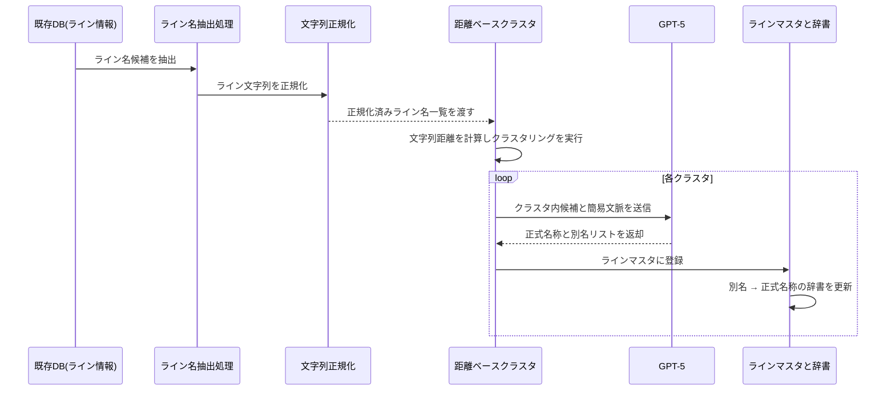

---

# 9. アルゴリズム詳細②：設備・部品マスタ（LLM＋Embedding）

## 9-1. 目的

- 記録の中から「設備」「部品」を抽出し、  
  - 設備マスタ  
  - 部品マスタ  
  - 設備 ＞ 部品の階層関係  
  を構造化して定義する。  

## 9-2. 処理フローのイメージ（テキスト図）

```text
1) レコードから「設備名・部品名」を含むテキストを抽出
2) 生成AIで、
   「設備」「部品」「部位」などの要素を抽出
3) 抽出された用語をEmbeddingによりベクトル化
4) 似ている用語同士をクラスタリング
   例) 「CV-1」「1号コンベア」など
5) クラスタごとに生成AIが
   ・標準設備名
   ・標準部品名
   ・設備と部品の親子関係
   を決定
6) 設備マスタ・部品マスタとして保存
```

## 9-3. シーケンス図（設備・部品マスタ）

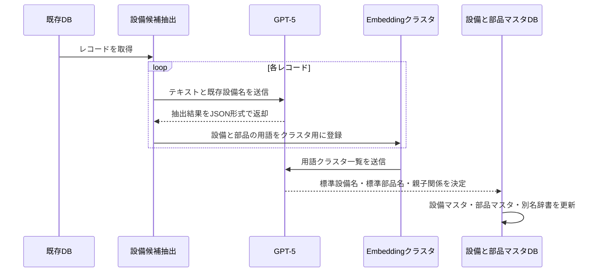

---

# 10. アルゴリズム詳細③：分類マスタ・標準用語辞書

## 10-1. 目的

- 現象・原因・処置を  
  - 大分類  
  - 中分類  
  - 小分類  
  の階層に整理し、分析や検索に利用しやすい形にする。  
- 略語・俗語・表記揺れを標準用語にまとめる辞書を生成する。  

## 10-2. 処理フローのイメージ（テキスト図）

```text
1) クレンジング候補データから
   「現象」「原因」「処置」テキストを抽出
2) 生成AIで各テキストを解析し、
   現象/原因/処置の候補ラベルを付与
3) 用語をEmbeddingしてクラスタリング
4) 各クラスタごとに生成AIが、
   ・大分類
   ・中分類
   ・小分類
   を一括生成
5) 同じ意味の単語 (例: Mtr, モータ, Motor) を、
   標準用語へのマッピングとして整理
6) 分類マスタ・標準用語辞書として保存
```

## 10-3. シーケンス図（分類マスタ・辞書）

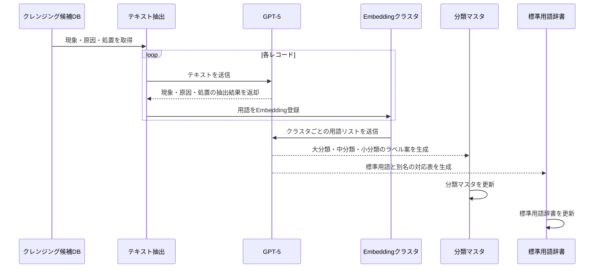

---

# 11. 提案要旨②の詳細：RAG検索＆AI入力支援アプリ

## 11-1. 目的

- 現場作業員が、  
  - 過去の類似案件  
  - 関連マニュアル  
  をすぐに参照できるようにし、復旧時間を短縮する。  
- 同時に、入力作業を軽くしながら、  
  高品質で標準化されたデータを自動的に蓄積する。  

## 11-2. 処理フローのイメージ（テキスト図）

```text
1) 現場作業員が、タブレット等から現象・対応内容を自由入力
2) 保全アプリ (Power Apps) から Azure Functions 経由で生成AIを呼び出し
3) 生成AIが、
   ・入力文を「現象」「原因」「処置」などに構造化
   ・標準用語辞書に基づき揺らぎを補正
   ・不足している情報 (例: ライン名・設備名) を検出
4) 類似案件を Azure AI Search + ベクトル検索で取得し、アプリに表示
5) アプリ上で、
   ・標準用語への置き換え案
   ・類似案件の一覧
   ・不足項目に関する質問
   をユーザーに提示
6) ユーザーは、案を確認・修正し、確定データとして登録
7) 確定データは Dataverse の保全DBおよびマスタ/辞書に反映
```

## 11-3. シーケンス図（RAG＋入力支援）

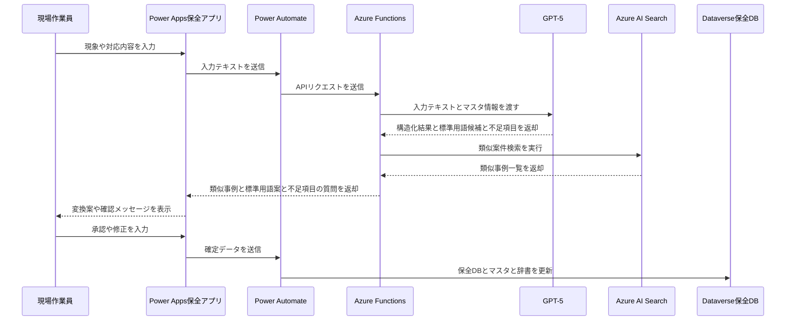

---

# 12. 提案要旨③の詳細：  
## 「少し試す → 確かめる → 全体に広げる」と  
## マスタ／保全データを“育てる”運用

## 12-1. 3つの「育てる」

1. **初期構築でマスタを育てる（10％ → 90％）**  
2. **運用しながらマスタを育てる（新しい設備・事象への対応）**  
3. **運用しながら保全報告データを育てる（要確認項目の“ついで補正”）**  

---

# 13. 「育てる」① 初期構築でマスタを育てる（10％ → 90％）

## 13-1. 処理フローのイメージ（テキスト図）

```text
1) 既存23万件のうち、バランス良く約10%を抽出
2) 10%サンプルから、AIが各種マスタを自動生成
3) 生成されたマスタ案を人が確認し、初期マスタとして確定
4) 確定マスタを使って、残り90%をクレンジング
5) このとき、マスタに当てはまらない新しいパターンを
   「マスタ追加候補」として記録
6) 候補を人が確認し、必要なものだけ正式なマスタに取り込む
→ 結果として、マスタの品質と網羅性が一段階向上した「v2マスタ」が完成
```

## 13-2. シーケンス図（育てる①）

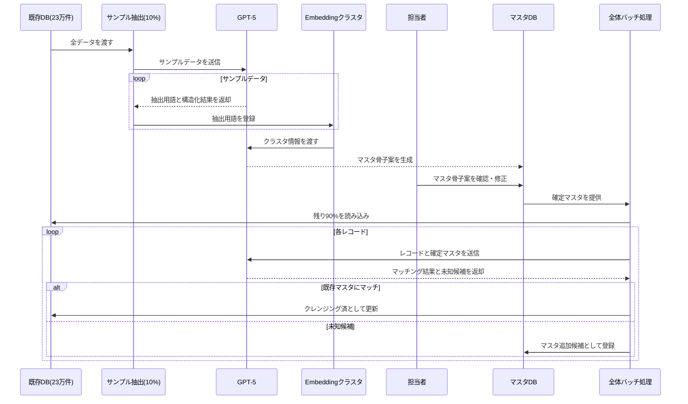

---

# 14. 「育てる」② 運用しながらマスタを育てる

## 14-1. 処理フローのイメージ（テキスト図）

```text
1) 新しい設備や新種の現象が発生
2) 現場作業員が保全アプリに自由入力
3) 生成AIが既存マスタとの類似度を判定
   ・類似度が高い → 既存マスタへの紐づけを提案
   ・類似度が低い → 「新しいマスタとして登録」を提案
4) ユーザーが画面上で確認・承認
5) 承認された内容をマスタDBに即時反映
6) 以後、同じ用語は自動で同じマスタIDに紐づくようになる
```

## 14-2. シーケンス図（育てる②）

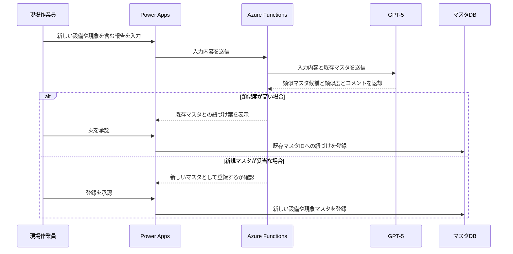

---

# 15. 「育てる」③ 運用しながら保全報告データを育てる

## 15-1. 処理フローのイメージ（テキスト図）

```text
1) 初期クレンジング時、信頼度が低い項目は無理に補完せず、
   ・項目は空欄のまま
   ・「要確認フラグ」をON
   として保全DBに登録
2) 現場担当者が、類似案件検索から過去案件を閲覧
3) 閲覧した案件に「要確認フラグ」があれば、
   画面上で「この案件は原因が未入力です。可能なら補足してください」と小さく表示
4) 担当者は時間に余裕がある範囲で、1〜2項目だけ補足入力
5) 生成AIが補足内容をチェックし、保全DBを更新
6) 更新後、その案件のフラグをOFFにして「確定データ」に昇格
→ 日常業務のついでに、保全データの品質が少しずつ向上していく
```

## 15-2. シーケンス図（育てる③）

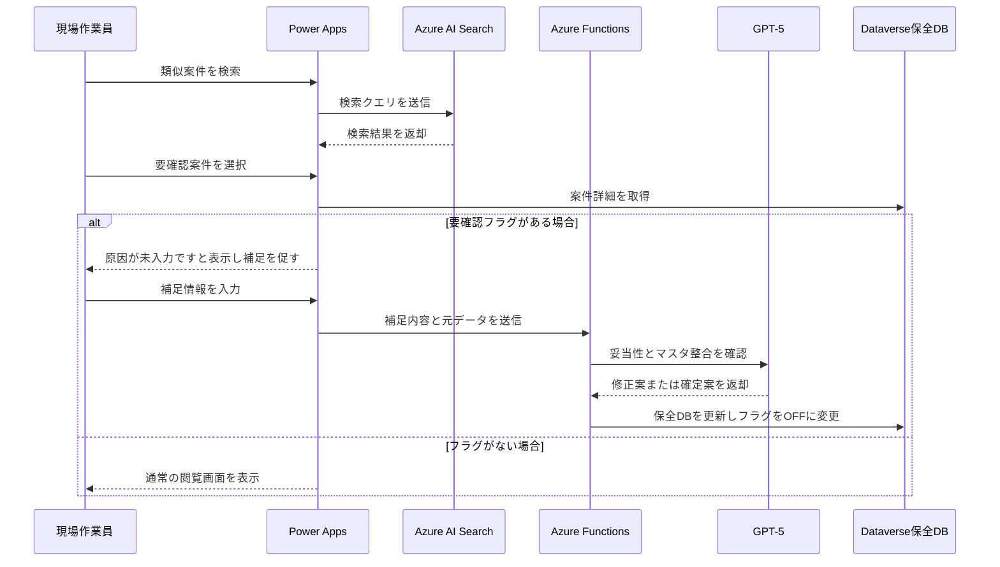

---

# 16. システムアーキテクチャ

## 16-1. 構成要素

- **フロントエンド**：Power Apps（保全アプリ）  
- **オーケストレーション**：Power Automate  
- **バックエンドロジック**：Azure Functions（Python）  
- **AIエンジン**：Azure OpenAI（GPT-5 ＋ Embeddings）  
- **検索基盤**：Azure AI Search  
- **データストア**：Dataverse（保全DB・マスタ・辞書）  
- **認証基盤**：Entra ID（旧Azure AD）  

## 16-2. 全体イメージ（テキスト図）

```text
[現場作業員]
      |
      v
[Power Apps 保全アプリ]
      |
      v
[Power Automate]
      |
      v
[Azure Functions (Python)]
      |
      +--> [Azure OpenAI (GPT-5, Embeddings)]
      +--> [Azure AI Search]
      +--> [Dataverse 保全DB/マスタ/辞書]

認証: Entra ID (旧Azure AD) による統合認証
```

---

# 17. Power Platform ライセンス選択ガイド

## 17-1. Case A：全社・全部署で広く活用する場合

- プラン：Power Apps Premium  
- 目安単価：約2,500円/ユーザー/月  
- 多数のアプリを展開する場合に、最もコストパフォーマンスが高い。  

## 17-2. Case B：特定部署・特定アプリのみ利用する場合

- プラン：Power Apps Per App  
- 目安単価：約625円/ユーザー/アプリ/月  
- 対象アプリが1〜数個に限られている場合に適する。  

## 17-3. Case C：利用頻度がごく少ない場合（月1回程度）

- プラン：Pay-as-you-go（従量課金）  
- 目安単価：約1,250円/アクティブユーザー/アプリ/月  
- 利用が発生した月だけ課金されるため、スポット利用に向いている。  

---

# 18. プロジェクトロードマップ（3ヶ月）

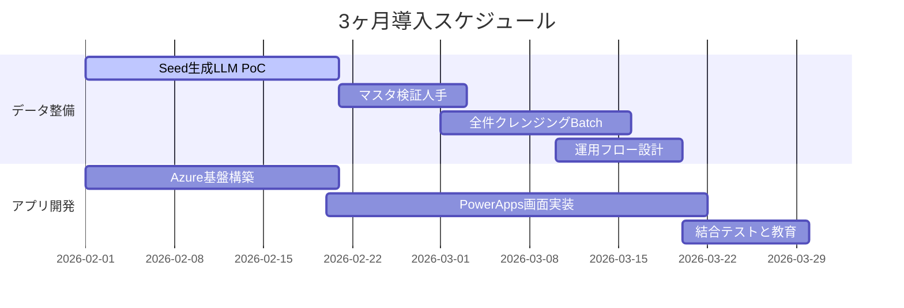

---

# 19. 概算費用とROI（投資対効果）

## 19-1. 概算費用（例）

- 合計：**1,300万円（税抜）**  
  - PM：120万円  
  - Data Scientist（マスタ生成・AIロジック）：625万円  
  - Engineer（Power Platform・Azure基盤）：450万円  
  - 予備費：105万円  

## 19-2. 投資対効果（イメージ）

1. **コスト回避（既存データ整備工数の代替）**  
   - 23万件 × 5分/件 = 約19,166時間  
   - 1人が不眠不休で約2年強、または10年かけて行う作業量を、  
     3ヶ月のプロジェクト＋AI処理で代替する効果がある。  

2. **業務時間削減（入力・調査工数）**  
   - 50名 × 15分/日 × 240日 = 3,000時間/年 程度の余力を創出可能。  
   - 余力を予防保全や改善活動に振り向けることができる。  

3. **将来の追加効果（本スコープ外）**  
   - クレンジング済み保全データを用いた予兆検知の高度化により、  
     設備停止時間の短縮・生産性向上が見込まれる。  

---

# 20. 将来の発展イメージ（本スコープ外：予防保全）

## 20-1. 本提案のスコープ

- 既存23万件の保全データのクレンジングとマスタ生成。  
- AI入力支援付き保全アプリによる「勝手に整う」運用の導入。  

## 20-2. 将来の発展の方向性

- クレンジング済み保全データを基盤として、  
  - 設備モニタリングデータ（振動・温度・電流値等）との連携  
  - 故障前の前兆パターンの分析  
  - 予兆段階でのアラート出力  
  といった予防保全／予兆保全への発展が可能。  

## 20-3. 位置づけ

- 本提案では、予防保全の実装はスコープ外とし、  
  「将来の発展フェーズとして検討可能」という位置づけとする。  

---

# 21. 次のアクション（Next Steps）

1. **スコープ・方針のご確認**  
   - 3つの提案要旨  
     （①AIクレンジング ②RAG＋入力支援 ③“育てる”運用）に関するご承認。  

2. **事前準備のご検討**  
   - 分析用サンプルデータ（CSV、機密情報はマスキング可）のご提供。  
   - Azure / Microsoft 365 テナント状況の確認。  

3. **プロジェクト体制の確定**  
   - 貴社側の窓口・キーユーザーの決定。  
   - キックオフミーティングの日程調整。  

---

# 22. 体制とDATUM STUDIOの強み

## 22-1. 体制（例）

- PM（1名）：全体統括、進捗管理、ステークホルダー調整。  
- Data Scientist（1名）：マスタ生成・クレンジングロジック・LLMプロンプト設計。  
- Power Platform Engineer（1名）：Power Apps / Power Automate / Dataverse / Azure基盤構築。  

## 22-2. DATUM STUDIOの強み

- データ分析とアプリケーション開発の両方のケイパビリティを保有。  
- 製造業におけるAI活用（予兆保全、外観検査、品質分析等）の実績。  
- Azure OpenAI・Power Platformを活用したエンタープライズDX支援の経験。  

---

# Appendix：技術メンバー向け詳細版

## A-1. 全体の4フロー構成（技術者視点）

```text
(1) Batch A: Seedマスタ生成 (10% サンプル)
(2) Batch B: マスタ拡張 (残り90% で未知パターン検出)
(3) Batch C: 本番クレンジング (v2マスタで23万件全件)
(4) Flow D: オンラインAI入力補助 (運用)

データの流れ:

既存DB(23万件) ──> Batch A ──> マスタDB v1
既存DB(23万件) ──> Batch B (v1参照) ──> マスタDB v2
既存DB(23万件) + マスタDB v2 ──> Batch C ──> クレンジング済DB(要確認含む)
現場作業員 ──> 保全アプリ ──> LLM / マスタDB v2 / クレンジング済DB を参照しながら入力・補正
```

---

## A-2. Batch A：Seed マスタ生成バッチ（10％サンプル）

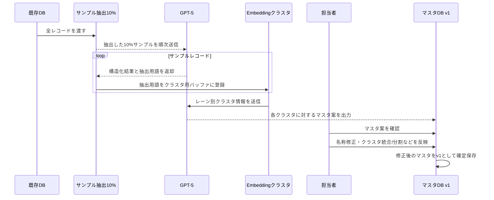

---

## A-3. Batch B：マスタ拡張バッチ（残り90％でマスタを育てる）

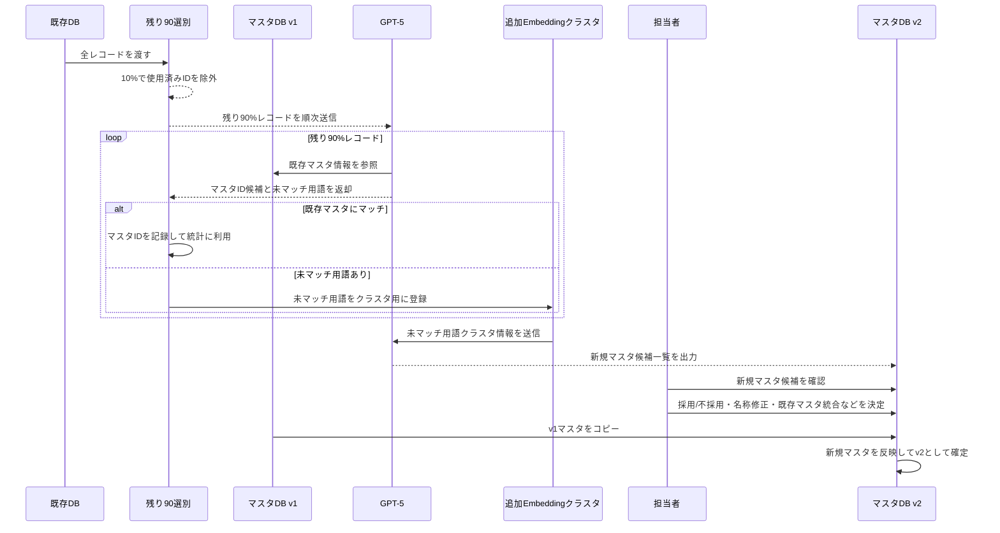

---

## A-4. Batch C：本番クレンジングバッチ（v2マスタで全件クレンジング）

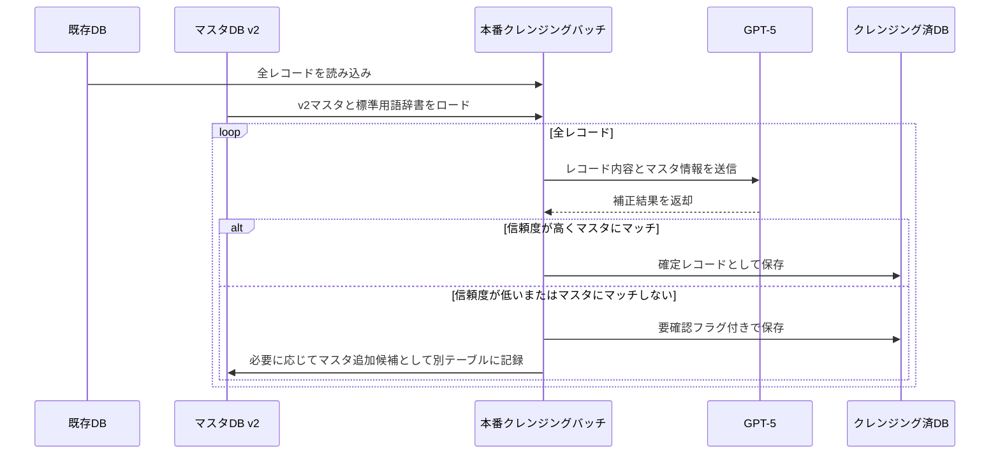

---

## A-5. Flow D：オンラインAI入力補助フロー（運用）

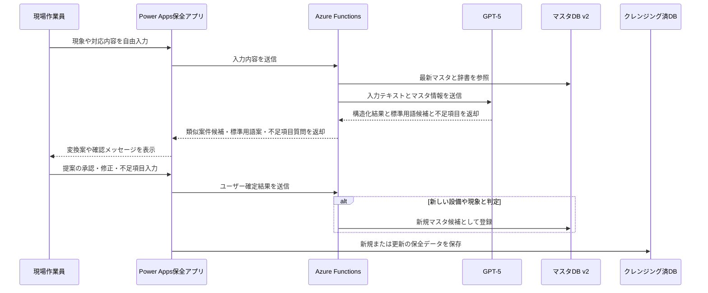
