# 保全業務DXおよび既存データ資産化プロジェクト 提案書（Markdown版）

## 目次

1. タイトル
2. 本日のアジェンダ
3. プロジェクト背景（弊社理解）
4. ご提案サマリ（3つの柱）
5. 現状の課題：負の連鎖（Vicious Cycle）
6. 技術アプローチの全体像（LLM主導）
7. 提案要旨①の深掘り：AIクレンジング＆マスタ自動生成
8. アルゴリズム詳細（ラインマスタ：文字列距離＋LLM）
9. アルゴリズム詳細（設備・部品マスタ：LLM＋Embedding）
10. アルゴリズム詳細（分類・標準用語辞書）
11. 提案要旨②の深掘り：RAG検索＆AI入力支援アプリ
12. 提案要旨③の深掘り：少し試す→確かめる→全体に広げる と “育てる”運用
13. 「育てる」① 初期構築でマスタを育てる（10％ → 90％）
14. 「育てる」② 運用しながらマスタを育てる
15. 「育てる」③ 保全報告データを運用の中で育てる
16. システムアーキテクチャ
17. Power Platform ライセンス選択ガイド
18. プロジェクトロードマップ（3ヶ月）
19. 概算費用とROI
20. 将来の発展イメージ（本スコープ外：予防保全）
21. 次のアクション（Next Steps）
22. 体制とDATUM STUDIOの強み

---

## 1. タイトル

**タイトル**  
保全業務DXおよび既存データ資産化プロジェクトのご提案  

**サブタイトル**  
Power Platform × Generative AI (GPT-5) による「ナレッジ駆動型保全」への変革  

**宛名**  
いすゞ自動車株式会社 御中  

**日付**  
2026年1月  

**提案者**  
DATUM STUDIO  

---

## 2. 本日のアジェンダ

1. プロジェクト背景とご提案サマリ  
2. 現状の課題：「負の連鎖」と23万件データの状況  
3. 技術アプローチの全体像（LLM主導）  
4. 提案要旨①：AIクレンジング＆マスタ自動生成  
5. 提案要旨②：RAG検索＆AI入力支援アプリ  
6. 提案要旨③：  
   「少し試す → 確かめる → 全体に広げる」と  
   マスタ／保全データを“育てる”運用  
7. システムアーキテクチャ  
8. Power Platform ライセンスとロードマップ  
9. 概算費用とROI  
10. 将来の発展イメージ（本スコープ外：予防保全）  
11. 次のアクション／体制と実績  

---

## 3. プロジェクト背景（弊社理解）

### ヘッダーメッセージ

> 「23万件の埋蔵データの資産化」と「現場入力業務の高度化」の課題に対し、Azure OpenAI × Power Platformによる保全ナレッジDX基盤の構築をご提案いたします。  
> 生成AIによるデータクレンジングの自動化と、検索・入力支援アプリの実装を通じて、現場の負荷を増やさずに高品質な保全データを継続的に蓄積できる仕組みを実現します。

### 貴社の現状（弊社理解）

- 既存の**保全履歴23万件**は、すでにCSV/DBとして **構造化されている**。  
- しかし、  
  - 表記揺れ（例：モータ／モーター／Mtr）  
  - 略語・誤字  
  - 項目のズレ（原因欄に処置内容が入っている 等）  
  により、**そのままでは信頼して検索・分析に使えない**。  
- 人手で全件修正すると、  
  - 23万件 × 5分/件 = 約19,000時間  
  - 現場では実質的に対応不可能。  

### 負の連鎖の構造

- 過去事例が検索でヒットしない → 毎回ゼロから調査・復旧。  
- 入力ルールも徹底しきれず、**新たな揺らぎデータが毎日増える**。  
- 時間が経つほど、「データ量は増えるが、活用難易度だけ上がる」状態に。  

---

## 4. ご提案サマリ（3つの柱）

### 提案要旨①：AIクレンジング＆マスタ自動生成による「23万件の一括資産化」

- GPT-5による構造化・補正エンジンと、  
  Embedding＋クラスタリングによる名寄せロジックにより、  
  既存23万件データを自動クレンジング。  
- 設備・現象・原因・処置マスタ＋標準用語辞書を自動生成。  
- 約19,000時間相当の人手作業をAIで代替。  

### 提案要旨②：RAG検索＆AI入力支援アプリによる「勝手に整うデータ運用」

- Power Apps上に、Azure OpenAIと連携した検索・入力支援アプリを構築。  
- 現場は「自然な日本語で入力するだけ」。  
  → 過去類似事例の提示・標準用語への変換・構造化補完が自動で実行。  
- **「現場が楽になればなるほど、データが勝手に整っていく」**サイクルを実現。  

### 提案要旨③：  
### 「少し試す → 確かめる → 全体に広げる」と  
### マスタ／保全データを少しずつ“育てる”運用設計

- いきなり全件自動ではなく、まず**約10％のサンプルでAIがマスタのたたき台を作成**。  
- 人が確認したうえで、残りの90％に一括適用し、処理中に見つかる「新しい設備・事象」をマスタに追加。  
- 運用開始後も、  
  - 新しい設備・事象が出てきたらアプリからマスタに追加。  
  - 初期クレンジングで埋めきれなかった項目は「要確認」として残し、  
    類似案件検索のタイミングで現場が**“ついでに補正”**できる。  
- これにより、**マスタ（用語集）と保全報告データの両方を、運用の中で育てていく**。  

---

## 5. 現状の課題：負の連鎖（Vicious Cycle）

### 顧客の真のペイン

> 「データを使って業務を効率化したいが、検索しても過去の類似事象がヒットしない。  
>  結果として入力の手間も減らず、ナレッジも活用できない。」

### 負の連鎖のメカニズム

1. 過去データに表記揺れ・項目ズレ・欠損が多く、検索してもヒットしない。  
2. データを直したいが、現場にその工数（約19,000時間）は確保できない。  
3. 既存の揺らぎデータは放置され、日々の入力で新たな揺らぎが再生産。  
4. 時間が経つほど、データ量は増えるが活用困難さは増していく。  

### ブレークスルー

- 現場が確保できない「約19,000時間」の工数を、  
  AI（GPT-5）という**仮想労働力**で肩代わりし、  
  このループを断ち切る。  

---

## 6. 技術アプローチの全体像（LLM主導）

### 基本コンセプト

- MeCab/Sudachiなどの従来の形態素解析ではなく、  
  **GPT-5による文脈理解＋構造化（JSON出力）を中核**に据えた設計。  
- そのうえで、Embedding＋クラスタリングで  
  - 設備／部品  
  - 現象／原因／処置  
  のマスタと標準用語辞書をボトムアップに自動生成。  

### 全体処理フロー（シーケンス図）

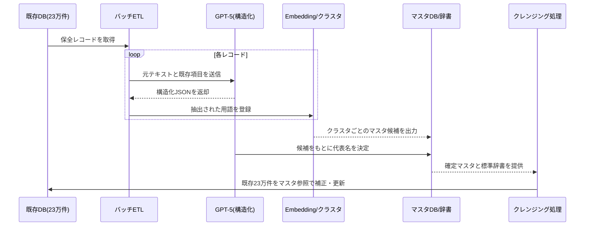

---

## 7. 提案要旨①の深掘り：AIクレンジング＆マスタ自動生成

### 目的

- 既存の23万件の構造化データについて、  
  - 項目ズレ（原因欄に処置等）を正しい欄に入れ直す。  
  - 表記揺れ・略語・誤字を標準用語に揃える。  
  - 空欄を文脈から可能な範囲で補完する。  
- その結果として、  
  - 設備マスタ  
  - 現象／原因／処置の分類マスタ  
  - 標準用語辞書（variantとcanonicalの対応）  
  を自動生成・整備する。  

### クレンジング後にできること

- 類似案件検索で、  
  - 「設備」「現象」「原因」「処置」を軸に検索可能。  
- 統計分析・傾向分析の精度が向上。  
- 以後の入力支援・RAG検索の“土台データ”として活用。  

### 詳細フロー（シーケンス図）

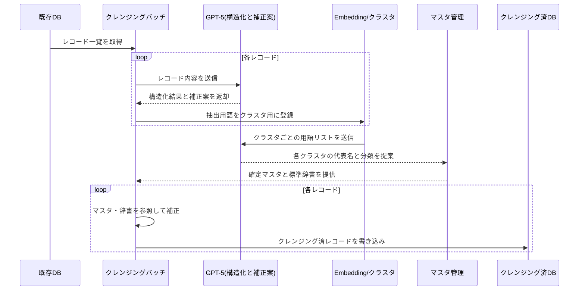

---

## 8. アルゴリズム詳細：ラインマスタ（文字列距離＋LLM）

### 目的

- 「Aライン」「A-Line」「Line A」などの揺らぎを名寄せし、  
  **ラインを一意に識別**できるようにする。  

### 考え方

- ライン名は意味よりも**記号的な違い**が重要。  
- Embeddingだけに頼ると、A/Bラインが「同じ工場のライン」として近くなり過ぎるリスク。  
- そのため、  
  - 文字列正規化（全角/半角・記号・大小文字）  
  - Levenshtein距離でのグルーピング  
  - 最後にLLMで正式名称決定  
  というハイブリッド方式を採用。  

### 処理フロー（シーケンス図）

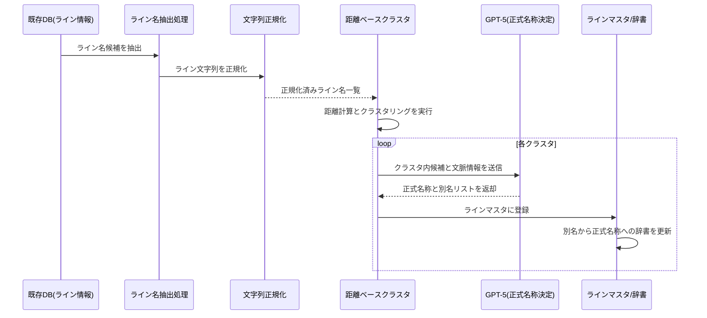

---

## 9. アルゴリズム詳細：設備・部品マスタ（LLM＋Embedding）

### 目的

- 文章や項目の中に埋もれている  
  「設備」「部品」を抽出し、  
  - 設備マスタ  
  - 部品マスタ  
  - 設備＞部品の親子関係  
  を構造化する。  

### ポイント

- GPT-5が  
  - line（ライン）  
  - equipment（設備）  
  - part（部品）  
  などを文脈から抽出。  
- 抽出された用語をEmbeddingし、クラスタリングで名寄せ。  
- GPT-5で、クラスタごとの代表名（標準設備名）と親子関係を決定。  

### 処理フロー（シーケンス図）

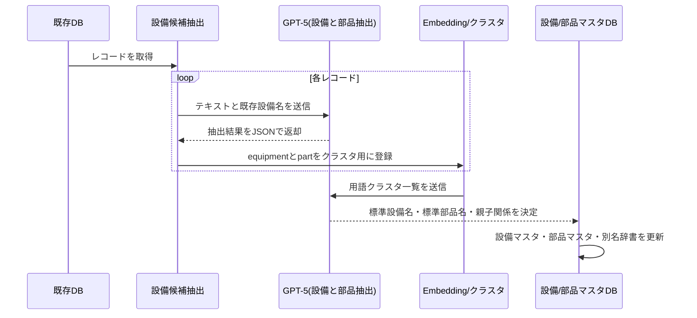

---

## 10. アルゴリズム詳細：分類・標準用語辞書

### 目的

- 現象・原因・処置を、  
  - 大分類  
  - 中分類  
  - 小分類  
  の階層に整理（Taxonomy）。  
- 略語・俗語を含む表記揺れを、標準用語辞書に集約。  

### 処理フロー（シーケンス図）

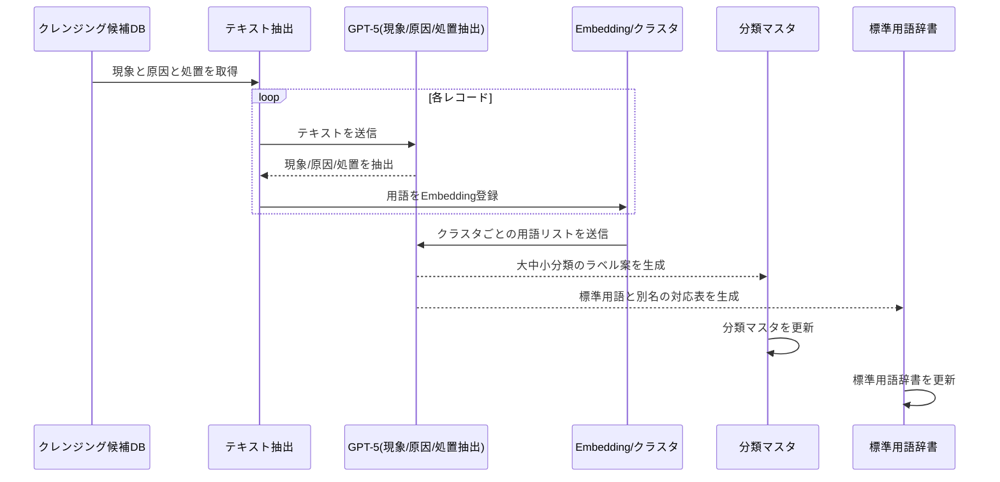

---

## 11. 提案要旨②の深掘り：RAG検索＆AI入力支援アプリ

### コンセプト

> 「現場が自由に入力するだけで、裏でAIが標準化と構造化を代行する」

### 主な機能

1. **RAGによる類似案件提示**  
2. **インテリジェント入力支援（標準用語化・構造化・不足項目の補完）**  
3. **「要確認」データの自然な解消**  

### 処理フロー（シーケンス図）

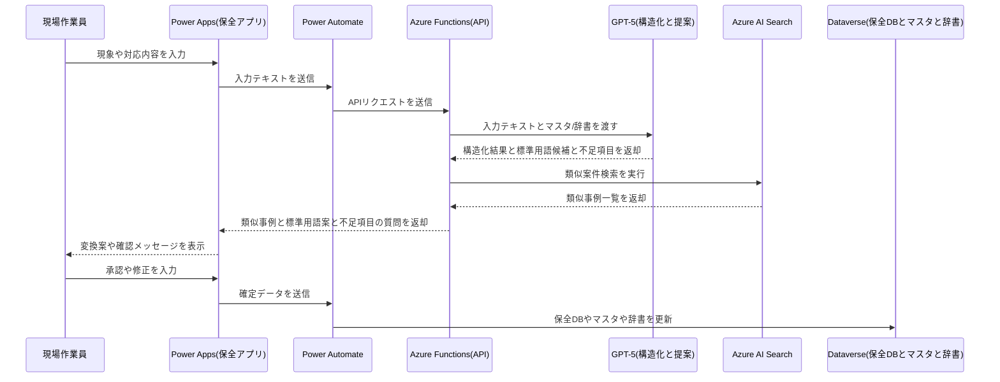

---

## 12. 提案要旨③の深掘り：  
## 「少し試す → 確かめる → 全体に広げる」と  
## マスタ／保全データを“育てる”運用

### 3つの「育てる」

1. **初期構築でマスタを育てる（10％ → 90％）**  
2. **運用しながらマスタを育てる（新しい設備・事象への対応）**  
3. **運用しながら保全報告データを育てる（埋まっていない項目を“ついでに”補正）**  

---

## 13. 「育てる」① 初期構築でマスタを育てる（10％ → 90％）

### ステップ1：データの約10％で「たたき台」を作る

- 23万件のうち、ライン・設備・年度のバランスを見ながら約10％を抽出。  
- GPT-5で構造化し、設備／現象／原因／処置マスタの**たたき台**を自動生成。  

### ステップ2：たたき台だけ人がチェックする

- 10％分から作られたマスタ候補を、担当者がざっと確認。  
- 全23万件を見るのではなく、**代表例だけを見るので負荷が小さい**。  

### ステップ3：残り90％に広げながら、未知のものをマスタに追加

- 検証済みマスタを「正解」として、残り90％を一括処理。  
- 処理中に、既存マスタに当てはまらない新しい設備・事象が出てきたら、  
  AIが「マスタ追加候補」として自動登録。  
- 後から「マスタ追加候補」一覧を人が見て、採用／不採用を決めることで、  
  **マスタが一段階レベルアップ**していく。  

### 処理フロー（シーケンス図）

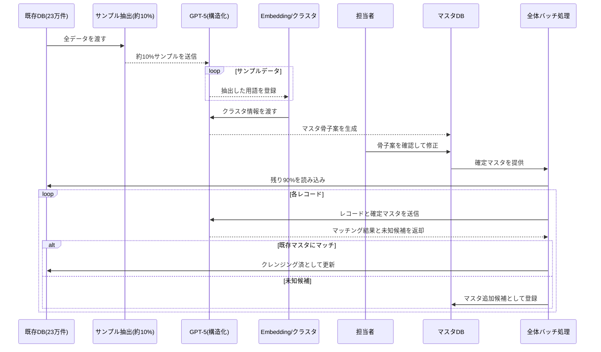

---

## 14. 「育てる」② 運用しながらマスタを育てる

### 状況

- 新しい設備が導入された。  
- これまで起きていなかった新種の現象が発生した。  

### 流れ

1. 現場がアプリ上で新しい設備・現象を入力。  
2. GPT-5が既存マスタと似ているかを判定。  
3. どれにも当てはまらなければ、  
   - 「新しい設備として登録しますか？」  
   - 「新しい現象分類として追加しますか？」  
   と提案。  
4. 承認されると、その場でマスタに反映。  
   - 以後は同じ表現が出てきても、自動で同じマスタIDに紐づく。  

### 処理フロー（シーケンス図）

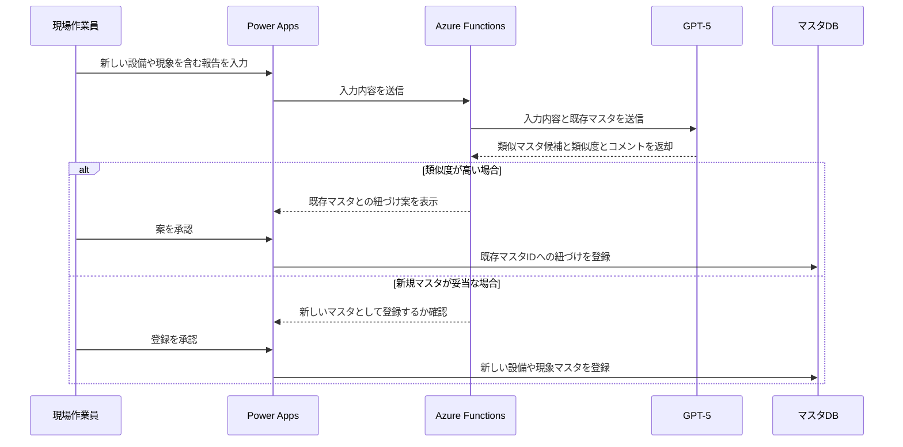

---

## 15. 「育てる」③ 保全報告データを運用の中で育てる

### 前提

- 初期クレンジングの段階で、  
  GPT-5のconfidenceが低い項目は無理に埋めず、  
  - フィールドは空欄のまま。  
  - 「要確認」フラグをON。  
  としてナレッジDBに登録。  

### 日常運用の中での「ついでに補正」

1. 現場が類似案件を検索し、検索結果一覧から案件を開く。  
2. 開いた案件が「要確認」フラグ付きの場合、  
   - 「この案件は原因が未入力です。わかる範囲で補足しますか？」  
     と小さなメッセージを表示。  
3. 担当者が余裕のある範囲で、1〜2項目だけ補足入力。  
4. GPT-5が入力内容をチェックし、  
   - 保全報告データに反映。  
   - 必要に応じてマスタ／辞書にも反映。  
5. 以後、その案件は**「要確認」から「確定済」へ昇格**。  

### 処理フロー（シーケンス図）

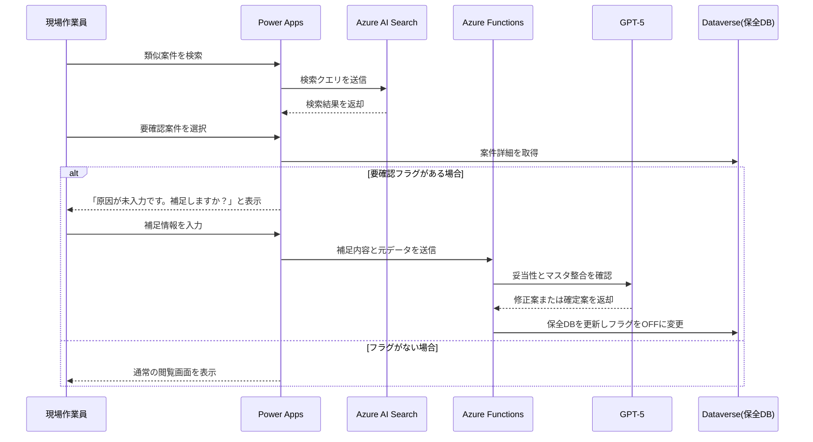

---

## 16. システムアーキテクチャ

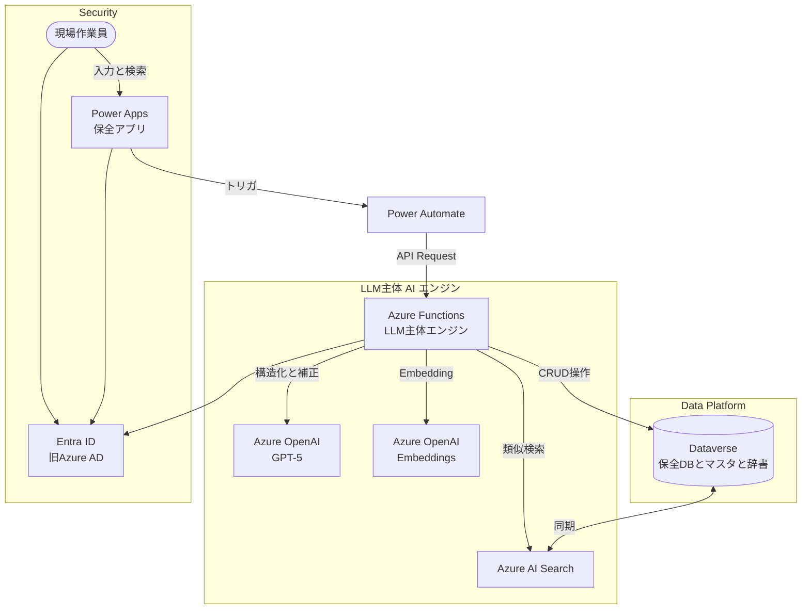

---

## 17. Power Platform ライセンス選択ガイド

### Case A：全社・全部署で広く活用

- Power Apps Premium  
- 約2,500円/ユーザー/月  
- 多数のアプリを横展開する場合に最適。  

### Case B：特定部署・特定アプリのみ

- Power Apps Per App  
- 約625円/ユーザー/アプリ/月  
- スモールスタートに最適。  

### Case C：利用頻度がごく少ない

- Pay-as-you-go  
- 約1,250円/アクティブユーザー/アプリ/月  
- 使った月だけ課金。  

---

## 18. プロジェクトロードマップ（3ヶ月）

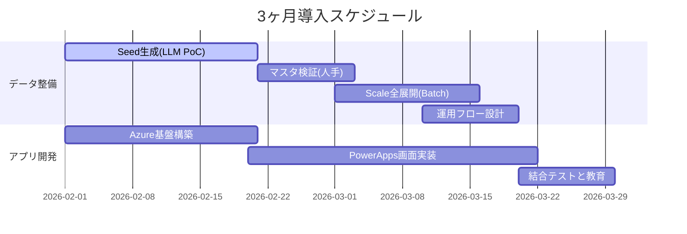

---

## 19. 概算費用とROI

### 概算費用（例）

- 合計：**1,300万円（税抜）**  
  - PM：120万円  
  - Data Scientist（AI・マスタ生成）：625万円  
  - Engineer（Power Platform・Azure基盤）：450万円  
  - 予備費：105万円  

### ROIイメージ

1. **コスト回避（既存データクレンジング）**  
   - 23万件 × 5分/件 = 約19,166時間。  
   - 1人が不眠不休で約2年強、または10年かけて行う作業を、  
     約3ヶ月のプロジェクト＋AI処理で完了。  

2. **業務削減（入力・調査時間短縮）**  
   - 50名 × 15分/日 × 240日 = 3,000時間/年。  
   - 高品質データとRAG検索により、調査・入力時間を削減。  

3. **将来の追加効果（スコープ外）**  
   - クレンジング済みデータを用いた予防保全／予兆検知への発展により、  
     設備停止時間の削減・生産性向上が期待可能（別途検討）。  

---

## 20. 将来の発展イメージ（本スコープ外：予防保全）

### 本提案のスコープ

- 既存23万件の保全データのクレンジングとマスタ生成。  
- AI入力支援つき保全アプリによる「勝手に整う」運用の実現。  

### 将来の発展（別フェーズ）

- クレンジング済み保全データ  
  ＋ 設備モニタリングデータ（振動・温度・電流値 等）  
  を組み合わせ、  
  - 故障前の「前兆パターン」を分析。  
  - 予兆段階でアラートを出す仕組みの構築。  

### 位置づけ

- 現フェーズの成果（高品質な保全データとマスタ）が揃って初めて実現可能。  
- 本提案書ではスコープ外とし、別途PoC・ロードマップをご提案可能。  

---

## 21. 次のアクション（Next Steps）

1. **スコープ・方針のご確認**  
   - 3つの提案要旨（①AIクレンジング ②AI入力支援 ③“育てる”運用）の方向性。  

2. **事前準備の確認**  
   - 分析用サンプルデータ（CSV、機密はマスキング可）のご提供。  
   - Azure / Microsoft 365 テナント状況の確認。  

3. **プロジェクト体制の確定**  
   - 貴社側の窓口・キーユーザーのご指名。  
   - Kickoffミーティング日程の調整。  

**口頭補足例**

> 「まずは10％のサンプルデータで、どの程度の精度でマスタを自動生成できるかをお見せし、その上で本格展開をご判断いただく形も可能です。」

---

## 22. 体制とDATUM STUDIOの強み

### 体制（例）

- PM（1名）：全体統括、進捗管理、ステークホルダー調整。  
- Data Scientist（1名）：LLM主導マスタ生成・クレンジングアルゴリズム設計・検証。  
- Power Platform Engineer（1名）：Power Apps / Power Automate / Dataverse / Azure基盤構築。  

### DATUM STUDIOの強み

- データ分析とアプリ開発の両輪を持つ体制。  
- 製造業におけるAI活用（予兆保全、品質検査、需要予測等）の実績。  
- Azure OpenAI / Power Platform を活用したエンタープライズDX案件の経験値。  

---
