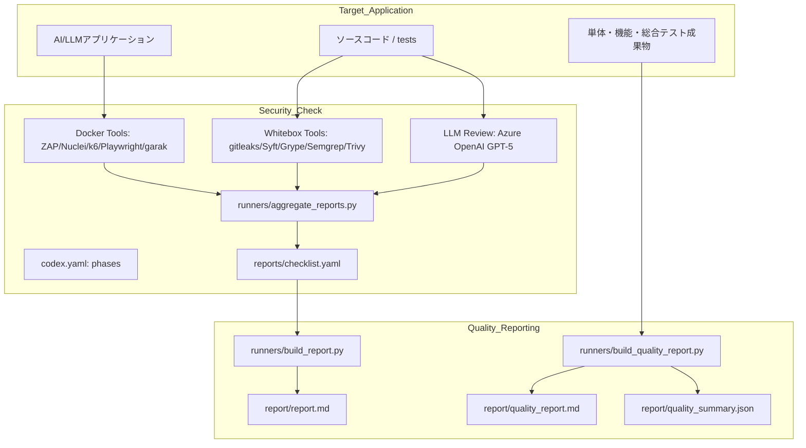
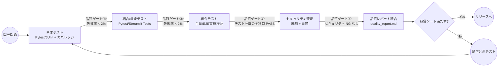

# 品質監査システム 全体説明資料

---

## 1. 目的・狙い・コンセプト

- **目的**  
  システム開発ライフサイクル全体に品質ゲートを設け、機能・非機能の両面から品質を可視化＆保証する。

- **狙い**  
  - 機能面: 単体 → 結合/機能 → 総合の自動/手動試験により品質劣化を早期検出。  
  - 非機能面: ホワイトボックス × ブラックボックスのセキュリティ診断で AI 特有の脅威を抑止。

- **コンセプト**  
  1. 「検証の自動化」と「証跡の集約」を両輪とする。  
  2. OSS 中心のツールチェーンを組み合わせて、実運用に近い環境で検証。  
  3. 品質レポートを自動生成し、開発者とステークホルダー双方に同一情報を提示。  
  4. 「バイブ品質監査」を実現できる柔軟性を持たせ、AI エージェント／LLM を活用して成果物そのものを直接精査できるようにする。

### 1.1 バイブ品質監査の背景

バイブコーディング時代に突入し、エンジニアだけでなく非専門職でもプログラミング成果物を迅速に生み出せる環境が整いつつある。一方で、アプリケーションの品質、とりわけセキュリティ面の確保が十分でないままリリースされるケースが増え、技術負債や組織全体のセキュリティレベル低下といったリスクが顕在化している。従来型の品質管理は、プロセス監査と証跡確認が中心であり、「品質ゲートを通過したか」という形式的な担保に留まっていた。

そこで本システムでは、AI エージェントの能力を監査側にも適用し、開発者がバイブコーディングで得られる柔軟性を監査にも拡張する。「バイブ品質監査」を掲げ、AI／LLM によりソフトウェア成果物の中身を直接読み解き、品質・セキュリティのリスクを多面的に抽出できる仕組みとして本フレームを企画・構築した。品質保証を高度化し、顧客クレームの未然防止と企業ブランド価値の向上を両立させることが目的である。

---

## 2. 全体アーキテクチャ概要

### 2.1 主要コンポーネント

| コンポーネント | 役割 |
| --- | --- |
| `security-check/` | セキュリティ監査フレーム（Docker ベース）。黒箱＋白箱のツール群をオーケストレーション。 |
| `target/` | 監査対象アプリケーション一式（ソース、テスト成果物、レポート等）。 |
| `runners/*` | 自動化スクリプト（環境準備、レポート集計、品質レポート生成など）。 |
| `runners/llm_code_review.py` | Azure OpenAI を用いた LLM ホワイトボックスレビュー（品質/セキュリティ観点の診断）。 |
| `reports/` | 個別ツールの生レポートと集約レポート（`checklist.yaml`、`report.md`、`quality_report.md` 等）。 |
| `Makefile` | 実行フローを簡略化（`run-all`、`report`、`quality-report`）。 |
| `.env` | 監査ターゲット URL、認証情報、環境変数の設定。 |

### 2.2 アーキテクチャ図（Mermaid）



---

## 3. 品質監査のフェーズ別フロー

### 3.1 フロー全体像



### 3.2 各ゲートのポイント

| ゲート | 対象 | 主な指標 | 合格基準（デフォルト） |
| --- | --- | --- | --- |
| ① 単体 | `tests/unit` | 成功/失敗件数、カバレッジ | 失敗率 < 2%、カバレッジ任意 |
| ② 結合・機能 | `tests/integration` / `tests/e2e` | 成功/失敗件数 | 失敗率 < 2% |
| ③ 総合 | 手動試験報告書 | 計画 vs 実績、PASS/FAIL | すべての手動項目が PASS |
| ④ セキュリティ | 黒箱/白箱診断 | NG 件数、HIGH 件数 | セキュリティ NG = 0（環境変数で緩和可） |

※ 閾値は `QUALITY_GATE_*` でカスタマイズ可能。

---

## 4. セキュリティ監査について

### 4.1 ホワイトボックス診断（静的解析）

| ツール | 目的 | 出力 |
| --- | --- | --- |
| LLM 白箱レビュー (Azure OpenAI) | LLM による品質／セキュリティ観点のコードレビュー | `reports/whitebox/llm_review.json`、`reports/whitebox/llm_review.md` |
| Syft | SBOM 抽出 | `reports/sbom/sbom.json` |
| Grype | 依存脆弱性スキャン | `reports/whitebox/sca.sarif` |
| gitleaks | Secrets 検出 | `reports/whitebox/secrets.sarif` |
| Semgrep（LLM 最小/汎用） | コードパターン検出 | `reports/whitebox/semgrep.sarif` |
| Trivy FS | ファイル/コンテナ脆弱性 | `reports/whitebox/trivy.sarif` |

#### 4.1.1 LLM 白箱レビューの流れ

1. `runners/llm_code_review.py` がターゲットコードから代表ファイルを抽出し、品質・セキュリティ観点のプロンプトを組み立てる。  
2. Azure OpenAI（例: GPT-5 mini デプロイ）へストリーミングで問い合わせ、JSON 形式の指摘結果を取得。  
3. `reports/whitebox/llm_review.json` と `llm_review.md` に品質・セキュリティの所見、MUST/SHOULD アクション、トークン使用量などを出力。  
4. 生成結果は `aggregate_reports.py` を通じてチェックリストに反映され、品質レポートにも転記される。

### 4.2 ブラックボックス診断（実行環境）

| ツール | チェック対象 | 備考 |
| --- | --- | --- |
| ZAP baseline | セキュリティヘッダ、リダイレクト、XSS 候補 | XML/HTML レポートを `reports/zap/` に出力 |
| Playwright | DOM ベース XSS 実害確認 | `reports/playwright/dom-trace.json` |
| k6 | レート制限・429/Retry-After 検証 | `reports/k6/k6.json` |
| Nuclei | SSRF / オープンリダイレクト等（安全テンプレ） | `reports/nuclei/result.json` |
| garak | LLM 攻撃（プロンプト注入/越権/データ流出） | `reports/garak/garak.report.jsonl` |

### 4.3 セキュリティレポート生成

- `runners/aggregate_reports.py` が SARIF/JSON/XML からセキュリティチェックリスト（`reports/checklist.yaml`）を作成。  
- `runners/build_report.py` が Markdown の `report/report.md` を生成。全文インラインで証跡を確認可能。

---

## 5. 品質監査レポート（`quality_report.md`）

### 5.1 レポート構成

| 章 | 内容 |
| --- | --- |
| 1–5 | サマリ、対象、スコープ、実施方法 |
| 6 | セキュリティ監査（全文引用、NG 抽出） |
| 7 | 単体テスト計画 + 結果（全文引用） |
| 8 | 機能テスト計画 + 結果（全文引用） |
| 9 | 総合テスト（手動）計画 + 実施手順 + 結果（全文引用） |
| 10 | 改善計画（テンプレ表） |
| 11–13 | 付録：リンク一覧、実行手順、再現情報 |

LLM 白箱レビューの品質・セキュリティ指摘は章 6 の冒頭に要約され、必要に応じて改善計画（章 10）へもリンクされる。

### 5.2 JSON サマリ（`quality_summary.json`）

- セキュリティ NG/HIGH 件数  
- 単体・機能のテスト件数、失敗率、関連ファイルリスト  
- 総合テスト Markdown/添付/計画  
- ゲート判定結果 & 活性ルール

---

## 6. 実行手順（ダイジェスト）

1. 監査対象を `security-check/target` に配置（ソース＆テスト報告書を含む）。  
2. `.env` を作成し `TARGET_URL`、認証ヘッダ/クッキー、`GARAK_*` 等を設定。  
3. セキュリティ監査を実行: `make run-all`  
4. セキュリティ報告書を生成: `make report`  
5. 品質監査レポート（統合版）を生成: `make quality-report`  
6. 出力: `report/report.md`、`report/quality_report.md`、`report/quality_summary.json`

### カスタマイズ例

```bash
# XML グロブを変更する例
export UNIT_REPORT_GLOBS="target/**/junit.xml,target/**/pytest-unit.xml"
export FUNC_REPORT_GLOBS="target/**/integration*.xml"

# ゲート閾値の変更
export QUALITY_GATE_FAILRATE=5
export QUALITY_GATE_SECURITY_NO_NG=false
```

---

## 7. まとめ & 今後の展望

- 本フレームは、機能品質（単体～総合）と非機能品質（セキュリティ）を一つのパイプラインで可視化する品質監査システム。  
- 既存のソフトウェア開発プロジェクトに組み込むことで、開発フェーズごとに証跡が蓄積され、リリース判定が明文化される。  
- バイブコーディング時代のリスクに応答し、AI エージェントを活用した「バイブ品質監査」を実現することで、成果物の中身に踏み込んだ柔軟な保証活動が可能となった。  
- 今後の拡張:
  - ビルド/リリースパイプライン（CI/CD）との統合。  
  - AI モデル品質（レスポンス評価、バイアスチェックなど）への拡張。  
  - 品質ダッシュボード連携（`quality_summary.json` を BI ツールで可視化）。

---

**問い合わせ:** セキュリティ検証チーム / 品質保証チーム  
**付録:** README「品質監査報告書の実施手順」を参照。
